# Κρυπτονομίσματα, Ιστορία, Παρόν και οι επιπτώσεις τους στην τεχνολογία

**Επιβλέπων:** _**&lt;Κωνσταντίνος Χαϊκάλης, Επίκουρος καθηγητής, Τριτοβάθμια &gt;**_

**ΛΑΡΙΣΑ 2020**

_«Εγώ ο/η Ελευθεριάδης Στυλιανός, δηλώνω υπεύθυνα ότι η παρούσα Πτυχιακή Εργασία με τίτλο κρυπτονομίσματα, ιστορία, παρόν και οι επιπτώσεις στην τους στην τεχνολογία είναι δική μου και βεβαιώνω ότι:_

* _Σε όσες περιπτώσεις έχω συμβουλευτεί δημοσιευμένη εργασία τρίτων, αυτό επισημαίνεται με σχετική αναφορά στα επίμαχα σημεία._
* _Σε όσες περιπτώσεις μεταφέρω λόγια τρίτων, αυτό επισημαίνεται με σχετική αναφορά στα επίμαχα σημεία. Με εξαίρεση τέτοιες περιπτώσεις, το υπόλοιπο κείμενο της πτυχιακής αποτελεί δική μου δουλειά._
* _Αναφέρω ρητά όλες τις πηγές βοήθειας που χρησιμοποίησα._
* _Σε περιπτώσεις που τμήματα της παρούσας πτυχιακής έγιναν από κοινού με τρίτους, αναφέρω ρητά ποια είναι η δική μου συνεισφορά και ποια των τρίτων._
* _Γνωρίζω πως η λογοκλοπή αποτελεί σοβαρότατο παράπτωμα και είμαι ενήμερος\(-η\) για την επέλευση των νόμιμων συνεπειών»_

_Ελευθεριάδης Στυλιανός_

_Ο φοιτητής εντάχθηκε αυτοδίκαια στο Πανεπιστήμιο Θεσσαλίας, σύμφωνα με την παρ. 1 του άρθρου 6 του Ν.4589/2019 \(ΦΕΚ 13/Α'/29.01.2019\). Η εκπαιδευτική λειτουργία του ανωτέρου προγράμματος σπουδών συνεχίζεται μεταβατικά σύμφωνα με την παρ. 2 του άρθρου 6 του Ν.4589/2019 \(ΦΕΚ 13/Α'/29.01.2019\)._

**Περίληψη**

Σκοπός της πτυχιακής εργασίας είναι να βοηθήσει τον μέσο χρήστη τεχνολογίας και μη, να κατανοήσει πλήρως την λειτουργία καινούριων τεχνολογιών όπως την blockchain και παράγωγα του. Το κυριότερο προϊόν της blockchain είναι τα κρυπτονομίσματα. Ένα νέο προϊόν τεχνολογίας που επηρεάζει την οικονομία αλλά τείνει να αλλάξει τον κόσμο και βασικά πράγματα από την μορφή που μέχρι τώρα γνωρίζουμε. Θα γίνει επεξήγηση όσο απλοϊκά και ξεκάθαρα είναι εφικτό για όλους τους τεχνολογικούς όρους. Η blockchain αποτελεί μια πολύπλοκη τεχνολογία, έτσι είναι εξαιρετικά δύσκολη η κατανόηση της από κάποιον αρχάριο χρήστη. Είναι όμως απαραίτητη η κατανόηση της γιατί πάνω σε αυτή βασίζεται το bitcoin, το πρώτο και κυρίαρχο κρυπτονόμισμα που με την σειρά του, πρέπει να αναλυθεί και να κατανοηθεί για την επεξήγηση όλων των κρυπτονομισμάτων. Θα περιγραφεί το πως μπορεί ο χρήστης να αποκτήσει κρυπτονομίσματα της επιλογής του, πως να τα πουλήσει όταν επιθυμεί, αλλά και τι εργαλεία είναι σημαντικά για την αποθήκευση, ταξινόμηση, παρακολούθηση και επεξεργασία τους. Επίσης θα αναλυθούν οι σχετικοί όροι όπως είναι το mining, miners, hash κ.α. Τέλος αναφέρονται τα θετικά και οι κίνδυνοι που εγκυμονούν αλλά και η επίπτωση στην τεχνολογία του παρόντος και του μέλλοντος και οι επιπτώσεις στην οικονομία.

**Ευχαριστίες**

Ευχαριστώ τον Νίκο Κρόντηρα που συνέγραψε το άρθρο “blockchain : Η Αόρατη τεχνολογία που αλλάζει τον κόσμο“, το οποίο ήταν οδηγός μου στη συγγραφή του δεύτερου κεφαλαίου. Τον Ίαν Ντε Μαρτίνο για την συγγραφή του βιβλίου “Bitcoin : Ο απόλυτος οδηγός”, Το οποίο ήταν οδηγός μου στη συγγραφή του τρίτου κεφαλαίου. Την εκπομπή “ΕΡΤ Reports” της Ελληνικής ραδιοφωνία τηλεόραση, το πανεπιστήμιο Θεσσαλίας, το πανεπιστήμιο Λευκωσίας, τον Νεόφυτο και τον Γιώργο για τις γνώσεις που με μετέδωσαν. Την Νένα για την διόρθωση του κειμένου. Τους γονείς μου και τους γονείς τους.

Ελευθεριάδης Στυλιανός

2/3/2020

## Εισαγωγή

Η πτυχιακή εργασία με τίτλο “Κρυπτονομίσματα, Ιστορία, Παρόν Και Οι Επιπτώσεις Τους Στην Τεχνολογία”, πρόκειται για μία ολοκληρωμένη δομή που θα βοηθήσει τους αρχάριους χρήστες να κατανοήσουν βασικά πράγματα στον χώρο των κρυπτονομισμάτων. Γίνεται πλήρης αναφορά στην τεχνολογία αλυσίδων των μπλοκ\(Blockchain\) η οποία είναι η αόρατη τεχνολογία που υποστηρίζει το γνωστό κρυπτονόμισμα Bitcoin. Επίσης πρόκειται για μία νέα τεχνολογία, ωστόσο πολύ δυνατή για να διαταράξει τα νερά της καθημερινότητάς μας. Πολλοί είναι αυτοί που πιστεύουν πως θα επιτελέσει το κλειδί για την επόμενη βιομηχανική επανάσταση.

Με τη χρήση των λέξεων “εναλλακτικά κρυπτονομίσματα”, περιγράφονται όλα τα κρυπτονομίσματα με εξαίρεση το bitcoin. Ονομάζονται έτσι διότι είναι μία εναλλακτική επιλογή από τους χρήστες έναντι του bitcoin. Τα περισσότερα από αυτά δημιουργήθηκαν αντιγράφοντας τον κώδικα του Bitcoin, εφόσον αυτός είναι ελεύθερο λογισμικό ανοιχτού κώδικα και ο καθένας έχει πρόσβαση σε αυτόν. Μερικά από αυτά δημιουργήθηκαν σαν φάρσα όμως πέτυχα, ενώ τα περισσότερα πρόκειται για απάτες.

Επίσης γίνεται ανάλυση στα οφέλη και στις επιπτώσεις στον πολιτισμό μας. Εξηγείται πώς επηρεάζει το περιβάλλον και την κλιματική αλλαγή, πώς επηρεάζει σε τεράστιο βαθμό την παγκόσμια οικονομία και πώς αλλάζει περιοδικά τη συνηθισμένη καθημερινότητα. Κυρίως τα συμπτώματα είναι εμφανή στην οικονομία, διότι είναι ελκυστική τεχνολογία και την υιοθετούν μεγάλες πολυεθνικές, κεντρικές τράπεζες και κυβερνήσεις. Ωστόσο οι εφαρμογές της τεχνολογίας είναι ποικίλες πρόκειται να αλλάξουν τη ροή των κυρίαρχων ρευμάτων της καθολικής τεχνολογίας.

Έπειτα από την ανάγνωση της πτυχιακής εργασίας, ο χρήστης θα έχει αποκτήσει βασικές γνώσεις τις οποίες θα μπορέσει εύκολα να τις εμβαθύνει. Κατά κύριο λόγο το επίπεδο της εργασίας είναι εύκολο διότι απευθύνεται σε αρχάριους χρήστες. Ωστόσο υπάρχουν δυσκολότερα κομμάτια μέσα σε αυτή, που θα βοηθήσουν τον χρήστη να αναπτύξει τη σκέψη του και να εμβαθύνει σε γνώση. Πρόκειται για ένα αντικείμενο που θα οξύνει την κρίση του χρήστη στις επιστήμες της πληροφορικής, των οικονομικών, και των κοινωνικών. Είναι ένα αντικείμενο, που μπορεί κάποιος να ασχοληθεί είτε απλά σαν ασχολία είτε σαν επάγγελμα .

Το δεύτερο κεφάλαιο με τίτλο “αλυσίδα των μπλοκ”, περιέχει όρους και παραδείγματα για να κατανοήσει ο χρήστης την λειτουργία της τεχνολογίας αλλά και τη δομή της. Γίνεται κατανοητό ότι μία αλυσίδα των μπλοκ διαφέρει με το Bitcoin. Περιγράφεται η δομή της, η δομή ενός μπλοκ και πώς αυτά συνδέονται μεταξύ τους. Επίσης περιγράφονται και άλλες τεχνολογίες οι οποίες χρησιμοποιούνται στην τεχνολογία αλυσίδων των μπλοκ και είναι αναγκαία η εξήγηση τους για την κατανόηση του θέματος. Τέτοιες τεχνολογίες είναι τα ομότυπα δίκτυα Peer-to-Peer, η κρυπτογράφηση και η αποκέντρωση. Στη συνέχεια αναλύονται προϊόντα των αλυσίδων των μπλοκ. Ένα από αυτά είναι οι έξυπνες συμβάσεις οι οποίες βοηθούν την διεξαγωγή αυτόματων συναλλαγών. Αναλύονται οι τύποι των αλυσίδων των μπλοκ και αναφέρονται οι σωστές χρήσεις για κάθε περίπτωση. Γίνεται πλήρης ανάλυση σε ολόκληρο το φάσμα της εξόρυξης. Εξηγούνται οι τύποι εξορύξεις, ποιοι από αυτούς είναι αποδοτικοί και διάφορα τεχνάσματα για την επίτευξη του κέρδους. Τέλος, δίνεται πλήρες παράδειγμα κώδικα για την δημιουργία προσωπικής αλυσίδας των μπλοκ του χρήστη.

Στο τρίτο κεφάλαιο εξηγείται το κρυπτονόμισμα και το δίκτυο Bitcoin. Δίνεται μία πλήρως αναφορά στην ιστορία των ηλεκτρονικών συναλλαγών. Στη συνέχεια περιγράφονται οι φορείς που το ελέγχουν, πώς υπολογίζεται η αξία του, ποιος ο σκοπός και ποια η χρήση του. Έπειτα, αναλύεται περιγραφικά η αγορά, η αποθήκευση και η εξαργύρωση, καθώς και τα εργαλεία που πρέπει να χρησιμοποιηθούν. Περιγράφεται η ανάγκη στην ανωνυμία και πώς αυτή εκμεταλλεύθηκε από κακοποιούς για τις ενέργειές τους και τις απάτες προς ανυποψίαστους χρήστες του Bitcoin. Επίσης αναφέρονται τρόποι και τεχνικές για την αποφυγή απατών. Τέλος, εξηγούνται τρόποι για να αποκτήσει κάποιος χρήστης bitcoin χωρίς να τα αγοράσει.

Στο τέταρτο κεφάλαιο, περιγράφονται 10 εναλλακτικά κρυπτονομίσματα τα οποία είναι αρκετά για να κάνουν κατανοητός στον χρήστη όλο το φάσμα των εναλλακτικών κρυπτονομισμάτων. Επίσης περιγράφεται τι ακριβώς είναι μία διχοτόμηση, οι τύποι της και χρησιμοποιείται το παράδειγμα διχοτόμησης της Bitcoin αλυσίδα των μπλοκ, για την κατανόηση της.

Το πέμπτο κεφάλαιο περιέχει τις επιπτώσεις της τεχνολογίας στον πολιτισμό μας. Περιγράφονται κρυπτονομίσματα που δημιουργήθηκαν από κυβερνήσεις και ποιες κυβερνήσεις σκοπεύουν να δημιουργήσουν το δικό τους κρυπτονόμισμα. Αναλύονται οι επιπτώσεις στο περιβάλλον και η καταστροφή της φύσης, αλλά και οι επιπτώσεις στην βιοτεχνία των καρτών γραφικών. Εξηγείται η συμβολή της τεχνολογίας των αλυσίδων των μπλοκ ώστε να λυθεί ένα μέρος του προσφυγικού προβλήματος. Τέλος περιγράφεται πώς η τεχνολογία των αλυσίδων τών μπλοκ, επηρεάζει την καθημερινότητά μας και το πως πρόκειται να την διαφοροποίηση στο μέλλον.

## Αλυσίδα των μπλοκ

Στο παρόν κεφάλαιο επεξηγείται τι ακριβώς είναι μία αλυσίδα των μπλοκ. Επίσης εξηγούνται διάφοροι τεχνικοί ορισμοί οι οποίοι είναι απαραίτητοι για την κατανόηση της λειτουργίας της.

### Τι είναι μία αλυσίδα των μπλοκ και ποια η χρήση της

Η αλυσίδα των μπλοκ είναι μια επαναστατική τεχνολογία βασισμένη σε δίκτυο peer-to-peer. Η συγκεκριμένη τεχνολογία έγινε γνωστή στον μέσο χρήστη τα τελευταία δύο χρόνια λόγω της ραγδαίας εκτόξευσης της αξίας του κρυπτονομίσματος bitcoin.

Πρόκειται για μία τεχνολογία που ανακαλύφθηκε το 2008 από τον Satoshi Nakamoto. δεν πρόκειται για αληθινό όνομα αλλά για ψευδώνυμο και κανείς δεν γνωρίζει αν είναι άντρας, γυναίκα ή ομάδα προγραμματιστών.

Η πρώτη χρήση της αλυσίδας των μπλοκ ήταν η υποστήριξη του κρυπτονομίσματος bitcoin ένα χρόνο αργότερα από την ανακάλυψη της αλυσίδας στο μπλοκ. Χωρίς αυτό να σημαίνει ότι είναι η μοναδική του χρήση. Αντιθέτως υποστηρίζει ποικίλες λειτουργίες που μέχρι σήμερα δεν θα φανταζόταν κανένας ότι μπορεί αλλάξουν μορφή και τρόπο διαχώρισης. Τέτοιες εφαρμογές είναι: η παιδεία, η υγεία, το εμπόριο, η προστασία πνευματικών δικαιωμάτων, η δήλωση περιουσιακών στοιχείων, αλλαγή των οικονομικών και τραπεζικών συστημάτων και πολλά ακόμα. Ωστόσο η μεγαλύτερη αξιοποίηση της αλυσίδας των μπλοκ είναι η υποστήριξη πολλών κρυπτονομισμάτων.

Με την αλυσίδα των μπλοκ υπάρχει μία εμπιστοσύνη στην ασφάλεια των δεδομένων του χρήστη και της περιουσίας του. Δεδομένο πως ότι προστεθεί σε αυτή, αυτόματος είναι κομμάτι μιας δημόσιας αποκεντρωμένης βάσης δεδομένων .Η Ασφάλεια οφείλεται στο δομικό υλικό της αλυσίδας των μπλοκ που ονομάζεται μπλοκ. Στη συνέχεια το κάθε κρυπτογραφημένο μπλοκ συνδέεται με ένα προηγούμενο και ένα επόμενο μπλοκ δημιουργώντας έτσι την αλυσίδα των μπλοκ.

### Η διαφορά της αλυσίδας των μπλοκ με το κρυπτονόμισμα bitcoin

Συνήθως ο χρήστης σε μία διάλεξη συνομιλία ακούει τον όρο αλυσίδα το μπλοκ πριν ή μετά τον όρο Bitcoin. Αυτό οδηγεί στην παρανόηση πως το εικονικό νόμισμα bitcoin είναι το ίδιο πράγμα με την τεχνολογία αλυσίδας των μπλοκ. Κάτι τέτοιο όμως είναι λανθασμένo, πρόκειται δύο διαφορετικά πράγματα.

Το bitcoin Είναι ένα εικονικό κρυπτονόμισμα, δηλαδή χρήματα. Θα μπορούσε να παρομοιαστεί σαν ένα προϊόν που δημιουργήθηκε χάρη στην Bitcoin αλυσίδα των μπλοκ και πού βρίσκεται στην κορυφή της πυραμίδας με τις δισεκατομμύρια χρήσης στην κατοχή του. Πιο κάτω από την κορυφή της πυραμίδας όμως βρίσκεται ένα υπόβαθρο το οποίο λειτουργεί ανεξαρτήτως από το αν πάνω από αυτό υπάρχει κρυπτονόμισμα ή όχι. Το υπόβαθρο είναι μέρος της αλυσίδας στο μπλοκ και στη συγκεκριμένη περίπτωση της bitcoin αλυσίδας των μπλοκ Και χρησιμοποιείται για την ασφαλή μεταφορά περιουσιακών ηλεκτρονικών στοιχείων μέσω διαδίκτυο.

Πιο απλά ένα κρυπτονόμισμα έχει ανάγκη την εκάστοτε αλυσίδα των μπλοκ για τη δημιουργία του και την επιβίωση του. Μία αλυσίδα των μπλοκ όμως λειτουργεί ανεξάρτητα και υποστήριξη σε κρυπτονομίσματα είναι απλά μία εφαρμογή του. Οι υπόλοιπες εφαρμογές είναι ποικίλες και ικανές να ξεπεράσουν την πρώτη δοκιμαστική εφαρμογή του τι μπορεί να κάνει μία αλυσίδα των μπλοκ, δηλαδή την κορυφή του, τα κρυπτονομίσματα. “Το Blockchain Είναι το όχι και τόσο μυστικό όπλο πίσω από την άνοδο του Bitcoin αλλά είναι προορισμένο να εξελιχθεί πολύ μακρύτερα από αυτό.”\(Κρόντηρας, 2017\)

Τέλος το Bitcoin κάνει ταχύτερα μία συναλλαγή σε σχέση με την κανονική διαδικασία με συμβατικά χρήματα χωρίς τη συμβολή μιας εταιρείας, τράπεζας ή της κυβέρνησης. Η αλυσίδα των μπλοκ Όμως προσφέρει στο παραπάνω πλεονέκτημα με φθηνό κόστος και ασφάλεια των δεδομένων.

### Περιγραφή αλυσίδα των μπλοκ

Τα πλεονεκτήματα της αλυσίδας του μπλοκ είναι ότι δεν επιτρέπει σε κάποια στοιχεία και πληροφορίες να αντιγράφουν, να αλλοιωθούν και διασφαλίζουν την ιδιωτικότητα τους. Αυτό το καταφέρνει με τη χρήση των μπλοκ.

Ένα μπλοκ είναι μία λίστα με διάφορες πληροφορίες που αντιστοιχούν σε μία συναλλαγή. Τέτοιες πληροφορίες μπορεί να είναι οτιδήποτε όπως όνομα, ποσό πληρωμής ή αγοράς, συντεταγμένες, ώρα, ημερομηνία, διεύθυνση ή ότι άλλο μπορεί να φανταστεί κανείς. Μετά τη δημιουργία ενός μπλοκ δημιουργείται ένας χρονικά καθορισμένος δεσμός ή αλλιώς “hash” ο οποίος συνδέει όλα τα μπλοκ μεταξύ τους δημιουργώντας μία αλυσίδα μπλοκ σε όλο το αποκεντρωμένο δικτύου από κόμβους οι οποίοι παλεύουν κάθε συναλλαγή. Οι κόμβοι μπορεί να είναι ο προσωπικός υπολογιστής του χρήστη, μία φάρμα κόμβων ή αλλιώς “mining farm” η αλυσίδα του μπλοκ σε σύννεφο\(blockchain cloud\).

Το 2016 o Ντον και Άλεξ Ταπσκοτ εξηγούν στο βιβλίο “blockchain revolution how technology behind bitcoin is changing money, Business and the world” τη δομή της αλυσίδας των μπλοκ όσο πιο συνοπτικά γίνεται. ”Τα ψηφιακά νομίσματα δεν αποθηκεύονται σε ένα αρχείο .Εκπροσωπούνται από συναλλαγές που έχουν καταγραφεί στα μπλοκ της αλυσίδας των μπλοκ το οποίο σαν ενα παγκόσμιο λογιστικό βιβλίο διαθέτει όλα τα αρχεία ενός peer-to-peer δικτύου ώστε να επαληθεύει και να εγκριθεί κάθε συναλλαγή bitcoin. Κάθε αλυσίδα το μπλοκ δίνεται και τρέχει σε υπολογιστές εθελοντών σε όλο τον πλανήτη. Δεν υπάρχει κεντρική βάση δεδομένων που μπορεί να πέσει θύμα απάτης. Είναι δημόσιο και ο καθένας μπορεί να το δει αφού βρίσκεται στο διαδίκτυο .Είναι κρυπτογραφημένο. Χρησιμοποιεί δημόσια και ιδιωτικά κλειδιά ώστε να διατηρεί ένα επίπεδο θεωρητικής ασφαλείας.” Ωστόσο η ασφάλεια της αλυσίδας των μπλοκ δεν βασίζεται τόσο στην φωτογραφική του φύση αλλά στο ότι παράλληλα είναι αποκεντρωμένο. \(Κρόντηρας, 2017\)

### Δομή του μπλοκ

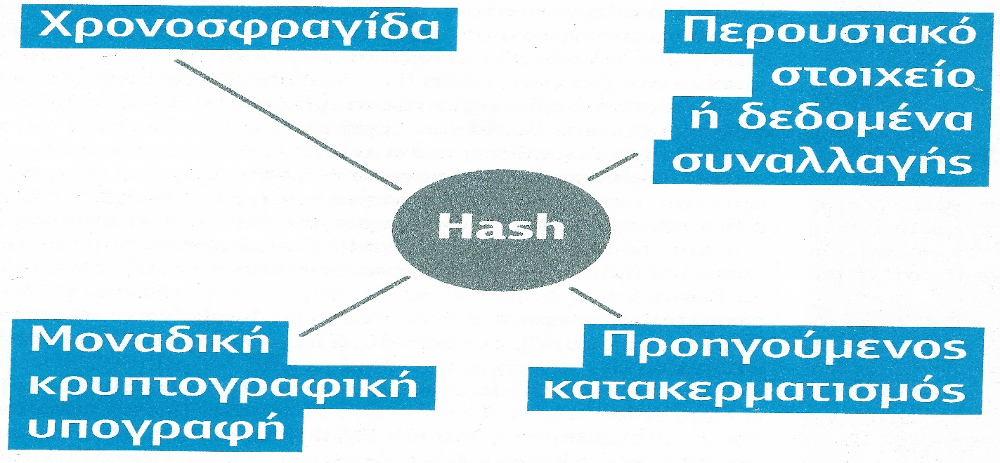

Εικόνα : Η δομή ενός μπλοκ.

Κάθε μπλοκ διαθέτει το προσωπικό του hash, Το hash του προηγούμενο μπλοκ και δεδομένα .Στην περίπτωση της Bitcoin αλυσίδας του μπλοκ, τα δεδομένα περιέχουν πληροφορίες για τον αποστολέα, τον παραλήπτη και το ποσό. Κάθε hash διαθέτει μία χρονοσφραγίδα, περουσιακά στοιχεία ή δεδομένα συναλλαγών, κατακερματισμό του προηγούμενου μπλοκ και μία μοναδική κρυπτογραφική υπογραφή. Σκεφτείτε το σαν ένα δακτυλικό αποτύπωμα. Όπως κάθε δακτυλικό αποτύπωμα είναι μοναδικό έτσι και ο κώδικας του hash που προκύπτει από όλα τα παραπάνω είναι μοναδικός στην εκάστοτε αλυσίδα των μπλοκ.\(Κρόντηρας, 2017\) Η εικόνα ανακτήθηκε από το άρθρο “Blockchain: Η αόρατη τεχνολογία που αλλάζει τον κόσμο“ στο περιοδικό “PC Magazine”. \(ΚΡΟΝΤΗΡΑΣ, 2017\)

### Σύνδεση μπλοκ

Κάθε αλυσίδα των μπλοκ έχει το δικό της ρυθμό εργασίας\(Proof-of-Work\).Είναι ένας μηχανισμός για την επιβράδυνση δημιουργίας νέων μπλοκ διότι οι σύγχρονοι υπολογιστές μπορούν να υπολογίσουν χιλιάδες μπλοκ το δευτερόλεπτο με αποτέλεσμα μία αξιόπιστα αποτελέσματα.

Κάθε φορά που περνάει αυτό το χρονικό όριο αποθηκεύονται όλες οι συναλλαγές σε ένα κομμάτι δεδομένων μέσα στο νέο μπλοκ και ενώνεται με το προηγούμενο δημιουργώντας έτσι μία αλυσίδα. Η ολοκληρωμένη δομή του νέου μπλοκ χρονοσφραγίζεται και είναι αδύνατον να διαφοροποιηθούν τα δεδομένα που βρίσκονται μέσα σε αυτό.

Στο παράδειγμα της Bitcoin αλυσίδα των μπλοκ ο ρυθμός εργασίας είναι κάθε 10 λεπτά. Δηλαδή όποιο καινούργιο μπλοκ είναι για δημιουργία θα δημιουργηθεί μαζί με όλα τα υπόλοιπα νέα στο επόμενο δεκάλεπτο. Στην περίπτωση που καταφέρει κάποιος να αλλάξει κάτι από τα δεδομένα ενός μπλοκ, αυτομάτως θα αλλάξει και το hash του μπλοκ. Έτσι δεν αποτελεί το ίδιο μπλοκ με πριν και δεν γίνεται αποδεκτό από την αλυσίδα των μπλοκ με αποτέλεσμα τη μη ταυτοποίηση και την αναζήτηση της λύσης του προβλήματος. Το τρίτο στοιχείο σε ένα μπλοκ είναι το hash του προηγούμενου έτσι εφόσον αλλάξει το hash από το προηγούμενο δεν θα ταυτοποιείται με τον κώδικα “hash προηγούμενου” στο επόμενο μπλοκ.

Το αμετάβλητο το δεδομένο είναι ο ένας λόγος που υπάρχει ασφάλεια. Το πρώτο μπλοκ που δημιουργείται σε μια αλυσίδα των μπλοκ δεν διαθέτει “hash προηγούμενου” για τον απλούστατο λόγο ότι δεν υπάρχει προηγούμενο μπλοκ. Το πρώτο μπλοκ ονομάζεται γεννητικό μπλοκ \(genesis block\).

Ένας Επίσης σημαντικός λόγος για την ασφάλεια είναι η αποκεντρωμένη φύση της αλυσίδας των μπλοκ. Σε ένα δίκτυο peer-to-peer που συμμετέχουν οι εθελοντές δίνεται πλήρης αντίγραφο της αλυσίδας των μπλοκ σε κάθε νέο χρήστη. Κάθε νέο μπλοκ στέλνεται σε όλους τους κόμβους \(εθελοντές\) για να επαληθευτεί από όλους και αφού ελεγχθεί να γίνει συναίνεση ή όχι στην σύνδεση του στο προηγούμενο μπλοκ. Όσα περισσότερα μπλοκ διαθέτει μία αλυσίδα των μπλοκ τόσο πιο ισχυρή είναι και πιο ασφαλές. Για το λόγο πως ανά πάσα στιγμή ανατρέχει ο χρήστης πίσω την αλυσίδα και αυτομάτως ταυτοποιεί την γνωστή συναλλαγή ή πληροφορία. Επίσης υπάρχει περισσότερη πληροφορία για αποτελεσματικότερη επαλήθευση από τους εθελοντές. Το μέγεθος της αλυσίδας και η μη-μεταβλητότητα των δεδομένων είναι η αιτία που κάνουν ισχυρή και αξιόπιστη μία αλυσίδα των μπλοκ. \(Simply Explained - Savjee, 2017\)

### Κρυπτογράφηση

Η κρυπτογράφηση είναι ένας όρος που επαναλαμβάνεται συνέχεια όταν αναφέρεται κάποιος σε αλυσίδα των μπλοκ .Ο ακροατής πρέπει να κατανοεί τι σημαίνει ψηφιακή κρυπτογράφηση. ”Σε έναν κόσμο χωρίς κρυπτογράφηση δεδομένων θα ήταν αδύνατο να έχουμε ένα προσωπικό e-mail, ένα προσωπικό λογαριασμό στο Facebook ή να χρησιμοποιήσουμε μία πιστωτική κάρτα για αγορές στο ίντερνετ. Κρυπτογράφηση δεδομένων χρησιμοποιείται παντού και είναι η κλειδαριά που κρατάει την ψηφιακή μας ζωή ασφαλή.”\(Άγγελος Κυρίτσης, 2016\)

Κρυπτογράφηση είναι όταν κωδικοποιούμε τα δεδομένα με τρόπο ώστε να μην μπορεί ο ανθρώπινος νους να τα ταυτοποιήσει με κάτι γνώριμο. Για παράδειγμα τα δεδομένα σε ένα μπλοκ επεξεργάζονται με τον αλγόριθμο “SHA-256 secure hash algorithm” ο οποίος κρυπτογραφεί μαθηματικά και τα κατακερματίζει την πληροφορία του μπλοκ με τρόπο ο οποίος να μην είναι αναστρέψιμος \(one way encryption\),πάντα με ένα σταθερό αποτέλεσμα είτε ένα δεδομένο που κατοχυρώσαμε είναι ένας χαρακτήρας είτε το κείμενο από ένα ολόκληρο βιβλίο.\(Hellenic Blockchain Hub, n.d.\). Με αυτό τον τρόπο το ανθρώπινο μάτι δεν καταλαβαίνει περί τίνος πρόκειται τα ορατά σε όλους δεδομένα του μπλοκ, αλλά η αλυσίδα των μπλοκ κατανοεί τον κώδικα κανονικά.

### Αποκέντρωση στην αλυσίδα των μπλοκ

Ένα σημαντικό πλεονέκτημα της αλυσίδας των μπλοκ είναι η αποκεντρωμένη φύση της. Δηλαδή τα δεδομένα αποθηκεύονται μοιρασμένα σε διάφορα σημεία πάνω στην αλυσίδα και όχι σε ένα κεντρικό σημείο όπως σε μία κεντρική βάση δεδομένων. Αυτό έχει ως αποτέλεσμα να μην υπάρχει ανάγκη για διαχείριση των δεδομένων, αποθήκευση και εκμετάλλευση από κάποιο κεντρικό οργανισμό όπως οι τράπεζες, μεγάλες πολυεθνικές εταιρείες, η κυβέρνηση.

Η έλλειψη αρχής είναι ο λόγος που μία αλυσίδα των μπλοκ εγγυάται την ασφάλεια των δεδομένων. Για την ασφαλή καταγραφή των δεδομένων χρησιμοποιούνται πρωτόκολλα συναίνεσης τα οποία αποτελούνται από σύνολα κανόνων που εξηγούν τους κανόνες για τη σύνδεση και μεταφορά δεδομένων ανάμεσα στους κόμβους. Η βασική τους λειτουργία είναι να νομοθετήσουν τους κόμβους ώστε να συμφωνήσουν για τη συναίνεση για την ενέργεια μιας καινούργιας ταυτοποίησης.

Για την κατανόηση της Ασφάλειας που προσφέρει η αποκέντρωση ο χρήστης πρέπει να σκεφτεί το εξής παράδειγμα. Έστω πως σε ένα αρχείο σε μία κανονική βάση δεδομένων για την εξουσιοδότηση τραπεζικής συναλλαγής, διαφοροποιηθεί κακόβουλα το ποσό των χιλίων ευρώ σε ποσό των δέκα χιλιάδων ευρώ. Στην περίπτωση που αλλάξει το ποσό και δεν υπάρχει τρόπος ανάκτησης τότε ο χρήστης θύμα θα πληρώσει εννιά χιλιάδες παραπάνω από ότι θα έπρεπε. Στην περίπτωση της αλυσίδας των μπλοκ κάτι τέτοιο είναι απίθανο διότι η συγκεκριμένη πληροφορία θα μοιραζόταν σε εκατομμύρια σημεία-κόμβους. Όταν θα γίνουν οι συναλλαγές στον έλεγχο των κόμβων για το αν είναι αληθές ή όχι, θα εντοπιζόταν σφάλμα με αποτέλεσμα να ανακτήσουν τη λάθος τιμή με την σωστή. \(blockchain.wtf, 2018\)

### Δίκτυο Peer-to-Peer

Ο όρος ομότυπα δίκτυα ή Peer-to-Peer δίκτυο ή P2P, είναι ένας ακόμα που επαναλαμβάνεται στην Επεξήγηση της αλυσίδας των μπλοκ. Πρόκειται για μία μορφή δικτύωσης η οποία δεν βασίζεται στη γνωστή μορφή των κόμβων.

Κάθε Κόμβος του δικτύου μπορεί είτε να λειτουργεί σαν πελάτης είτε σαν εξυπηρετητής ανάλογα με τις ανάγκες των ενεργειών. Οι κόμβοι μπορεί να είναι απλοί υπολογιστές γραφείου που συνδέονται και αποστέλλουν αρχεία όλοι με όλους με αποτέλεσμα στην περίπτωση βλάβης κάποιου κόμβου να μην έχει επιπτώσεις στη λειτουργία του δικτύου. Χωρίζονται σε τρεις κατηγορίες .Συγκεντρωτικά, αποκεντρικά Και τρίτης γενιάς ομότυπα δίκτυα .\(Γιώργος Τράντζας, 2016\)

#### Συγκεντρωτικά δίκτυα ή πρώτης γενιάς

Μία βάση δεδομένων διαχειρίζεται από τον κεντρικό κόμβο. Όταν ένας άλλος κόμβος επιθυμεί την ανταλλαγή κάποιου αρχείου, κάνει κλήση μιας ειδικής εφαρμογής η οποία συνεργάζεται με τον κεντρικό κόμβο για την εύρεση των κόμβων που περιέχουν το συγκεκριμένο αρχείο. Στη συνέχεια πραγματοποίησε σύνδεση των κόμβων που περιέχουν το αρχείο και του κόμβου που επιθυμεί τη μεταφορά του.\(Γιώργος Τράντζας, 2016\)

#### Αποκεντρωτικά δίκτυα ή δεύτερης γενιάς

Δεν υπάρχει κεντρικός κόμβος. Όλοι οι κόμβοι είναι και πελάτες και εξυπηρετητές και κάθε νέος κόμβος γνωστοποιείται σε ένα μικρό πλήθος κόμβων που με τη σειρά τους γνωστοποιούν σε παραπάνω κόμβους μέχρι να γίνει γνωστός από όλο το δίκτυο. Με τον ίδιο τρόπο πραγματοποιείται η αναζήτηση αρχείων και η μεταφορά τους.\(Γιώργος Τράντζας, 2016\)

#### Τρίτης γενιάς δίκτυα

Βασίζονται στον τρόπο λειτουργίας των αποκεντρωμένων ομοτύπων δικτύων με τη διαφορά ότι κωδικοποιούνται τα δεδομένα για την ασφάλεια και την ανωνυμία των κόμβων.\(Γιώργος Τράντζας, 2016\)

### Έξυπνες συμβάσεις

Οι έξυπνες συμβάσεις λειτουργούν όπως οι συμβάσεις στον κανονικό κόσμο με τη μόνη διαφορά ότι είναι ψηφιακές .Πρόκειται για μικρές εφαρμογές οι οποίες εξυπηρετούν διάφορες λειτουργίες βάση στο τι προγραμματίστηκαν να κάνουν από το δημιουργό τους ή από τον διαχειριστή. Η αποθήκευσή τους γίνεται σε ένα σημείο μέσα στην αλυσίδα των μπλοκ, ανάλογα για τι χρήση προορίζεται .

Για την ευκολότερη κατανόηση μιας έξυπνης σύμβασης θα εξεταστεί ένα παράδειγμα στο φυσικό κόσμο. Έστω πως τρεις ιδιοκτήτες πολυτελούς διαμερίσματος επιθυμούν να το πουλήσουν. Διαθέτει ο καθένας διαφορετικό περιουσιακό ποσοστό. Οι ιδιοκτήτες θα αναγκαστούν να εμπιστευτούν συμβολαιογράφους, δικηγόρους και με μεσιτικούς υπαλλήλους για την εύρεση αγοραστών αλλά και για την ανταλλαγή χρημάτων με το διαμέρισμα. Επίσης ο καθένας τους θα πρέπει να πληρωθεί ανάλογα με το ποσοστό που διαθέτει. Το μεσιτικό γραφείο πρέπει να φροντίσει στην περίπτωση που δεν βρεθεί αγοραστής, την επιστροφή των αδειών στους ιδιοκτήτες. Ο αγοραστής από τη μεριά του πρέπει να εμπιστευτεί τους δικηγόρους και τους συμβολαιογράφους για την μεταβίβαση στο όνομά του. Επιπλέον όλοι οι ενδιάμεσοι πρέπει να αμειφθούν για τη δουλειά τους, το οποίο ανεβάζει το κόστος του διαμερίσματος και επιβαρύνει τους ιδιοκτήτες και τον αγοραστή.

Με έξυπνες συμβάσεις μπορεί να δημιουργηθεί παρόμοιο σύστημα που δεν απαιτεί τρίτους \(δικηγόρους, συμβολαιογράφους, μεσίτες\) στο ίδιο παράδειγμα πώλησης διαμερίσματος. Οι μονοί εμπλεκόμενοι θα είναι οι τρεις ιδιοκτήτες και ο αγοραστής. Ο ενδιάμεσος τρίτος θα είναι μία έξυπνη σύμβαση. Μπορεί να προγραμματιστεί έτσι ώστε εφόσον συμπληρωθεί το πόσο πολύ του διαμερίσματος, αυτομάτως να μεταβιβαστούν τα χρήματα στους τρεις ιδιοκτήτες. Ταυτόχρονα θα είναι προγραμματισμένη έτσι ώστε να μοιραστούν τα χρήματα στους ιδιοκτήτες ανάλογα με το περιουσιακό ποσοστό που διαθέτουν. Η έξυπνη σύμβαση θα μεταφέρει αυτομάτως στον αγοραστή όλο το περιουσιακό ποσοστό και έτσι ολοκληρώνεται επιτυχώς μία συναλλαγή. Στην περίπτωση που δεν βρεθεί αγοραστής στο χρονικό όριο που προγραμματίστηκε, η έξυπνη σύμβαση επιστρέφει το περιουσιακό ποσοστό στους τρεις ιδιοκτήτες. Επειδή μία έξυπνη σύμβαση αποθηκεύεται στην αλυσίδα των μπλοκ, κανείς δεν έχει τον έλεγχο της ιδιοκτησίας του διαμερίσματος μέχρι να πραγματοποιηθεί μία συνθήκη στην έξυπνη σύμβαση.

Η εγγύηση της ασφάλειας είναι δεδομένη. Οι έξυπνες συμβάσεις αποθηκεύονται σε ένα σημείο στην αλυσίδα των μπλοκ με αποτέλεσμα να κληρονομούν τις ιδιότητες του αμετάβλητου και της διανομής.

Αμετάβλητη έξυπνη σύμβαση σημαίνει πως δεν γίνεται να αλλαχτεί ο κώδικας της εφόσον αυτή συνδεθεί στην αλυσίδα των μπλοκ. Με αποτέλεσμα να μην μπορέσει κάποιος να ανατρέξει τον κώδικα και να εξαπατήσει τον πελάτη όπως θα μπορούσε να κάνει κάποιος κακόβουλος ενδιάμεσος στον φυσικό κόσμο. Διανομή σημαίνει ότι το αποτέλεσμα της σύμβασης εξετάζεται και επικυρώνεται από όλους τους κόμβους στην αλυσίδα των μπλοκ. Έτσι δεν επιτρέπει σύμβαση από ένα κόμβο να πραγματοποιήσει μία συναλλαγή επειδή οι υπόλοιποι κόμβοι θα εξετάσουν την ενέργεια και θα την κρίνουν άκυρη.

Πλέον υπάρχουν ποικίλες αλυσίδες των μπλοκ που επιτρέπουν ενέργειες στις έξυπνες συμβάσεις. Η δημοφιλέστερη είναι η “Ethereum αλυσίδα των μπλοκ”. Δημιουργήθηκε και σχεδιάστηκε ειδικά για να υποστηρίξει έξυπνες συμβάσεις. Η γλώσσα προγραμματισμού που χρησιμοποιείται για τον προγραμματισμό μιας ειδικής έξυπνη σύμβασης στην Ethereum αλυσίδα των μπλοκ ονομάζεται Solidity. Είναι δημιουργημένη για το δίκτυο Ethereum και η σύνταξη της είναι παρόμοια με τη γλώσσα προγραμματισμού Javascript. Η διαφορά που χαρακτηρίζει καλύτερη αλυσίδα των μπλοκ για χρήση έξυπνων συμβάσεων είναι ότι δημιουργήθηκε για αυτό το λόγο με αποτέλεσμα την ευκολότερη, αποτελεσματικότερη και συμβατή λειτουργία τους σε αντίθεση με την Bitcoin αλυσίδα των μπλοκ η οποία είναι πιο περιορισμένη.

Συνοπτικά, οι έξυπνες συμβάσεις είναι μικρές εφαρμογές οι οποίες προγραμματίζονται για την αυτόματη πραγματοποίηση συναλλαγών χωρίς την επίβλεψη τρίτων με δεδομένη την ασφάλειά τους. Οι έξυπνες συμβάσεις είναι τα εργαλεία της αλυσίδας των μπλοκ που θα οικοδομήσουν την αναγκαιότητα της στην καθημερινότητά μας .Οι ενέργειες τους εφαρμόζονται στον οικονομικό κλάδο, στον Ιατρικό, στο νομικό, στην εξακρίβωση περιουσίας, στον πολιτικό και οπουδήποτε αλλού. Ωστόσο έχουν δημιουργηθεί έξυπνες συμβάσεις για ψυχαγωγικούς λόγους όπως τον τζόγο και την εύρεση συντρόφου.\(Simply Explained - Savjee, 2017; Κρόντηρας, 2017\)

#### Παραδείγματα έξυπνων συμβάσεων

* Everledger blockchain

Στην καταχώρηση φυσικών αγαθών είναι πιθανόν να συμβούν διάφορες απάτες. Για να ταυτοποιηθεί η περιουσιακή αξία ενός χρήστη σε διαμάντια η πολυτελή κοσμήματα, πρέπει να συνεργαστεί μία αλυσίδα το μπλοκ με την Everledger blockchain ώστε να δημιουργηθούν έξυπνες συμβάσεις για την ταυτοποίηση των πολύτιμων λίθων. Η Everledger blockchain τοποθέτησε ένα πετράδι στο φυσικό κόσμο ένα hash. Το μοναδικό κλειδί των πετραδιών είναι μία φωτογραφία για την ψηφιακή τους διατύπωσης στην Everledger blockchain. Στη συνέχεια γίνεται αντιστοιχία στην Bitcoin αλυσίδα των μπλοκ και κάθε φορά που γίνεται ο έλεγχος πιστοποίησε σε ποιόν ανήκει το πετράδι.\(Κρόντηρας, 2017\)

* MyCelia

To MyCelia είναι ένας σύλλογος από επαγγελματίες μουσικούς που αγαπάνε τη μουσική. Ιδρύθηκε τον μουσικό Ίμογκεν Χιπ με σκοπό την έρευνα και την ανάπτυξη της μουσικής κοινότητας. Η αποστολή τους είναι η δημιουργία ενός δικαίου μουσικού συστήματος που θα αλληλεπιδρά με όλες τις ηλεκτρονικές μουσικές υπηρεσίες. Επίσης διασφαλίζει πως όλοι Οι μουσικοί πληρώνονται πλήρως .Τέλος έχει σκοπό να συνδέσουν όλους τους ενδιάμεσους μουσικούς με σκοπό την εύρεση νέων τεχνολογικών λύσεων για να επηρεάσουν θετικά το μουσικό οικοσύστημα.\(MyCelia, 2018\)

Είναι βασισμένο σε αλυσίδα των μπλοκ και οι έξυπνες συμβάσεις υπηρετούν την ασφάλεια για τα κέρδη που θα επιστρέφουν στους καλλιτέχνες .”To ΜyCelia είναι παράδειγμα για το πώς μπορεί να χρησιμοποιηθεί η αλυσίδα των μπλοκ στην περίπτωση των ψηφιακών δικαιωμάτων. Η χρήση του σε μουσικά αρχεία ή σε άλλο υλικό προστατευόμενο από την πνευματική ιδιοκτησία μπορεί να επιτρέψει στους καλλιτέχνες να διαθέσουν και να πουλήσουν μουσική κατευθείαν στους καταναλωτές χωρίς την ανάγκη μεσαζόντων.”\(Κρόντηρας, 2017\)

* Etheroll

Το Etheroll πρόκειται για ψυχαγωγική έξυπνη σύμβαση. Είναι βασισμένη στην Ethereum αλυσίδα των μπλοκ. Ο χρήστης προσπαθεί να μαντέψει έναν αριθμό από το 1 ως το 99.Στη συνέχεια εμφανίζεται ένας τυχαίος αριθμός του και αν είναι αυτός που προέβλεψε ο χρήστης τότε μεταβιβάζει το χρήστη το πόσο που πόνταρε συν το ποσό ώστε να διπλασιάσει Το αρχικό ποσό. Στην περίπτωση που δεν προβλέψει σωστά, η έξυπνη σύμβαση μεταβιβάζει το ποσό του χρήστη στο λογαριασμό του Etheroll.\(Mironichev, 2017\)

* TimeBank

Πρόκειται για μία έξυπνη σύμβαση αποταμίευσης. Ο χρήστης τοποθετεί ένα κεφάλαιο στην αλυσίδα των μπλοκ και προκαθορίζει μία ημερομηνία. Η έξυπνη σύμβαση δεν επιτρέπει στο χρήστη να αναλήψει το κεφάλαιο μέχρι να περάσει η χρονική διάρκεια που επιλέχθηκε.\(Mironichev, 2017\)

* BlindAuction

Βασίζεται στην Ethereum αλυσίδα των μπλοκ προγραμματισμένη σε γλώσσα προγραμματισμού Solidity, για τη διαχείριση τυφλών δημοπρασιών. Όταν δημιουργηθεί είναι έξυπνη σύμβαση για την εκτέλεση μιας δημοπρασίας κατοχυρώνεται το προϊόν σε αυτή. Οι ενδιαφερόμενοι για το συγκεκριμένο προϊόν καταθέτουν την προσφορά τους στην έξυπνη σύμβαση. Σε περίπτωση που κάποιος προσφέρει μεγαλύτερο ποσό, η σύμβαση αναλαμβάνει να επιστρέψει το μικρότερο ποσό στο δικαιούχο και να σφραγίσει τη μεγαλύτερη προσφορά. Η δημοπρασία τελειώνει όταν λήγει ο χρόνος εκτέλεσης της και μεταβιβάζει το ποσό στον πωλητή και το προϊόν στον αγοραστή με τη μεγαλύτερη προσφορά. Το αποτέλεσμα της δημοπρασίας δημοσιεύεται μόνο οταν λήξει.\(Mironichev, 2017\)

### Ιδιωτική και δημόσια αλυσίδα των μπλοκ

Ένας από τους στόχους μιας αλυσίδας των μπλοκ είναι η δημιουργία αμετάβλητου δημοσίου βιβλίου πληροφοριών για την ακεραιότητα των συναλλαγών. Τα τελευταία χρόνια εξελίχθηκαν διάφορες αλυσίδες των μπλοκ με αποτέλεσμα την εξέλιξη των εννοιών όπως ιδιωτικών και δημόσιων αλυσίδων των μπλοκ.

Οι δύο κατηγορίες μοιάζουν μεταξύ τους καθώς έχουν πολλά κοινά όμως διαφέρουν στην εφαρμογή τους, στον τρόπο που διαχειρίζεται τα δεδομένα και στα δικαιώματα που επιτρέπουν. Οι δύο κατηγορίες αλυσίδων το μπλοκ είναι αποκεντρωμένες,P2P δίκτυα που χρησιμοποιούν ένα αντίγραφο του βιβλίου με τις αποθηκευμένες ψηφιακές συναλλαγές. Η διαφορά του σχετίζεται με τον τύπο συμμετεχόντων που επιτρέπει στο δίκτυο την διατήρηση του βιβλίου και την εκτέλεση του πρωτοκόλλου συναίνεσης.\(Praveen Jayachandran, 2018; The LuxTag Project, 2018\)

#### Δημόσια αλυσίδα των μπλοκ

Οι Δημόσιες αλυσίδες των μπλοκ είναι ανοιχτά δίκτυα που μπορεί να συμμετέχει οποιοσδήποτε χρήστης .Για να είναι αποτελεσματικό ένα τέτοιο δίκτυο πρέπει να διαθέτει μεγάλο πληθυσμό χρηστών στο δυναμικό του. Για αυτό το λόγο ενθαρρύνει χρήστες για τη συμμετοχή τους σε αυτό, δίνοντας κίνητρο ανταμοιβής.

Για παράδειγμα η δημοφιλέστερη αλυσίδα των μπλοκ είναι το Bitcoin το οποίο ανταμείβει τους χρήστες του \(miner ή ανθρακωρύχοι\) με bitcoin κρυπτονομίσματα.

Κάθε μπλοκ της αλυσίδας περιέχει ένα αρχείο με πολλές συναλλαγές. Με κάθε νέο μπλοκ που δημιουργείται, δίνεται η ανταμοιβή στο δημιουργό του. Σε ένα δίκτυο που υπάρχουν πολλοί χρήστες, άρα πάρα πολλοί υποψήφιοι δημιουργοί για το επόμενο μπλοκ, το δίκτυο πρέπει να μεριμνήσει για την ανάθεση του σε κάποιο δημιουργό. Για την επιλογή του δημιουργού του επόμενου μπλοκ κάθε χρήστης-κόμβος πρέπει να επιλύσει ένα περίπλοκο αλγόριθμο. Όποιος τον επιλύσει γρηγορότερα δημιουργεί το επόμενο μπλοκ και ανταμείβεται με την ολοκλήρωσή του.

Ένα μειονέκτημα είναι ότι όλη η διαδικασία καταλαμβάνει πολύ μεγάλη υπολογιστική ισχύ και είναι χρονοβόρα. Ένα ακόμη μειονέκτημα είναι η ίδια η δημοσιότητα. Δεν Υπάρχει προστασία ιδιωτικών πληροφοριών εφόσον είναι όλα διαθέσιμα για προβολή στους χρήστες. Η Δημόσια αλυσίδα των μπλοκ είναι κατάλληλη για δημόσιες εργασίες, για παράδειγμα η Bitcoin αλυσίδα των μπλοκ. Όμως δεν είναι η καλύτερη επιλογή για επιχειρήσεις που θέλουν να διαφυλάξουν κρυφές πληροφορίες.\(Praveen Jayachandran, 2018; The LuxTag Project, 2018\)

#### Ιδιωτικές αλυσίδες των μπλοκ

Οι ιδιωτικές αλυσίδες των μπλοκ είναι πιο ασφαλή και ελεγχόμενες. Συνήθως τις δημιουργούν επιχειρήσεις για την προστασία και διαχείριση ευαίσθητων δεδομένων για την ομαλή λειτουργία τους.

Η συμμετοχή κάποιου χρήστη σε ένα τέτοιο δίκτυο γίνεται με μία πρόσκληση η οποία ελέγχεται από ένα σύνολο κανόνων στο δίκτυο για το πρέπει να γίνει δεκτή ή να απορριφθεί. Έχει ευέλικτη λειτουργία ορισμού δικαιωμάτων στους χρήστες της. Οι Κανόνες συμμετοχής του δίκτυο και τα αναθεωρημένα δικαιώματα στους χρήστες δημιουργούνται από υφιστάμενους ή από συνέλευση των αρμοδίων της επιχείρησης. Ένα παράδειγμα ιδιωτικής αλυσίδας των μπλοκ είναι η “R3 αλυσίδα των μπλοκ“.\(Praveen Jayachandran, 2018; The LuxTag Project, 2018\)

#### Διάφορες δημόσιων και ιδιωτικών αλυσίδων των μπλοκ

Για να αποτυπωθούν ευκολότερα οι διαφορές των δύο βασικών κατηγοριών αλυσίδων των μπλοκ. Η χρήση του πίνακα 1.\(The LuxTag Project, 2018\)

Πίνακας : Διαφορές δημόσιων και ιδιωτικών αλυσίδων των μπλοκ.

[Untitled](Untitled/Untitled%20Database.csv)

#### Ανοιχτές και κλειστές αλυσίδες των μπλοκ

Οι δημόσιες με τις ιδιωτικές αλυσίδες των μπλοκ εκπροσωπούν το ποιος μπορεί να διαχειριστεί δεδομένα στην αλυσίδα των μπλοκ. Όταν όμως αυτά τα δεδομένα επιθυμεί επιχειρήσει να τα κρατήσει κρυφά ή φανερά, η σωστή ορολογία, είναι ανοιχτές ή κλειστές αλυσίδες των μπλοκ. Στον πίνακα 2 αναφέρονται οι τύποι εταιρειών και υπηρεσίες σε αντιστοιχία του κατάλληλου τύπου της αλυσίδας των μπλοκ.\(Demiro Massessi, 2018\)

Πίνακας : Συνδυασμοί τύπων αλυσίδων των μπλοκ και οι κατάλληλες εφαρμογές τους.

[Untitled](Untitled/Untitled%20Database%201.csv)

#### Πλεονεκτήματα και μειονεκτήματα ιδιωτικών αλυσίδων των μπλοκ

* Πλεονεκτήματα ιδιωτικών αλυσίδων των μπλοκ

Η ταχύτητα των συναλλαγών είναι ένα από τα μεγαλύτερα πλεονεκτήματα των ιδιωτικών αλυσίδων των μπλοκ. Τα ιδιωτικά μπλοκ της αλυσίδας έχουν τη δυνατότητα να επεξεργάζονται εκατοντάδες χιλιάδες συναλλαγές το δευτερόλεπτο σε αντίθεση με τις 7 της δημόσιας Bitcoin αλυσίδα στων μπλοκ. Αυτό οφείλεται στην προκαθορισμένη επικύρωση κάθε νέου χρήστη. Το δίκτυο δέχεται ως χρήστες έχει εμπιστοσύνη εξαρχής με αποτέλεσμα να μη χρειάζεται να πραγματοποιεί ελέγχους σε κάθε νέο μπλοκ. Επίσης ένα ιδιωτικό δίκτυο αλυσίδας των μπλοκ είναι πιο εύχρηστο για τον ίδιο λόγο. Επειδή κόμβοι είναι λιγότεροι, αυτόματος παρέχει δυνατότητα διαχείρισης μεγαλύτερων συναλλαγών.\(Aziz, Master the Crypto Founder, 2018\)

* Μειονεκτήματα ιδιωτικών αλυσίδων των μπλοκ

Σε αντίθεση με τα δημόσια που απαιτείται εμπιστοσύνη για τη συμμετοχή νέου κόμβου, στα ιδιωτικά απαιτείται απόλυτη εμπιστοσύνη διότι η ακεραιότητα του δικτύου βασίζεται στους αξιόπιστους κόμβους. Οι αξιόπιστοι κόμβοι είναι αυτοί που θα πραγματοποιήσουν τις συναλλαγές, επομένως οι εξωτερικοί παράγοντες πρέπει να μην έχουν αμφιβολίες για τα αποτελέσματα. Το δίκτυο είναι ευάλωτο στην ασφάλεια του. Εφόσον δοθεί σε κάποιο κακόβουλο χρήστη συμμετοχή στο δίκτυο τότε αυτομάτως μπορεί να αποκτήσει έλεγχο ή να καταστρέψει το δίκτυο.

Η κεντροποίηση του δικτύου είναι ένα αντιφατικό πρόβλημα διότι με τις αλυσίδες των μπλοκ προσπαθούμε να απαλλαγούμε από αυτή. Ένα ιδιωτικό δίκτυο πρέπει να διαφυλάσσεται και να συντηρείται από την επιχείρηση που το δημιούργησε σε δικό της μέρος.\(Aziz, Master the Crypto Founder, 2018\)

#### Πλεονεκτήματα και μειονεκτήματα δημόσιων αλυσίδων των μπλοκ

* Πλεονεκτήματα δημόσιων αλυσίδων των μπλοκ

Το βασικό πλεονέκτημα της αλυσίδας των μπλοκ είναι να εξαλείψει την ανάγκη για εμπιστοσύνη. Αυτό συμβαίνει στα δημόσια δίκτυα, αφού σε κάθε μπλοκ γίνεται έλεγχος από όλους τους κόμβους και γίνεται δεκτός μόνο εφόσον συμφωνήσουν. Συνεπώς, όσοι περισσότεροι κόμβοι εντάσσονται στο δίκτυο, μεγαλώνει και η αποκεντρωμένη φύση του με αποτέλεσμα να γίνονται ακόμα περισσότεροι έλεγχοι στο επόμενο μπλοκ. Με αυτό τον τρόπο ένας κακόβουλος χρήστης αντιμετωπίζεται επιτόπου χωρίς να διαφοροποιήσει τα δεδομένα. Τέλος τα δεδομένα του δικτύου είναι ανοιχτά προς όλους και ο καθένας μπορεί να τα επαληθεύσει.\(Aziz, Master the Crypto Founder, 2018\)

* Μειονεκτήματα δημόσιων αλυσίδων των μπλοκ

Για την επικύρωση συναλλαγών μέσα στο μπλοκ, απαιτείται έλεγχος από πολλούς κόμβους. Μέχρι τη συμφωνία των κόμβων, απαιτείται αρκετός χρόνος κάνοντας το δίκτυο αργό. Ταυτόχρονα υπάρχει μέγιστος αριθμός συναλλαγών σε ένα μπλοκ. Το παραπάνω γεγονός οδηγεί σε ένα ακόμη πρόβλημα. Η κατανάλωση ηλεκτρικών πόρων από επεξεργαστική ισχύ για την επιτυχία του Proof-of-Work δημιουργεί σοβαρές ανησυχίες για το περιβάλλον.\(Aziz, Master the Crypto Founder, 2018\)

### Εξόρυξη

Εξόρυξη \(mining\) ονομάζεται η διαδικασία ανταμοιβή στους κόμβους-χρήστες της εκάστοτε αλυσίδας των μπλοκ. Κάθε αλυσίδα τον μπλοκ δίνει κίνητρο σε νέους χρήστες για τη συμμετοχή τους σε αυτήν. Η αμοιβή γίνεται σε κρυπτονομίσματα.

Για κάθε νέο μπλοκ που θα δημιουργηθεί, το δίκτυο πρέπει να προσλάβει ένα κόμβο-χρήστη που θα το δημιουργήσει. Υποψήφιοι είναι όλοι οι κόμβοι του δικτύου που δεν απασχολούνται από άλλες διεργασίες μέσα σε αυτό. Την ανάθεση της δημιουργίας του νέου μπλοκ την κερδίζει ο κόμβος που θα λύσει ένα αλγόριθμο πιο γρήγορα από τους υπόλοιπους. Αλγόριθμος είναι ιδιαίτερα δύσκολος και απαιτεί τεράστια υπολογιστική ισχύ για την επίλυσή του. Επιπλέον δυσκολεύει ανάλογα τη συμμετοχή των κόμβων και των συνολικών μπλοκ που έχουν δημιουργηθεί. Η δυσκολία του αλγόριθμου εκφράζεται με τον όρο Proof-of-Work\(PoW\).Ο αλγόριθμος δυσκολεύει συνήθως κάθε δύο εβδομάδες κάνοντας ολοένα δυσκολότερη την ανάθεση του μπλοκ σε κόμβο. Όταν το μπλοκ ανατεθεί σε ένα κόμβο τότε αυτόματα ξεκινάει τη δημιουργία του. Όταν την ολοκληρώσει ανταμείβεται από το δίκτυο σε κρυπτονομίσματα. Οι υπόλοιποι κόμβοι που δεν ολοκλήρωσαν κανένα μπλοκ, δεν θα ανταμειφθούν.

Υπάρχει όμως άλλος τρόπος ανταμοιβής στους κόμβους που δεν έχουν ισχυρή υπολογιστική ισχύ. Ωστόσο δεν υποστηρίζεται από όλες τις αλυσίδες των μπλοκ. Οι αλυσίδες των μπλοκ που επιτρέπουν αυτό τον τρόπο ανταμοιβής, αναθέτουν ένα νέο μπλοκ σε πολλούς κόμβους και ο κάθε κόμβος ανταμείβεται αναλογικά για τις συναλλαγές που εκτέλεσε μέσα στο μπλοκ.Αυτό το πρωτόκολλο ονομάζεται Proof-of-Stake\(PoS\).\(Greene, 2018; GuruSoccerBlog, 2018; Άγγελος Κυρίτσης, 2019\)

#### Εξόρυξη με χρήση κεντρικού επεξεργαστή

Εμφάνιση του Bitcoin έγινε το 2009,o μόνος τρόπος για να επιλυθεί ο αλγόριθμος ήταν με τον επεξεργαστής του ηλεκτρονικού υπολογιστή. Οποιοσδήποτε μπορούσε να συμμετέχει σε κόμβους και να αναλαμβάνει νέα μπλοκ στο δίκτυο λύνοντας τον αλγόριθμο από απλό οικιακό υπολογιστή. Μέσα σε μικρό χρονικό διάστημα ο κόμβος ανταμοιβών με εκατοντάδες χιλιάδες bitcoins. Με την πάροδο του χρόνου πολλοί χρήστες σύνδεαν παράλληλα ηλεκτρονικούς υπολογιστές ακόμα και κινητά τηλέφωνα για τη γρηγορότερη επίλυση των αλγορίθμων.

Σήμερα τα πράγματα έχουν αλλάξει κάτι τέτοιο ειδικά για την Bitcoin αλυσίδα των μπλοκ, ακούγεται ακατόρθωτο. Όμως υπάρχουν άλλες αλυσίδες των μπλοκ οι οποίες υποστηρίζουν εξόρυξη με επεξεργαστή και είναι εφικτό το κέρδος. Μερικές από αυτές είναι οι εξής: Bytecoin, Zencash, Electroneum, AEON Και το δημοφιλέστερο Μonero.\(Bruno, 2019; GuruSoccerBlog, 2018; Άγγελος Κυρίτσης, 2019\)

#### Εξόρυξη με χρήση κάρτας γραφικών

Σε μικρό χρονικό διάστημα οι υποψιασμένοι χρήστες σκέφτηκαν ότι η κάρτα γραφικών θα είχε μεγαλύτερη απόδοση στην εξόρυξη. Αυτό Διότι οι υπαίτιοι για την επίλυση των αλγορίθμων δεν είναι πυρήνες του επεξεργαστή αλλά τα νήματα ή αλλιώς theards.

Λόγω της αρχιτεκτονικής των καρτών γραφικών που αποτελούνται από αρκετά νήματα σταμάτησαν την εξόρυξη με τους επεξεργαστές και ξεκίνησαν με τις κάρτες γραφικών. Ο αλγόριθμος επιλυόταν 50 με 100 φορές γρηγορότερα σε σχέση με την επίλυση με επεξεργαστή. Όπως στην περίπτωση των παράλληλων επεξεργαστών σταδιακά ξεκίνησε ο παραλληλισμός των καρτών γραφικών για ακόμη γρηγορότερα αποτελέσματα.

Ακόμη και σήμερα αυτός ο τρόπος είναι αρκετά δημοφιλής. Αλυσίδες των μπλοκ που υποστηρίζουν αποδοτικά εξόρυξη με χρήση κάρτας γραφικών είναι το δημοφιλέστερο ethereum, Galactum, VIVO, innova κ.α.\(GuruSoccerBlog, 2018; hashrates.com, 2019; Άγγελος Κυρίτσης, 2019\)

#### Εξόρυξη με τεχνολογία FPGA

Εφόσον ήταν γνωστό πως ο τύπος επεξεργαστή ήταν υπεύθυνος για την ταχύτερη επίλυση των αλγορίθμων αναγεννήθηκε ξανά νέα τεχνολογία επεξεργασίας δεδομένων που ανακαλύφθηκε αρχικά το 1985 για ηλεκτρονικούς εγκεφάλους αμαξιών. Ονομάζεται FPGA από τα αρχικά “Field programmable gate Array” ή αλλιώς προγραμματιζόμενη πύλη πίνακα.

Πρόκειται για μικρό σε μέγεθος κύκλωμα από πολλαπλές λογικές πύλες και μία μνήμη ram.

Το 2013 δημιουργήθηκε το πρώτο επιτυχημένο μηχάνημα “FPGA” για εξόρυξη κρυπτονομισμάτων. Ονομαζόταν “single” της εταιρείας “butterfly labs”.Το μεγάλο πλεονέκτημα δεν ήταν τόσο η ταχύτητα που δεν αυξήθηκε ραγδαία όπως τη μετάβαση από κεντρικό επεξεργαστή σε κάρτα γραφικών αλλά η οικονομία στο ηλεκτρικό ρεύμα .Μία τυπική κάρτα γραφικών με τη δυνατότητα να κάνει 600.000 ελέγχους ανά δευτερόλεπτο \(600Megahash/sec, Mh/s\),Κατανάλωνε περισσότερα από 400 watt. Ένα τυπικό FPGA μπορεί να έχει απόδοση 826 Mh/s μόλις με 80 Watt κατανάλωση. Έτσι το ηλεκτρικό ρεύμα για τη δημιουργία ενός Bitcoin κόστιζε λιγότερο της αξίας ενός Bitcoin.\(Άγγελος Κυρίτσης, 2019\)

#### Εξόρυξη με τεχνολογία ASIC

Σύντομα στο προσκήνιο θα αντιστοιχεί μία παλαιότερη τεχνολογία από την FPGA αλλά πολύ περισσότερο αποτελεσματική. Τα ASIC από τα αρχικά των γραμμάτων “Application Specific Integrated Circuit ή ειδικό ολοκληρωμένο κύκλωμα εφαρμογής, πρωτοέκαναν την εμφάνισή τους το 1981 στα κυκλώματα ULA στους οκτάμπιτους υπολογιστές ΖΧ81 και το 1982 στον ZX Spectrum.

Η απόδοση στην εξόρυξη είναι τουλάχιστον δεκαπλάσια με ταυτόχρονη την μείωση της ηλεκτρικής κατανάλωσης. Η πρώτη μηχανή για το κοινό ήταν ο Avalon ASIC που κυκλοφόρησε τον Ιανουάριο του 2013.Από το 2013 έως σήμερα η τεχνολογία ASIC είναι στο προσκήνιο και ισχυρότερες μηχανές για εξόρυξη κρυπτονομισμάτων.

Οι εξειδικευμένοι χρήστες ανακάλυψαν πώς είναι η καλύτερη τεχνολογία που υπάρχει έως τώρα για αυτή τη χρήση. Εταιρείες που κατασκευάζουν μηχανές ASIC βελτιώνουν συνεχώς την απόδοσή τους μειώνοντας την ηλεκτρική κατανάλωση. Η πιο αποδοτική ASIC μηχανή είναι η “Antminer S17 Pro” της εταιρείας “Bitmain” με Hashrate 62 Th/s και ανέρχεται στη μέση τιμή των 4.500 ευρώ.\(Bitcoin Mining Hardware, 2014; GuruSoccerBlog, 2018; Άγγελος Κυρίτσης, 2019\)

#### Σχετικό συμπέρασμα για την εξόρυξη κρυπτονομισμάτων

Ο χρόνος μας έδειξε πως με την ισχύ του επεξεργαστή και της κάρτας γραφικών ο χρήστης έχει περιορισμένες επιλογές στην εξόρυξη κρυπτονομισμάτων. Ωστόσο δεν απαιτείται υπέρογκο ποσό κεφαλαίου για να ξεκινήσει κάποιος την εξόρυξη. Ανάλογη όμως θα είναι και η αμοιβή που δέχεται. Οι μηχανές ASIC είναι ισχυρά μηχανήματα επεξεργασίας, χρησιμεύουν στην επίλυση δύσκολων αλγορίθμων όπως στην Bitcoin και litecoin Αλυσίδα των μπλοκ και είναι εξαιρετικά ακριβά.

#### Δεξαμενές

Για να πετύχει ένας χρήστης Κόμβος να αναλάβει τη δημιουργία του επόμενου blog πρέπει να επιλύσει πιο γρήγορα από τους υπόλοιπους κόμβους τον αλγόριθμο όπως είναι γνωστό. Για να επιτευχθεί αυτό χρειάζεται να διαθέτει ένας μόνο χρήστης, τεράστια υπολογιστική ισχύ κάτι το οποίο είναι εξαιρετικά δύσκολο. Συνήθως μεμονωμένοι χρήστες δεν διαθέτουν τόσο μεγάλο και ακριβό εξοπλισμό με αποτέλεσμα να μην μπορούν να αναλάβουν κανένα μπλοκ για αρκετούς μήνες.

Δεξαμενές ή αλλιώς “Pool”, είναι μία ιστοσελίδα-οργανισμός που συμμετέχουν χρήστες-κόμβοι σε ομάδες. Όλοι οι χρήστες διαθέτουν στο κεντρικό χρήστη την προσωπική τους υπολογιστική ισχύ. Ο κεντρικός χρήστης είναι οι εκάστοτε ιστοσελίδα-οργανισμός. Αυτός με τη σειρά του μοιράζει τις συναλλαγές του μπλοκ τους χρήστες και τους ανταμείβει αναλογικά με αυτό που πρόσφεραν κρατώντας ένα ποσοστό 1 έως 4% από το συνολικό κέρδος.

Είναι διαθέσιμες πολλές δεξαμενές για να συμμετέχει ο χρήστης. Η πιο παλιά και δεδομένη για εξόρυξη Bitcoin είναι η slush, ενώ για το Ether το MinerGate. Οι δεξαμενές είναι μία λύση προς τους χρήστες που δε διαθέτουν φάρμες εξόρυξης, δίνοντάς τους το δικαίωμα στο κέρδος δουλεύοντας συνολικά.\(GuruSoccerBlog, 2018; Άγγελος Κυρίτσης, 2019\)

#### Εξόρυξη μέσο Νέφους

Το υπέρογκο κεφάλαιο που πρέπει να επενδύσει ένας νέος χρήστης για να δημιουργήσει το δικό του εργαστήριο ή φάρμα εξόρυξης, είναι το μεγαλύτερο πρόβλημα που αντιμετωπίζει. Οι εταιρείες που παρέχουν μεθόδους νέφους\(cloud\) για σκοπούς εξόρυξης, νοικιάζουν στο χρήστη δικό τους εξοπλισμό, Παρέχουν στον χρήστη υπολογιστική ισχύ σύμφωνα με την επιθυμία του. Ο χρήστης κρατάει το κέρδος που το προσφέρει ενοικιαζόμενος εξοπλισμός δίνοντας ένα ποσό για κάθε μέρα για κόστος συντήρησης.

Κάποιες από τις αξιόπιστες εταιρείες εξόρυξης νέφους είναι η ”nicehash” και η “genesis-mining”. Πολλές από αυτές έχουν την επιλογή παροχής εξοπλισμού για διαφορετικά κρυπτονομίσματα, όπως: bitcoin, dash, ether, litecoin, monero, Zcash. Ανάλογα την επιλογή του κρυπτονομίσματος, διαθέτουν στο χρήστη διάφορα πακέτα χρονικής σύμβασης αλλά και δυναμικές υπολογιστικής ισχύς. Για παράδειγμα η “Genesis mining” για την επιλογή εξόρυξη bitcoin ξεκινάει τη διάθεση της με το μικρότερο πακέτο στα 139 δολάρια προσφέροντας 3Th/s για 18 μήνες.

Η Προσοχή για την επιλογή σωστής εταιρείας είναι απαραίτητη διότι ολοένα αυξάνονται τα κρούσματα απάτης από ψεύτικες εταιρείες εξόρυξης νέφους με αποτέλεσμα να εξαπατηθούν χρήστες που επένδυσαν μεγάλα χρηματικά ποσά.\(GuruSoccerBlog, 2018; Άγγελος Κυρίτσης, 2019\)

### Δημιουργία αλυσίδας στο blog με χρήση γλώσσας προγραμματισμού Go

Γλώσσα προγραμματισμού “go” ή “golang” είναι μία γλώσσα προγραμματισμού ανοιχτού κώδικα που αναπτύχθηκε από την Google. Η δομή της μοιάζει πάρα πολύ με της γλώσσας προγραμματισμού C και της γλώσσας προγραμματισμού Python. Είναι εξαιρετικά χρήσιμη και αξιόπιστη στον προγραμματισμό νέφους \(clouding\).Πρόσθετα είναι μία καλή επιλογή για να δημιουργήσει ένας χρήστης την προσωπική του αλυσίδα των μπλοκ και να μελετήσει τη δημιουργία της και την αλληλεπίδραση των μπλοκ.

Ο κώδικας της δομής ενός μπλοκ είναι ο εξής:

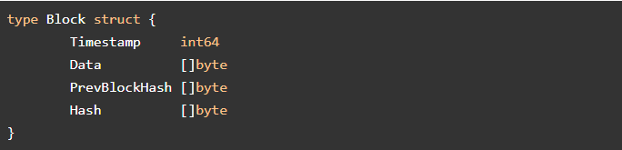

Εικόνα : Η δομή ενός μπλοκ.

Timestamp είναι ο ακριβής χρόνος που δημιουργήθηκε το μπλοκ. Data τα δεδομένα που περιέχει \(π.χ σε χρηματική αξία\). PrevBlockHash το Hash του προηγούμενου μπλοκ. Hash, το δικό του hash.

Το hash που θα αποδοθεί στο μπλοκ δημιουργείται με τον παρακάτω κώδικα για τον υπολογισμό κρυπτογράφησης SHA-256.

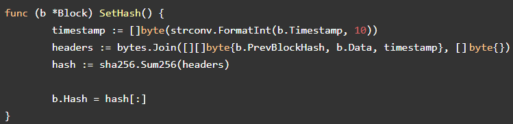

Εικόνα : Κωδικοποίηση με αλγόριθμο SHA-256.

Στη συνέχεια η Golang δημιουργεί το μπλοκ που κάναμε την δομή του με τον εξής κώδικα στο αρχείο του μπλοκ.

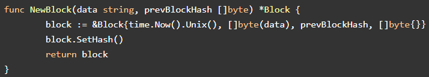

Εικόνα : Κώδικας δημιουργίας μπλοκ.

Μία αλυσίδα των μπλοκ είναι πολλά μπλοκ συνδεδεμένα μεταξύ τους. Για τη δέσμευση της δομής στην Golang χρησιμοποιούμε τον κώδικα:

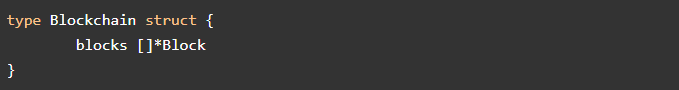

Εικόνα : Κώδικας δέσμευση μπλοκ στο αρχείο block.

Και προσθέτουμε τα στοιχεία του μπλοκ μέσα σε αυτή:

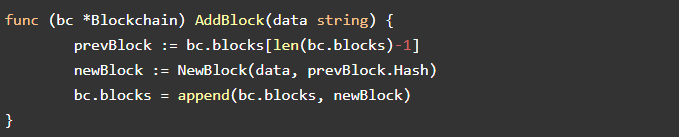

Εικόνα : Ανάθεση τιμών στα πεδία του μπλοκ.

Για να συνδέσουμε όμως το μπλοκ στην αλυσίδα μας πρέπει να υπάρχει ήδη ένα μπλοκ για να συνδεθεί το επόμενο μεταξύ του. Το πρώτο μπλοκ ονομάζεται Genesis block.

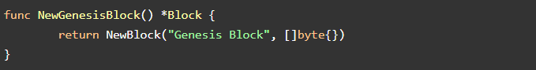

Εικόνα : Δημιουργία πρώτου μπλοκ στο αρχείο blockchain.

Για την επαλήθευση της λειτουργίας του τρέχουμε τη βασική συνάρτηση με τον εξής κώδικα:

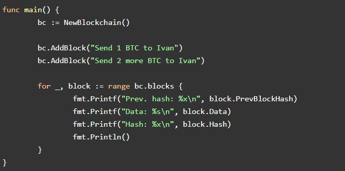

Εικόνα : Ο κώδικας της βασικής συνάρτησης.

Το επιθυμητό αποτέλεσμα πρέπει να είναι :

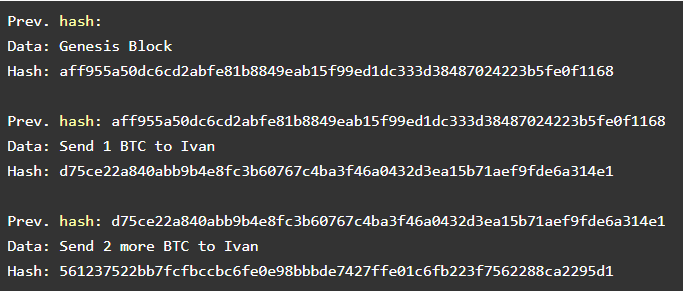

Εικόνα : Το αποτέλεσμα του προγράμματος.

Η δημιουργία της συγκεκριμένης αλυσίδας των μπλοκ είναι στην πιο απλή της μορφή. Οι αλυσίδες των μπλοκ μπορούν να υποστηρίξουν μεγάλες βάσεις δεδομένων, να επεξεργαστούν και να αποθηκευτούν οπουδήποτε επιθυμεί ο διαχειριστής. Στην περίπτωση που εξετάστηκε δεν υπάρχει αυτή η δυνατότητα όμως κάποιος αρχάριος χρήστης μπορεί να δημιουργήσει και να μελετήσει την προσωπική του αλυσίδα των μπλοκ. Ολόκληρος ο κώδικας βρίσκεται στην εξής ηλεκτρονική διεύθυνση: [https://github.com/nosequeldeebee/blockchain-tutorial](https://github.com/nosequeldeebee/blockchain-tutorial) . \(Kuznetsov, 2017; nosequeldeebee, 2019\)

## Bitcoin

Στο συγκεκριμένο κεφάλαιο θα επεξηγηθεί όλο το φάσμα του κρυπτονομίσματος Bitcoin. Είναι σημαντικό να αναφερθεί πως σαν Bitcoin Αναφερόμαστε το δίκτυο του και στην αλυσίδα των μπλοκ του. Σαν bitcoin στο κρυπτονόμισμα.

### Τι είναι το Bitcoin

Το Bitcoin είναι μία νέα μορφή χρημάτων αποτελούμενη από λογισμικό. Είναι το κρυπτονόμισμα που δίνετε στους εργάτες για την ολοκλήρωση ενός μπλοκ στην αλυσίδα των μπλοκ σαν αμοιβή.

” Είναι το πρώτο αποκεντρωμένο δίκτυο πληρωμών μεταξύ ομοτύπων\(peer-to-peer\) που λειτουργεί από τους χρήστες του χωρίς κεντρική αρχή οι μεσάζοντες”.\(bitcoin.com, 2017\) Τα νομίσματα δεν υπάρχουν σε υλική μορφή όπως το ευρώ και το δολάριο αλλά αποτελούνται από ένα ιδιωτικό κλειδί που προσδιορίζει τις συναλλαγές του χρήστη και υπολογίζει πόσο υπόλοιπο του αντιστοιχεί. ”Ένα τέτοιο κλειδί έχει τη μορφή 5JJgkVlv29gfafvCjva9zBtVapE8NerXWt9RTAv4ebbDX4E Και πρέπει να προστατευτεί πάση θυσία.\(Demartino, 2016\) Κλειδί αποθηκεύεται σε κάποιο λογισμικό πορτοφόλι\(wallet\) στο διαδίκτυο ή στον υπολογιστή ή στο κινητό του χρήστη ή σε κάποιο φυσικό πορτοφόλι με τη μορφή εκτύπωσης του.

### Η ιστορία των ηλεκτρονικών συναλλαγών

Το Bitcoin είναι ένα κρυπτονόμισμα που κατά κύριο λόγο οφείλει την ανάπτυξή του στην ευκολότερη, ασφαλέστερη και ανώνυμη αγορά προϊόντος από το διαδίκτυο. Η ανάγκη για διαδικτυακό εμπόριο δεν είναι κάτι νέο όπως στην περίπτωση του bitcoin. Η πρώτη αγοραπωλησία μέσω διαδικτυακού φαίνεται να ήταν το 1971 μεταξύ κάποιων φοιτητών του πανεπιστημίου MIT για την αγορά κάνναβης. Ωστόσο δεν καταγράφεται διότι ήταν παράνομη ενέργεια.

Η πρώτη νόμιμη αγοραπωλησία στο διαδίκτυο πραγματοποιήθηκε στις 11 Αυγούστου του 1994 από τον ιδρυτή του ιστότοπου “NetMarket, Νταν Κον. Η συναλλαγή αποτελούνταν από ένα CD των Sting με όνομα ”Ten Summoner’s Tales” στην τιμή των 12,48 δολαρίων συν τα μεταφορικά έξοδα μέχρι τη Φιλαδέλφεια της Αμερικής. Για την αποστολή του κωδικού της πιστωτικής κάρτας που εκτέλεσε την πληρωμή, για πρώτη φορά χρησιμοποιήθηκε λογισμικό κρυπτογράφησης για την ασφάλεια του.\(Fessenden, 2015\) Από κείνη τη στιγμή Ξεκίνησε μία επανάσταση που λίγοι την αντιλήφθηκαν. Σιγά-σιγά ο κόσμος συνειδητοποίησε πως οι αγορές μέσω διαδικτύου είναι εφικτές και όχι τόσο επικίνδυνος όσο πίστευαν. Ένα χρόνο αργότερα ,το 1995 εγκαινιάστηκαν οι ιστοχώροι amazon και e-bay.

Για τη χρήση του NetMark απαιτούνταν από τους χρήστες να χρησιμοποιήσουν ένα ειδικό λογισμικό κρυπτογράφησης PGP. Το PGP είναι μία τεχνολογία που επιτρέπει την επικοινωνία δύο χρηστών στο διαδίκτυο κρυπτογραφώντας το περιεχόμενο των δεδομένων που ανταλλάσσουν για την ιδιωτική και ασφαλή επικοινωνία.\(Demartino, 2016\) Ωστόσο με το πέρασμα του χρόνου οι κωδικοί των πιστωτικών καρτών έγιναν στόχος των κακόβουλων χρηστών και με επιθέσεις στην κεντρική βάση δεδομένων, που διατηρούσε ένας μεγάλος ιστότοπος τους κωδικούς των πιστωτικών καρτών των χρηστών.

Το 1983 ο Ντέιβιντ Τσάουμ Δημοσιεύει μία έρευνα με τίτλο “blind signatures for Untraceable payments” όπου σύμφωνα με αυτόν, τρία είναι τα βασικά χαρακτηριστικά για ένα σύστημα ηλεκτρονικών μέτρων όπου τελικά θα ενσωματωθούν στο πρώτο διαδικτυακό νόμισμα, το gigicash.

1. Αδυναμία τρίτων να προσδιορίσουν το δικαιούχο ,το ποσό ή το χρόνο των συναλλαγών κάποιου χρήστη.
2. Αδυναμία να παρέχονται αποδείξεις συναλλαγών ή ο προσδιορισμός των δικαιούχων υπό εξαιρετικές περιπτώσεις.
3. Αδυναμία να σταματήσει η χρήση πληρωμών που έχουν χαρακτηριστεί κι από τα μέσα ως κλεμμένες.\(Chaum, 2013\)

Ένας χρήστης ζητάει μία ψηφιακή μάρκα με μοναδικό χαρακτηριστικό κωδικό και μία προκαθορισμένη αξία. Ο χρήστης εισάγει σε αυτήν ένα σειριακό αριθμό που δεν είναι ορατός από την τράπεζα η υπογραφή τι μάρκα χωρίς να έχει τη δυνατότητα να δει τον κωδικό. Ο χρήστης αποκαλύπτει τον κωδικό πριν τον αποστείλει σε κάποιον έμπορο. Ο έμπορος θα πηγαίνει με τη μάρκα στην τράπεζα για να εξαργυρώσει το ποσό. Η τράπεζα θα ελέγχει αν ήταν έγκυρη η μάρκα ενός λογιστικού βιβλίου που αποθηκεύονται όλες οι μάρκες.\(Grig, 1999; Pitta, 2013\)

Το πρόβλημα που δημιουργείται είναι η δυνατότητα να χρησιμοποιήσει ο χρήστης επιτυχώς τη μάρκα δύο φορές αν καταφέρει να αγοράσει κάποιο προϊόν πριν εξαργυρώσει ο έμπορος στην ίδια μάρκα. Το 1990 digicash εμφανίζεται σαν εταιρεία και παρουσιάζει το eCash. Για την αντιμετώπιση της διπλής χρήσης της μάρκας πρότεινα κρυπτογραφούνται τα δεδομένα που στέλνει ο χρήστης στην τράπεζα. Ο έμπορος δεν θα μπορεί να δει τα στοιχεία, όμως σε περίπτωση που ξοδευόταν δεύτερη φορά η ίδια μάρκα, η δεύτερη μάρκα θα διαφοροποιηθεί ελαφρώς με αποτέλεσμα να βρεθεί ο ύποπτος από την τράπεζα. Όμως και αυτή η λύση δεν εξασφάλισε την περίπτωση υποκλοπής του λογαριασμού εκ μέρους της Τράπεζας. Έτσι αναγκάστηκε η Digicash να κινηθεί εντός των ορίων για να κερδίσει την εμπιστοσύνη τόσο των πολυεθνικών και τραπεζών αλλά και της Κυβέρνησης. Η ανωνυμία δεν ήταν πλέον ένα χαρακτηριστικό του eCash και όλες οι συναλλαγές θα ήταν ανιχνεύσιμες.

Η ανωνυμία εκείνη την περίοδο ερχόταν δεύτερη αφού προτεραιότητα είχε η σωστή λειτουργία του eCash που δεν μπορούσε να εφαρμοστεί χωρίς την υποστήριξη των τραπεζών και της Κυβέρνησης. Η μη-ανωνυμότητα στην κοινότητα του Bitcoin είναι απαγορευμένη έννοια, ωστόσο το μεγαλύτερο πρόβλημα που δεν ξεπέρασε το eCash ήταν η συγκεντρωτική του φύση σε αντίθεση με την αποκεντρωτική φύση της Bitcoin αλυσίδας των μπλοκ. Έτσι το 1998 η Digicash υπέβαλε αίτηση πτώχευσης.

Το 1995 ο Ντάγκλας Τζάξον εμπνευσμένος από το χρυσό παρουσίασε το e-Golg. Το e-Gold ήταν ένα διεθνές νόμισμα που θα κυκλοφορούσε ανεξάρτητα από κυβερνητικό έλεγχο και δεν θα επηρεαζόταν από τις διακυμάνσεις της αγοράς όπως τα συμβατικά χρήματα.Έπειτα από ενοχή του Ντάγκλας Τζάξον σε κατηγορία ξεπλύματος χρημάτων, αλλά και την ανώνυμη χρήση του E-golg σε παράνομες ενέργειες όπως ξέπλυμα χρήματος, διαδικτυακές απάτες αλλά και πληρωμή λίτρων με το συγκεκριμένο νόμισμα, ο ιδιοκτήτης του αποφάσισε να συνεργαστεί με τις αρχές και να διαθέσει όλα τα ονόματα των χρηστών του νομίσματος στις αρμόδιες υπηρεσίες. Οι αρμόδιες υπηρεσίες δεν δέχτηκαν καμία συνεργασία μαζί του και παράλληλα οι χρήστες συνειδητοποίησαν ότι δεν είναι τελικά τόσο ανώνυμος όσο πίστευαν. Τα παραπάνω συμβάντα είχαν ως αποτέλεσμα Την τελευταία πνοή του νομίσματος το 2009.\(Demartino, 2016; e-gold, 2009\)

Το 2005 ο Νικ Σζάμπο δημοσίευσε τη δική του πρόταση για διαδικτυακό νόμισμα στην οποία έκανε τροποποιήσεις μέχρι το Δεκέμβριο του 2008.\(Κυρίτσης, 2019\) Το bit gold δεν δημιουργήθηκε ποτέ αλλά ενσωμάτωνε όλα τα βασικά χαρακτηριστικά του Bitcoin πλην την ανωνυμία.\(Szabo, 2008\) Η ιδέα ήταν πως η αξία των συμβατικών χρημάτων βασίζεται στην εμπιστοσύνη που έχουμε στις τράπεζες και στην κυβέρνηση. Από την αντίθετη μεριά τα σπάνια μέταλλα όπως ο χρυσός ή τα συλλεκτικά αντικείμενα δεν χάνουν την αξία τους με την πάροδο του χρόνου ή με κακουχίες λόγω της σπανιότητας τους. Όμως η χρήση των μετάλλων και των αντικειμένων δεν είναι εφικτή σε διαδικτυακές συναλλαγές. Η πρόταση του Σζάμπο ήταν το bit gold που θα αντιπροσώπευε τη σπανιότητα του χρυσού αφού θα μπορούσε να το παράγει ο καθένας για ένα συγκεκριμένο αριθμό στο γενικό πληθυσμό του.

Η τεχνολογία που βοήθησε στην πραγμάτωση της σπανιότητας και της ασφαλής αλληλεπίδρασης των κόμβων του δικτύου, την εφάρμοσε πρώτα ο Σζάμπο και την υλοποίησε ο Σατόσι Νακαμότο. Ονομάζεται απόδειξη εργασίας\(Proof-of-Work\) και έχει εφαρμογή στην αλυσίδα των μπλοκ. Μία ακόμη διαφορά του bit gold από το την αλυσίδα των μπλοκ είναι ότι το bit gold χρησιμοποιούσε τον αριθμό των συμμετεχόντων αντί για την υπολογιστική ισχύ όπως στην περίπτωση της αλυσίδας των μπλοκ, με αποτέλεσμα να είναι ευάλωτο το δίκτυο σε επιθέσεις 51% που αναφέρθηκαν στο προηγούμενο κεφάλαιο.

Το 1998 ο Βάι Ντάι σε μία λίστα αλληλογραφίας το cypherpunk πρότεινε τη λύση του hashcash που θα είχε εφαρμογή στην πρότασή του για τη δημιουργία ηλεκτρονικών νομισμάτων με όνομα b-money, για την εξασφάλιση της σπανιότητας του\(FRANKENFIELD, 2019\) η οποία προφανώς επηρέασε το Σζάμπο.\(Aaron van Wirdum, 2018; Demartino, 2016\)

“Όταν προσθέσουμε την κρυπτογράφηση του PGP, των μαρκών του digicash και την ιδέα του B-money σχετικά με τη χρήση των της υπολογιστικής δύναμης του κεντρικού επεξεργαστή που απαιτείται για να ολοκληρωθεί το hashcask ώστε να επιτευχθεί η σπανιότητα, τότε θα δούμε ότι φτάνουμε σε ένα είδος κρυπτονομίσματος παρόμοιο του Bitcoin”\(Demartino, 2016\)

Στις 31 Οκτωβρίου του 2008 o Σατόσι Νακαμότο δημοσιεύει μία διατριβή με όνομα “Bitcoin: A Peer-to-Peer Electronic Cash System” Ενώ σχεδόν όλοι την αποκαλούν “white paper” ή λευκή βίβλο, η οποία περιέγραψε την Bitcoin αλυσίδα των μπλοκ και το bitcoin.\(Nakamoto, 2008\) Δεν πρόκειται για κάποιο φυσικό πρόσωπο, αλλά για ψευδώνυμο. Η κοινότητα και τα μέσα ολοένα προσπαθούν να ταυτίσουν ανθρώπους ή ομάδες ανθρώπων για να μάθουν ποιος ή ποιοι κρύβονται πίσω από αυτό.

Ο Νικ Σζάμπο θεωρείται κύριος ύποπτος διότι πριν από τη δημοσίευση της λευκής βίβλου, δημοσίευση σχεδόν ίδιες ιδέες με αυτήν. Επίσης φαίνεται πως η λευκή βίβλος διόρθωσε τεχνικά προβλήματα των προηγούμενων δημοσιεύσεων του Σζάμπο. Ο Χαλ Φινέι είναι ένας κρυπτογράφος που εφηύρε την επαναχρησιμοποίηση απόδειξη εργασίας\(RPoW, Reusable proofs of work\).Στην πρώτη συναλλαγή με Bitcoin ο Χαλ ήταν αποδέκτης.\(Satoshi Nakamoto Institute, 2014\) Οι κύριοι υποψήφιοι για το γρίφο που κρύβεται πίσω από το όνομα Σατόσι Νακαμότο είναι ο Σζάμπο, Χαλ Φινέι και ο Βάι Ντάι ή ομάδα που συμμετείχαν αυτοί. Φυσικά έχουν αρνηθεί όλοι ότι είναι ο αληθινός Σατόσι Νακαμότο.

Λίγο καιρό αργότερα από τη δημοσίευση της λευκής βίβλου, στις 3 Ιανουαρίου 2009, εγκαταστάθηκε το Genesis block, το πρώτο μπλοκ της αλυσίδας Bitcoin και εννέα μέρες αργότερα πραγματοποιήθηκε η πρώτη συναλλαγή από τον Σατόσι Νακαμότο στον Χαλ Φινέι. Στις 5 Οκτωβρίου 2009 ορίστηκε πρώτη φορά η ισοτιμία bitcoin-δολαρίου, με ένα δολάριο αγόραζε ο χρήστης 1.309,03 bitcoins.\(MARIO, 2014\)

Στις 18 Μαΐου 2010, στον ιστότοπο “bitcointalk forum” ένας χρήστης με όνομα “laszlo”,σε μία δημοσίευση του ζήτησε από την κοινότητα να του παραγγείλει ή να μαγειρέψει και να του στείλει σπίτι του δύο μεγάλες πίτσες έναντι 10.000 bitcoins. Επισήμανε ότι του αρέσουν τα κρεμμύδια, οι πιπεριές, τα λουκάνικα, τα μανιτάρια, οι ντομάτες, το πεπερόνι και θα ήθελε κανονικό τυρί στην πίτσα τους.\(laszlo, 2010\) Τέσσερις μέρες αργότερα συνέβη η πρώτη νόμιμη συναλλαγή bitcoin έναντι φυσικού αγαθού, αυτή μέρα ονομάστηκε χαϊδευτικά η μέρα της πίτσας. Στις 22 Μαΐου 2010, ο χρήστης “Jercos” ανταποκρίθηκε στην προσφορά του “laszlo” και απέστειλε στο σπίτι του δύο μεγάλες πίτσες από την πιτσαρία “Papa John’s pizzas”.Εκείνη τη μέρα, 10.000 bitcoin άξιζαν 41 δολάρια, ενώ ο “Jercos” πλήρωσε 25 δολάρια για τις πίτσες.\(Hankin, 2019\)

Τον Ιούλιο του 2010, στο Τόκιο της Ιαπωνίας ιδρύθηκε το πρώτο ανταλλακτήριο bitcoin, το MtGox. Σε αυτό οι χρήστες του Bitcoin πραγματοποιήσουν γρήγορες συναλλαγές ,εκτοξεύοντας την τιμή του Bitcoin στα 0.06 δολάρια. Το όνομα δημιουργήθηκε από το ακρώνυμο ”Magic : The Gathering Online Exchange” και πριν των συναλλαγών bitcoin ήταν ανταλλακτήριο καρτών του παιχνιδιού “Magic the Gathering”.\(Demartino, 2016; Frankenfield, 2019\) Στις 9 Φεβρουαρίου 2011, το Bitcoin εξισώθηκε με το δολάριο, προκαλώντας αυξημένο ενδιαφέρον των μέσων μαζικής ενημέρωσης. Το αποτέλεσμα ήταν η προσέλκυση πολλών νέων χρηστών.\(Demartino, 2016\)

Την 26η Ιουλίου, το μπαρ “Room 77” στο Βερολίνο της Γερμανίας γίνεται το πρώτο φυσικό κατάστημα που δέχεται bitcoins ως μέσο πληρωμής.\(Kallgren, 2014\)

Από τότε ως σήμερα έγινε αποδεκτό από πολλούς ανθρώπους, κερδίζοντας την εμπιστοσύνη πολλών μεγάλων πολυεθνικών επιχειρήσεων. Επίσης μικρές επιχειρήσεις υιοθέτησαν τον τρόπο πληρωμής με bitcoin και με άλλα κρυπτονομίσματα. Πλέον είναι ένα δεδομένο κρυπτονόμισμα που συνέχεια τα Μέσα Μαζικής Ενημέρωσης αναφέρονται σε αυτό. Σε αντίθεση με τις προηγούμενες προτάσεις ηλεκτρικού νομίσματος, το Bitcoin κατάφερε να ορθοστατήσει από τα σκάνδαλα και τις υποκλοπές που υπέστησαν σε αυτό.Χάρη στην αξιοπιστία της τεχνολογίας της Bitcoin αλυσίδα των μπλοκ, στάθηκε ακέραιο με σχετική ευκολία και διατήρησε τη φήμη και την εμπιστοσύνη της κοινότητας.

### Φορείς που το ελέγχουν

Λόγω της μεγάλης έκτασης της δημοσιότητας που απέκτησε το Bitcoin, υπάρχουν εσφαλμένες αντιλήψεις και παρανοήσεις για το ποιος το ελέγχει. Τα Μέσα Μαζικής Ενημέρωσης ευθύνονται σε μεγάλο ποσοστό σε αυτό. Η αλήθεια είναι πως κανένα συγκεκριμένα δεν ελέγχει και δεν διοικεί το Bitcoin .Η ύπαρξη του δεν εξαρτάται από κανέναν οργανισμό και κανείς δεν είναι διευθυντής του.

Ο Σατόσι Νακαμότο ήταν ο ιδρυτής του αυτός δημιούργησε τον κώδικα με σκοπό να είναι ανεξάρτητο από όλους τους φορείς. Οπότε είναι εύλογο να χαρακτηριστεί πώς αυτός είναι ο διαχειριστής του Bitcoin. Ωστόσο δεν σημαίνει πως είναι διαχειριστής τον πάντων. Υπάρχουν άνθρωποι ή ομάδες ανθρώπων που συμβάλλουν σε αυτό με πολύ σημαντικό ρόλο. Οι χρήστες του Bitcoin είναι η βασικότερη συντεταγμένη αφού χωρίς αυτούς θα ήταν ένα σύστημα στον αέρα, χωρίς λόγο ύπαρξης. Στην ίδια κατηγορία εντάσσονται και οι εταιρίες-ιστοσελίδες που παρέχουν υπηρεσίες μέσω Bitcoin με αποτέλεσμα την πραγματοποίηση εμπορίου. Οι εξόριστες, οι προγραμματιστές και οι άνθρωποι που πληρώνουν τους προγραμματιστές έχουν ένα λόγο στη διαχείριση του. Οι προγραμματιστές πρέπει να πληρωθούν για τη συντήρηση και αναβάθμιση του κώδικα. Επενδυτές οι ομάδες επενδυτών ή δωρεές είναι αυτοί που χρηματοδοτούν τους προγραμματιστές. Την μεγαλύτερη εξουσία όμως τη διαθέτει η κοινότητα. Οι άνθρωποι δηλαδή που χρησιμοποιούν το Bitcoin, οι επενδυτές, οι χρήστες κάνουν συναλλαγές.

Φαίνεται Λοιπόν πως η κοινότητα διαθέτει την περισσότερη δύναμη σχετικά με το που θα δώσει την ψήφο της, εφόσον άμα κάτι δεν της αρέσει επιλέγει να αποχωρήσει από την Bitcoin αλυσίδα των μπλοκ και να προβεί σε κάποια άλλη κάποιου εναλλακτικού κρυπτονομίσματος. Οι συνέπειες θα είναι να αποδυναμωθεί το δίκτυο και οι εξορύκτες να αρχίσουν να εγκαταλείπουν σιγά-σιγά με αποτέλεσμα την ολική κατάρρευση του δικτύου. Όμως η δύναμή τους φτάνει μέχρι εκεί, μπορεί να ψηφίζουν πράγματα με τη συμμετοχή τους, όμως οι προγραμματιστές είναι αυτοί που θα υλοποιήσουν αυτές τις αλλαγές. Το μόνο σίγουρο είναι πως καμία εταιρεία, επιχείρηση ή οργανισμός, κράτος, κυβέρνηση ή τράπεζα δεν ελέγχει τη λειτουργία της αλυσίδας των μπλοκ και κανείς δεν έχει το ρόλο του διαχειριστή ή του αφεντικού.\(Demartino, 2016\)

### Υπολογισμός της αξίας

Η αξία που έχει ένα κρυπτονόμισμα Bitcoin δεν είναι σταθερή. Η τιμή του, λεπτό με το λεπτό εναλλάσσεται και είναι πάρα πολλές οι φορές που η τιμή του εκτοξεύτηκε στα ύψη ή που έπεσε αισθητά. Αυτές τις προσαυξήσεις τις προκαλούν η ζήτηση των χρηστών. Αξία στο κρυπτονόμισμα bitcoin δίνει η χρησιμότητα του και η σπανιότητα του. Χωρίς τη χρησιμότητα του όλα καταρρέουν. Επίσης πολλοί είναι αυτοί που παρομοιάζουν το bitcoin με τον χρυσό. Ότι κι αν συμβεί ο αριθμός των Bitcoin που θα δημιουργηθούν με την εξόρυξη δεν θα ξεπεράσουν τα 21 εκατομμύρια.\(Demartino, 2016\) Περίπου κάθε τέσσερα χρόνια ο αριθμός bitcoins που παράγεται από την ολοκλήρωση ενός μπλοκ διαιρείται στην μέση, μέχρι τον τελικός αριθμός των συνολικών bitcoins που θα είναι 21 εκατομμύρια όπου και θα σταματήσει .\(Barone, 2019\)

Στις 18 Δεκεμβρίου 2017, είχε τη μεγαλύτερη αξία ένα bitcoin κόστιζε 18.733,60 δολάρια \(16.967,84 ευρώ\).Μέχρι τις 14 Δεκεμβρίου 2018, η αξία του ολοένα έπεφτε φτάνοντας τα 3.318,62 δολάρια το ένα \(3.005,18 ευρώ\). Σήμερα, 14 Οκτωβρίου 2019, το ένα bitcoin κοστίζει 8.374,04 δολάρια \(7.583,12 ευρώ\),φτάνοντας συνολική αξία 150.666.398.945 δολάρια \(136.436.047.667 ευρώ\). \(CoinMarketCap, 2019\)

### Ποια η χρησιμότητά του

Σε προηγούμενο υποκεφάλαιο Αναφέρθηκε πως η αξία του bitcoin προκύπτει από τη χρησιμότητά του.Σε αυτό το κεφάλαιο αναφέρονται μερικοί από τους λόγους για την απόκτηση και χρήση bitcoin.

Το μεγαλύτερο προνόμιο του Bitcoin είναι η ανωνυμία του. Κάποιος χρήστης έχει το δικαίωμα να αγοράσει αγαθά ή υπηρεσίες χωρίς να ταυτοποιηθεί. Πολλοί χρήστες αποκτούν ντροπιαστικά αγαθά εξαιτίας αυτής της δυνατότητας, όμως οι περισσότεροι το εκμεταλλεύτηκαν και το χρησιμοποίησαν για την αγορά παράνομων αγαθών ή δραστηριοτήτων. Επίσης παρέχει εύκολο τρόπο στους χρήστες που επιθυμούν να επενδύσουν σε ασφάλειες, μετοχές, πολύτιμες ύλες, ακόμη και σε εναλλακτικά κρυπτονομίσματα χωρίς την προμήθεια και το ψηλό κόστος εγγραφής που είναι συνήθως η παραδοσιακή μέθοδος επενδύσεις σε αυτούς τους τομείς.\(Demartino, 2016\)

Μεγάλο ποσοστό χρηστών του Bitcoin είναι οικονομικοί μετανάστες, κυρίως από χώρες του τρίτου κόσμου που θέλουν να αποστείλουν κάποια χρήματα στις οικογένειές τους.Με τη χρήση Bitcoin όχι μόνο παρακάμπτουν μεσάζοντες εταιρείες μεταφορών χρημάτων, αλλά το ποσό που θα αποσταλεί θα φτάσει ολόκληρο στον προορισμό του, σε αντίθεση με την παραδοσιακή μέθοδο που ένας μεσάζοντας θα πληρωνόταν με ένα ποσό 30% του ολοκλήρου. Τα bitcoins αποστέλλονται σε κάποια λεπτά αντί σε εβδομάδες ή και μήνες. Ο παραλήπτης δεν έχει να κάνει τίποτα, παρά να επισκεφτεί ένα bitcoin ATM και να πάρει τα λεφτά του στο τοπικό του νόμισμα. Η προμήθεια που θα κρατήσει το σύστημα είναι περίπου 0,02 δολάρια για οποιαδήποτε συναλλαγή.\(Demartino, 2016\)

Αυξάνεται ο αριθμός των υπηρεσιών που δέχονται bitcoins ως μέσο πληρωμής. Ένας κάτοχος bitcoin μπορεί να αγοράσει οτιδήποτε επιθυμεί με bitcoin. Πλέον με bitcoins γίνονται αγορές ακριβών και πολυτελών αγαθών για το λόγω της μεγάλης αξίας του κρυπτονομίσματος, χωρίς όμως αυτό να είναι αναγκαίο. Η αγορά φθηνότερων καθημερινών αγαθών, συνήθως γίνεται με εναλλακτικά νομίσματα, αλλά είναι εφικτό και με bitcoins.

Οι παραπάνω χρήσεις αφορούν οικονομικές ενέργειες. ωστόσο η αλυσίδα των μπλοκ μπορεί να υποστηρίξει διάφορες μη-οικονομικές ενέργειες. Είναι εφικτό να αποθηκεύονται έγγραφα με ασφαλή-κρυπτογραφικό τρόπο στην αλυσίδα. Οποιοδήποτε έγγραφο μπορεί να ψηφιοποιηθεί και να αποθηκευτεί κρυπτογραφημένο στην αλυσίδα. Περιουσιακά στοιχεία, συναλλαγές και η αξία των ακινήτων, μπορούν να αποθηκευτούν στην αλυσίδα, μειώνοντας το κόστος και το χρόνο και παρέχοντας διαφάνεια μεταξύ των ανθρώπων που εκτελούν τη συναλλαγή. \(Hackernoon, 2018\)

Το “IBM Food Trust” χρησιμοποιεί την τεχνολογία μιας αλυσίδας των μπλοκ για να παρακολουθεί τα τρόφιμα από τη στιγμή που βρίσκονται στο αγρόκτημα μέχρι να φτάσουν στα ράφια των σούπερ-μάρκετ, για τη διευκόλυνση στον εντοπισμό σε περίπτωση μόλυνσης των τροφίμων.\(IBM, 2019\)

Ψήφοι χρηστών σε μία ψηφοφορία μπορούν να αποθηκευτούν σε μία αλυσίδα. Είναι ένας αποτελεσματικός τρόπος εξάλειψης των απατών και των λαθών εφόσον τα πάντα στην αλυσίδα είναι διάφανα και τίποτα δεν μπορεί να διαγραφεί από τη στιγμή που ενσωματωθεί σε αυτή.\(Hackernoon, 2018b\)

Μία αλυσίδα των μπλοκ έχει πάρα πολλές εφαρμογές. Η επικρατέστερη και η πιο διαδεδομένη έως σήμερα είναι τα κρυπτονομίσματα. Στην περίπτωση της Bitcoin αλυσίδα των μπλοκ είναι το bitcoin. Οι περισσότερες εφαρμογές της, διευκολύνουν την καθημερινότητα κάποιων χρηστών. Πρόκειται για οικονομικές εφαρμογές, όμως σιγά-σιγά αρχίζουν μη-οικονομικές εφαρμογές να γίνονται δημοφιλείς, αποδεικνύοντας πόσο δυνατή τεχνολογία είναι η αλυσίδα των μπλοκ και ίσως είναι η τεχνολογία που θα αλλάξει το μέλλον.

### Αγορά, αποθήκευση και εξαργύρωση

Στο προηγούμενο κεφάλαιο εξηγήθηκε πώς ένας τρόπος για να αποκτήσει ο χρήστης bitcoins, είναι με τη διαδικασία της εξόρυξης κάτι που είναι εξαιρετικά δύσκολο και απαιτεί μεγάλο χρηματικό ποσό. Ένας τρόπος για να επενδύσει κάποιος στο bitcoin είναι απλά η αγορά του.

Αγορά γίνεται από οποιονδήποτε επιθυμεί να πουλήσει, προϋποθέτοντας ότι υπάρχει αγοραστής. Ένας χρήστης μπορεί να αγοράσει απευθείας από κάποιον άλλο χρήστη. Το πρόβλημα είναι πως δεν μπορεί κάποιος να ξέρει ποιος είναι πρόθυμος να πουλήσει κάποια bitcoins ώστε να του κάνει προσφορά. Ο πιο διαδεδομένος τρόπος είναι να αγοράσει από κάποιο διαδικτυακό ανταλλακτήριο. Ανταλλακτήρια είναι ένας ψηφιακός χώρος που οι χρήστες του bitcoin και κάποιων εναλλακτικών κρυπτονομισμάτων κάνουν αγοραπωλησίες. Τα πιο γνωστά είναι το coinbase.com και το binance.com. Για τη χρήση τους απαιτείται ιδιωτικός λογαριασμός και να συμφωνήσει ο χρήστης με κάποιους κανόνες που αποδεικνύουν την αληθινή ταυτότητα του χρήστη για την ασφάλεια των συναλλαγών και τη διατήρηση των χρημάτων. Κανόνες όπως η Know-Your-Customer\(KYC\) και Anti-Money Laundering\(AML\), αναγκάζουν τον χρήστη να αποστείλει σκαναρισμένα κάποια προσωπικά του έγγραφα όπως την ταυτότητα του ή ένα έγγραφο απόδειξης διεύθυνσης κατοικίας για την ταυτοποίηση του.\(Coinbase, 2019; Coinbase, 2020\) Στη συνέχεια πρέπει να τοποθετηθεί μία πιστωτική ή χρεωστική κάρτα τραπέζης στο ίδιο όνομα που δημιούργησε το λογαριασμό. Είναι όλα έτοιμα για την πρώτη αγορά bitcoin. Αυτό σημαίνει πως το ιδιωτικό κλειδί που αποδεικνύει την αγορά, φυλάσσεται από το εκάστοτε ανταλλακτήριο και έχει κάθε δικαίωμα να κλειδώσει τον λογαριασμό του χρήστη με αποτέλεσμα να χαθούν τα bitcoin του. Κάτι τέτοιο όμως θα συμβεί σε περίπτωση επίθεσης ή αν αντιμετωπίσει πρόβλημα ρευστότητας.\(Demartino, 2016\).

Παρόλα αυτά πολλοί χρήστες εμπιστεύονται τα ανταλλακτήρια και αποθηκεύουν στα διαδικτυακά πορτοφόλια τα bitcoin τους .Τα διαδικτυακά πορτοφόλια παρέχουν ευκολία στον χρήστη. Διαθέτουν φιλικό περιβάλλον προς αυτό, ενώ υπάρχει δυνατότητα διαχείρισης του κεφαλαίου τους από τον ηλεκτρονικό υπολογιστή τους ή από το κινητό με χρήση της εφαρμογής που διαθέτει το ανταλλακτήριο. Το μειονέκτημα είναι, οι θυσίες που κάνουν οι χρήστες στα προσωπικά τους δεδομένα και ο κίνδυνος να χαθούν τα bitcoins τους διότι τα διαχειρίζεται κάποιος τρίτος και ο κίνδυνος να κλαπούν από κάποιο κακόβουλο χρήστη, είναι πραγματικότητα. Τα μεγάλα ανταλλακτήρια χρησιμοποιούν πιστοποίηση δύο παραγόντων. Έναν προσωπικό κωδικό και κάτι επιπλέον. Συνήθως αποστέλλουν ένα κωδικό στο χρήστη με μήνυμα στο κινητό του ή στο ηλεκτρονικό ταχυδρομείο και ζητάει να συμπληρωθεί στη φόρμα εισόδου.Ο πιο ασφαλής τρόπος είναι η χρήση του “Google authenticator” στο κινητό. Πρόκειται για μία εφαρμογή που παράγει αυτόματα κωδικούς ταυτοποίησης για συγκεκριμένες ιστοσελίδες που επιθυμεί ο χρήστης και λειτουργεί ακριβώς με τον ίδιο τρόπο που λειτουργούν οι κωδικοί στο ηλεκτρονικό ταχυδρομείο ή στο κινητό.\(CryptoPro, 2019\)

Αν κάποιος χρήστης επιθυμεί να τοποθετήσει τα χρήματα του κάπου αλλού και όχι στο διαδικτυακό πορτοφόλι τότε έχει κάποιες επιλογές. Μία από αυτές είναι να αποθηκεύονται τα Bitcoin σε τοπικό πορτοφόλι\(Desktop-Wallet\).Στα συγκεκριμένα πορτοφόλια φυλάσσονται τα κλειδιά σε μία εφαρμογή που εκτελείται στον προσωπικό υπολογιστή. Αν η εφαρμογή χρησιμοποιεί διαδίκτυο τότε είναι ένα ζεστό τοπικό πορτοφόλι ενώ σε διαφορετική περίπτωση κρύο τοπικό πορτοφόλι. Είναι ασφαλής από απειλές κακόβουλου λογισμικού και ιούς. Επίσης τα κλειδιά δεν τα διαχειρίζεται κάποιος τρίτος. Η ανάκτηση του κλειδιού είναι πιθανή εφόσον συμπληρώσετε σωστά τη δοκιμασία που θα ζητηθεί για την ανάκτηση του.\(CryptoPro, 2019\)

Μία ακόμα επιλογή είναι το υλυσμικό πορτοφόλι \(hardware wallet\).Πρόκειται για συσκευές που συνδέονται στη θύρα USB του ηλεκτρονικού υπολογιστή και χειρίζονται τα κλειδιά. Μία συσκευή υλισμού κοστίζει μεταξύ 70-150 δολάρια αλλά προσφέρει μεγάλη ασφάλεια.Τα πιο δημοφιλή πορτοφόλια υλισμού είναι το “ledger Nano S” και “Trezor”. \(Agrawal, 2018\)

Το πιο ασφαλές πορτοφόλι είναι το xάρτινο\(apper wallet\).Πρόκειται για ένα κομμάτι χαρτί που περιέχει τον ιδιωτικό κωδικό και το δημόσιο κλειδί μαζί. Είναι ένα χωρίς σύνδεση ψυχρό πορτοφόλι. Στο χαρτί τυπώνονται τα κλειδιά με τη μορφή QR barcode. Ο χρήστης μπορεί να αντιγράψει τους κωδικούς σε κάποιο σημείο και στη συνέχεια να διαγράψει μόνιμα το πρότυπο χαρτί για λόγους ασφαλείας. Υπάρχουν ιστοσελίδες οι οποίες αναλαμβάνουν να δημιουργήσουν τυχαίους κωδικούς, χρησιμοποιώντας τυχαία στίγματα από τον κέρσορα του ποντικιού. Στη συνέχεια ο χρήστης πρέπει να στείλει το επιθυμητό ποσό σε κρυπτονόμισμα στη δημόσια διεύθυνση που παράχθηκε και εκτυπώθηκε στο χάρτινο πορτοφόλι και τέλος να το αποθηκεύσει σε ασφαλές μέρος. Θεωρείται ο ασφαλέστερος τρόπος διαφύλαξης bitcoin διότι είναι πλήρης εκτός σύνδεσης και δεν έχει τη δυνατότητα κάποιος κακόβουλος χρήστης να τα κλέψει. Φυσικά όμως υπάρχει περίπτωση να κλαπούν από κάποιο φυσικό κλέφτη που λήστεψε το σπίτι του χρήστη. Ο χρήστης πρέπει να σκεφτεί όλες τις πιθανές συντεταγμένες έτσι ώστε να τα προφυλάξει και να το κρύψει με τον πιθανότερο αποτελεσματικότερο τρόπο. Πρέπει να σκεφτεί αν φθαρεί σε περίπτωση πλημμύρας ή τι θα κάνεις σε περίπτωση φωτιάς. Οι μελλοντικοί κακοποιοί δεν θα στοχεύουν μόνο χρυσαφικά και χρήματα όταν ληστεύουν ένα σπίτι, αλλά θα ψάχνουν και για χάρτινα πορτοφόλια. Όταν επιθυμήσει ο χρήστης να εξοφλήσει την αποθηκευμένη αξία πληκτρολογεί τις πληροφορίες του ιδιωτικού κλειδιού και σαρώνει τον κωδικό QR. \(Agrawal, 2017\)

Ο πιο εύκολος τρόπος και παράλληλα αρκετά ασφαλής διότι τυπώνει bitcoin απευθείας σε χάρτινο πορτοφόλι είναι να προβεί ο χρήστης σε κάποιο bitcoin ATM. Όπως και στα συμβατικά ATM της τράπεζας, μπορεί κάποιος να πάει στο κοντινότερο ATM bitcoin και να αγοράσει μερικά bitcoins με συμβατικά χρήματα ή την πιστωτική του κάρτα. Στην ιστοσελίδα [https://coinatmradar.com/country/83/bitcoin-atm-greece/](https://coinatmradar.com/country/83/bitcoin-atm-greece/) υπάρχει χάρτης που απεικονίζει τα Bitcoin ATM που υπάρχουν στην Ελλάδα. Το πρώτο Bitcoin ATM λειτούργησε στην Αθήνα στο Κουκάκι το οποίο δημιουργήθηκε από Έλληνες και δεν ανήκει σε καμία τράπεζα. Για την Αγορά bitcoin αξίας 20 ευρώ ο χρήστης πρέπει να δημιουργήσει το χάρτινο πορτοφόλι του που το εκτυπώνει αυτόματα το μηχάνημα. Στη συνέχεια τοποθετεί το χαρτονόμισμα των 20 ευρώ στην ειδική υποδοχή του μηχανήματος και τέλος σαρώνει το δημόσιο κλειδί που είναι εκτυπωμένο στο χάρτινο πορτοφόλι, στην ειδική θέση του μηχανήματος. Για την πώληση του, το Bitcoin ATM παράγει αυτόματα έναν QR-code κωδικό ο οποίος πρέπει να σαρώθει από τον χρήστη με το κινητό του αφού πρώτα επιλέξει το ποσό που επιθυμεί να πουλήσει. Στη συνέχεια τοποθετεί το χάρτινο πορτοφόλι στον ειδικό σαρωτή του Bitcoin ATM και το χαρτονόμισμα των 20 ευρώ δίνεται στο χρήστη.\(Bcash, 2020; Αργείτη et al., 2019\) Για την εξαργύρωση των bitcoin, ο χρήστης μπορεί να χρησιμοποιήσει ένα πορτοφόλι συνδεδεμένος στο διαδίκτυο και να πουλήσεις στο ανταλλακτήριο το διαθέσιμο ποσό bitcoin που επιθυμεί και να μεταφερθούν τα χρήματα απευθείας στον τραπεζικό λογαριασμό που είναι συνδεδεμένος με το πορτοφόλι του.

Στην περίπτωση που ο χρήστης βρίσκεται σε χώρα που η χρήση διαδικτύου είναι περιορισμένη ή δεν επιτρέπονται οι τραπεζικές κινήσεις αγοραπωλησιών κρυπτονομισμάτων, τότε ο ευκολότερος τρόπος είναι να πουλήσει κρυπτονομίσματα σε κάποιο Bitcoin ATM. Φυσικά κάποιος χρήστης μπορεί να πουλήσει κρυπτονομίσματα σε κάποιον άλλον χρήστη χωρίς να μεσολαβήσει κάποιος τρίτος. Μπορεί απλούστατα να μεταβιβάσει το ποσό και να πληρωθεί σε χρήματα, εξάλλου το μεγαλύτερο προνόμιο των κρυπτονομισμάτων είναι η ανεξαρτητοποίηση από μεσάζοντες.

### Αναγκαιότητα της ανωνυμίας

Ένα από τα κυριότερα οφέλη της χρήσης κρυπτονομισμάτων είναι η ανωνυμία. Πολλοί χρήστες χρησιμοποιούν bitcoin αποκλειστικά για να μένουν ανώνυμοι στις αγορές τους. Συνεπώς η διατήρηση της, έχει ζωτική σημασία για το σύστημα και πρέπει να διαφυλαχθεί.

Πολλές φορές αναφέρεται πως ένα bitcoin είναι ανώνυμο όμως κάθε πορτοφόλι διαθέτει αποκλειστικό ιδιωτικό και δημόσιο κλειδί. Ο πιο σωστός χαρακτηρισμός θα ήταν να αποκαλείται ψευδώνυμο. Ωστόσο από τη στιγμή που ο χρήστης δεν εργάζεται για την Bitcoin αλυσίδα των μπλοκ και δεν γνωρίζει κάποιον προσωπικά να του πουλήσει κρυπτονομίσματα, αναγκάζεται να χρησιμοποιήσει κάποιο ανταλλακτήριο. Με αυτό τον τρόπο αποκαλύπτεται πλήρως η ταυτότητα του εφόσον στέλνει προσωπικά έγγραφα στο ανταλλακτήριο και συνδέει τον τραπεζικό του λογαριασμό με αυτό.

Η δομή του Bitcoin δεν επιτρέπει να εντοπιστούν τα κρυπτονομίσματα εφόσον δεν διαθέτουν κάποιο αναγνωριστικό. Αυτό Πού εντοπίζεται είναι οι συναλλαγές. Ο χρήστης πρέπει να αποκρύψει τις συναλλαγές του αν επιθυμεί να είναι ανώνυμες. Πολύ γνωστή τεχνική είναι το “ξέπλυμα των νομισμάτων”. Πολλοί χρήστες περνούν συναλλαγές από διάφορους άλλους χρήστες, τις συνδυάζουν και τις αποστέλλουν σε μία διεύθυνση που θα υποδείξει ο πελάτης. Τα κρυπτονομίσματα κρατιούνται για πολύ ώρα για την αποτελεσματικότερη ασφάλεια της ανωνυμίας. Κάτι τέτοιο όμως απαιτεί μεγάλη εμπιστοσύνη σε άτομα που ο χρήστης δεν γνωρίζει.

Ένας άλλος τρόπος είναι οι συναλλαγές με εναλλακτικά κρυπτονομίσματα. Ο χρήστης αγοράζει εναλλακτικά κρυπτονομίσματα, τα μεταφέρει σε κάποιο άλλο ανταλλακτήριο κι από εκεί ξανά αγοράζει bitcoins τα οποία εξαργυρώνει με απομακρυσμένο από το διαδίκτυο τρόπο.

Ο αποτελεσματικότερος τρόπος διαφύλαξης των προσωπικών δεδομένων του χρήστη αυτή τη στιγμή είναι το λειτουργικό σύστημα “TailsOS”.Πρόκειται για ένα σύστημα που στοχεύει στη διαφύλαξη της ιδιωτικότητας και της ανωνυμίας. Το λειτουργικό σύστημα εγκαθίσταται σε ένα USB ή κάποια άλλη συσκευή αποθήκευσης και διαγράφει τα δεδομένα, πλην τα δεδομένα του λειτουργικού συστήματος κάθε φορά που χρησιμοποιείται. Είναι ελεύθερο λογισμικό Ανοικτού κώδικα και βασίζεται σε Debian GNU/Linux.\(Tails, 2020\)

Υπάρχουν πολλοί λόγοι για να επιθυμεί ο χρήστης να διατηρήσει την ανωνυμία του οι οποίοι συσχετίζονται με παράνομες ενέργειες. Ίσως κάποιος χρήστης που διαθέτει μεγάλο ποσό, να στοχοποιηθεί από κακοποιούς. Τα κρυπτονομίσματα μπορούν να τα χρησιμοποιήσουν τόσο οι αθώοι πολίτες όσο και οι εγκληματίες. Η αγορά πορνογραφικού υλικού είναι ένας σοβαρός λόγος που επιθυμεί κάποιος την ανωνυμία του. Ωστόσο κάποιος μπορεί να εκμεταλλευτεί την ανωνυμία για αγορά ναρκωτικών παράνομων ουσιών ή για αγορά όπλων και παράνομων υπηρεσιών. Η δυσκολία εντοπισμού ενός χρήστη, εξαρτάται από το πόσο πολύ προσπαθεί να αποκρύψει τον εαυτό του.\(Demartino, 2016\)

### Η συμβολή του Bitcoin στην παρανομία

Η περισσότερη αξία του bitcoin οφείλεται στη δυνατότητα παράνομων ενεργειών. Πολλοί ήταν εκείνοι που βρήκαν ελκυστική την ανωνυμία του, για την αγορά κυρίως ναρκωτικών ουσιών. Ήταν ο λόγος που εκτοξεύτηκε η αξία του και άρχισε να γίνεται γνωστός στο κοινό. Κάτι τέτοιο όμως δεν σημαίνει πως το Bitcoin οφείλεται για παράνομες δράσεις. Αυτές θα μπορούσαν να γίνουν και χωρίς τη χρήση του εάν αυτό δεν είχε ανακαλυφθεί. Οι παράνομες ενέργειες από χρήστες, με χρήση bitcoin, υπήρχαν από το ξεκίνημά του και θα υπάρχουν και στο μέλλον.

Ο επιφανειακός ιστός \(Surface web\) είναι ο παραδοσιακός παγκόσμιος ιστός. Περιέχει όλες τις γνωστές ιστοσελίδες και αυτές που έχουν δυνατότητα να βρεθούν από τις μηχανές αναζήτησης όπως το “Google”.

Ο βαθύς ιστός \(Deep web\) είναι ένα κομμάτι του διαδικτύου που δεν υπάρχει δυνατότητα να βρεθεί στην αναζήτηση, από τις μηχανές αναζήτησης. Όσο περίεργο και αν ακούγεται ο μέσος χρήστης κάνει χρήση του βαθύ ιστού εν αγνοία του. Για παράδειγμα τα προσωπικά μηνύματα του ηλεκτρονικού ταχυδρομείου, δεν εμφανίζονται σε οποιονδήποτε κάνει αναζήτηση. Ο λογαριασμός και τα στοιχεία των ηλεκτρικών μας λογαριασμών, δεν είναι διαθέσιμα σε όλους. Εκτός τους προσωπικούς μας λογαριασμούς, υπάρχουν και σελίδες στις οποίες έχουμε πρόσβαση μόνο με τον έναν ειδικό σύνδεσμο. Για παράδειγμα ένα μη-καταχωρημένο βίντεο στην ιστοσελίδα youtube.com. Δεν υπάρχει δυνατότητα να αναπαραχθεί ούτε να βρεθεί ,αν δεν δοθεί ο ειδικός σύνδεσμος. Στην πραγματικότητα ο βαθύς ιστός είναι ο καθολικός παγκόσμιος ιστός. Το μέγεθός του είναι 400 έως 550 φορές μεγαλύτερος από τον επιφανειακό ιστό. Ο βαθύς ιστός περιέχει 7500 terabytes πληροφορίας, σε σύγκριση με 19 terabytes πληροφορίας του επιφανειακού ιστού. \(Bergman, 2001\)

Ο Σκοτεινός ιστός \(Dark web\) είναι ένα υποσύνολο του βαθύ ιστού. Στο σκοτεινό στο περιέρχονται τα “Dark Net”. Ένα Dark net, είναι οποιοσδήποτε δίκτυο, συνήθως ιστοσελίδα σκοτεινούς ιστού. Για να έχει ο χρήστης πρόσβαση σε ένα τέτοιο δίκτυο πρέπει να διαθέτει ειδικό λογισμικό και να ακολουθεί ειδικά πρωτόκολλα. Αναγγέλλω λογισμικό είναι ο φυλλομετρητής ToR \(The Onion Router\). Λόγω των πολλών στρωμάτων που διαπερνάει η διεύθυνση IP του χρήστη, την καθιστά μη ανιχνεύσιμη και προσφέρει ανωνυμία. Ωστόσο εάν επιθυμεί περισσότερη ασφάλεια, πρέπει να κάνει χρήση ενός VPN λογισμικού πριν συνδεθεί στον φυλλομετρητή TOR, για να μην φανερωθεί η IP του, με αποτέλεσμα να μην ανιχνεύεται η εταιρεία παροχής διαδικτύου από την κλήση στο δίκτυο του TOR.

Η χρήση των παραπάνω δεν είναι παράνομη. Το 2016 μετά το αποτυχημένο πραξικόπημα στην Τουρκία η κυβέρνηση διέταξε απαγόρευση των ιστοσελίδων YouTube, twitter και facebook. Ο Φυλλομετρητής Tor ήταν το εργαλείο που προσπέλασε τη λογοκρισία και επίτρεψέ στους χρήστες στην Τουρκία να χρησιμοποιήσουν όποια ιστοσελίδα επιθυμούσαν.\(Enikos.gr, 2016\) Εντυπωσιάζει πως η δημοφιλής πλατφόρμα Facebook παρέχει ειδική έκδοση για το σκοτεινό στο από το 2014.\(Greenberg, 2014\) Ωστόσο, πάρα πολλοί ήταν αυτοί που εκμεταλλεύτηκαν την ανωνυμία που προσφέρουν τα εν λόγω λογισμικά και τη χρησιμοποιούν για την αγορά παράνομων προϊόντων και υπηρεσιών.

Το 2011 πρωτοεμφανίστηκε στη σελίδα silkroad στον σκοτεινό ιστό. Ήταν η πρώτη δημοφιλέστερη διαδικτυακή αγορά ναρκωτικών στην οποία ο χρήστης χρησιμοποιούσε bitcoins για την αγορά τους. Η φύση της ήταν πλήρως κρυπτογραφημένη και ανώνυμη. Αποτελούσε δικτύου σκοτεινού ιστού και οι πληρωμές γινόταν με bitcoins άρα ήταν αρκετά πολύπλοκο να ταυτοποιηθούν οι χρήστες της. Άρχισε να γίνεται στόχος πολλών κυβερνήσεων και ξεκίνησαν οι επιχειρήσεις για το κλείσιμο της. Λόγω κάποιας απροσεξίας στην κρυπτογράφηση της διεύθυνσης IP του διαχειριστή της με το ψευδώνυμο “Dread Pirate Roberts”, το FBI κατάφερε να τον εντοπίσει και έστησε μία πλεκτάνη. Οι Πράκτορες εμφανίστηκαν σαν αγοραστές και πωλητές. Κάποιος συνεργάτης του αποφάσισε να υπεξαιρέσει bitcoins της αξίας 800.000 δολαρίων. Ο διαχειριστής εκνευρίστηκε και διέταξε τη δολοφονία του έναντι 40.000 δολαρίων. Ο εκτελεστής έστειλε φωτογραφία με τον δολοφονημένο άντρα κι έγινε η συναλλαγή. Τελικά ήταν όλα στα σχέδια του FBI για να τον κατηγορήσουν.

> Την ημέρα της σύλληψης του Ρος Ούμπριχτ ή αλλιώς “Dread Pirate Roberts”, αυτός

καθόταν στη βιβλιοθήκη με το φορητό του υπολογιστή. Οι πράκτορες υπολόγισαν πως αν τους καταλάβαινε, θα τερματίζεται την λειτουργία του υπολογιστή και αυτομάτως τα στοιχεία του θα κρυπτογραφηθούν. Του απέσπασαν την προσοχή δημιουργώντας έναν ψεύτικο καυγά και αφού απομακρύνθηκε από τον υπολογιστή του, τον συνέλαβαν και απέσπασαν το φορητό του υπολογιστή ανοιχτό με τα αποδεικτικά στοιχεία.\(Demartino, 2016; Lyberis, 2013\)

Το φθινόπωρο του 2013 το Silk road έκλεισε. Όμως αυτό δεν εμπόδισε τα κακοποιά στοιχεία να μην αγοράζουν παράνομα προϊόντα από το σκοτεινό ιστό. Το ship marketplace ήταν ο συνεχιστής του silkroad, αλλά δημιουργήθηκαν και άλλες σκοτεινές ιστοσελίδες. Η δημιουργία αυτών των ιστοσελίδων είναι ανεξέλεγκτη διότι δεν θα σταματήσει ποτέ.

Ωστόσο δεν χρησιμοποιούν τον σκοτεινό ιστό μόνο για την αγορά παράνομων ναρκωτικών ουσιών. Σεβαστό χώρο καταλαμβάνει η παράνομη πορνογραφία. Διάφορα πολύ σκληρά φετίχ από βιασμούς μέχρι και σκοτωμούς Θυμάτων. Το μεγαλύτερο πρόβλημα είναι η παιδική πορνογραφία η οποία έχει στοχοποιηθεί από όλες τις κυβερνήσεις και από ομάδες χάκερ οι οποίες δεν δείχνουν ευαισθησία σε αντίθεση με άλλες παράνομες ενέργειες.

Η αγορά όπλων και πυρομαχικών είναι εφικτή αλλά και διακίνηση αυτών με μυστικές συνομιλίες. Είναι μία λύση για τους τρομοκράτες και για την επέκταση της τρομοκρατίας. Επίσης υπάρχουν ιστοσελίδες που πληρώνουν δολοφόνους για την εκτέλεση ενός φόνου ή τον άγριο ξυλοδαρμό ή την απαγωγή οποιουδήποτε ανθρώπου. Διάφορα είδη ταινιών βασανισμό ανθρώπων ή ζώων σε ζωντανή μετάδοση ή ακόμα και ζωντανές δολοφονίες και βασανισμό μέχρι θανάτου μπορούν να βρεθούν στο σκοτεινό ιστό. Σε ένα τέτοιο διαδικτυακό μέρος υπάρχει οτιδήποτε μπορεί να φανταστεί ο ανθρώπινος εγκέφαλος. Ακόμη και σκλάβοι πωλούνται αλλά και άνθρωποι με σκοπό τη σεξουαλική τους εκμετάλλευση.

Σε όλα τα παραπάνω οι παρανομούντες χρησιμοποιούν bitcoin για την απόκτησή τους. Βέβαια η κοινότητα της Bitcoin αλυσίδα των μπλοκ, τα κατατάσσει κατακριτέα και επικρίνονται από αυτήν.

Η συνηθέστερη παράνομη δραστηριότητα είναι η εξαπάτηση κατόχων bitcoin με την υποκλοπή τους από τα πορτοφόλια τους. Οι πιο κοινές τακτικές είναι εντοπισμός εκτός σύνδεσης πορτοφολιών, η εγκατάσταση προγραμμάτων εξόρυξης, και η κρυπτογράφηση σημαντικών αρχείο. Το τελευταίο είναι το πιο τρομακτικό. Ένα κακόβουλο λογισμικό εγκαθιστάται στον ηλεκτρονικό υπολογιστή του χρήστη και κρυπτογραφεί αρχεία. Στη συνέχεια τα κλειδώνει και ζητάει από τον χρήστη λύτρα που πρέπει να πληρώσει για να ξεκλειδώσουν. Ωστόσο όταν αυτό συμβεί, τα αρχεία παραμένουν κλειδωμένα. Αυτή η απάτη ονομάζεται λυτρισμικό.

Το bitcoin είναι ένα κρυπτονόμισμα που δεν δημιουργήθηκε αποκλειστικά για την παράνομη δραστηριότητα. Η κρυπτογραφημένη του φύση, διευκόλυνε τους παρανομούντες να κινηθούν στο διαδίκτυο όπως θα κινούνταν στην φυσική ζωή. Αν δεν υπήρχε το Bitcoin θα ανακάλυπταν κάτι άλλο για να εκπληρώσουν τις επιθυμίες τους. Ωστόσο η δομή και η φύση της αλυσίδας των μπλοκ είναι ικανά να επιστρέψουν την επικαιρότητα και να ανακαλύψουν τους παρανομούντες. Ότι εισάγεται σε μία αλυσίδα των μπλοκ, δεν υπάρχει δυνατότητα να διαγραφεί ποτέ. Ακόμη και σε 50 χρόνια από σήμερα κάποιος εξειδικευμένος πράκτορας, μπορεί να ανατρέξει την αλυσίδα, να βρει παραθυράκια που ο κακόβουλος χρήστης εκτέθηκε στην αλυσίδα και εν τέλει να ανακαλύψει ποιος πραγματικά είναι ο εγκληματίας. \(Demartino, 2016; Αναγνωστόπουλος, 2017; Χουλιάρα, 2019\)

### Απάτες

Το Bitcoin λόγω της δημοφιλίας του προσέλκυσε αρκετούς χρήστες. Η αξία του εκτοξεύτηκε και προσέλκυσε ακόμα παραπάνω χρήστες. Ωστόσο πολλοί από αυτούς πρόκειται για κακόβουλο σε εγκληματίες οι οποίοι επιθυμούν την υπεξαίρεση μεγάλο ποσόν σε bitcoin.

* MtGOX

Η μεγαλύτερη απάτη ήταν αυτή που στήθηκε στην ιστοσελίδα mtgox.com ή διαφορετικά Magic: the gathering online exchange. Η συγκεκριμένη απάτη είναι υπαίτια για την πρώτη μεγάλη πτώση της αξίας του bitcoin. Το MtGOX, με έδρα το Τόκιο ήταν μία ιστοσελίδα ανταλλαγής καρτών του παιχνιδιού Magic the gathering. Στη συνέχεια μετατράπηκε στο δημοφιλέστερο ανταλλακτήριο bitcoin. Ύστερα από πολλά προβλήματα που αντιμετώπισε, παραδέχτηκε η διοίκηση του πως έχασε το μεγαλύτερο ποσοστό των bitcoin των πελατών του και κάποιο ποσό δικό του. Η συνολική απώλεια ήταν 850.000 κρυπτονομίσματα αξίας περίπου 480 εκατομμυρίων δολαρίων. Κατά τη διάρκεια της κατάρρευσης του κάτοχος της ήταν ο Μαρκ Καρπελές που την αγόρασε από τον Τζεμπ Μακάλεμπ.

Το 2014 η εταιρεία δηλώσει πτώχευση. Από το 2012, υπήρχαν δυσλειτουργίες και αναφορές χρηστών για αργές αναλήψεις και τελικά τον Φεβρουάριο του 2014 η ιστοσελίδα κατέρρευσε. Οι αναλήψεις σταμάτησαν επίσημα στις 7 Φεβρουαρίου, όμως είχαν επιβραδυνθεί τόσο πολύ που δυσλειτουργούσε το σύστημα από τον Ιανουάριο.

Μετά τη μετατροπή του MtGOX σε ανταλλακτήριο bitcoin, έπαψαν οι άμεσες διαπραγματεύσεις χρηστών για την τιμή της αγοράς που θα πραγματοποιούσαν. Η ύπαρξη του προσδιορίζει μία γενική τιμή, η οποία καθορίζεται από τους χρήστες ανάλογα με το πόσο είναι διαθέσιμη να πουλήσουν και πόσο να αγοράσουν. Το εν λόγω γεγονός επέτρεψε τη στόχευση του bitcoin από τα μέσα και ταυτόχρονα την πρώτη πραγματική αξία του. Εκείνη την περίοδο το bitcoin έγινε το νέο επιτυχημένο νόμισμα μετά το ευρώ. Αυτή η αύξηση σε προσοχή και σε αξία, θα έπρεπε να υποψιαστεί τους υπεύθυνους για την αύξηση της ασφάλειας. Κάτι τέτοιο δεν έγινε ποτέ και το 2011 χιλιάδες bitcoins χάθηκαν. Η κλοπή οφειλόταν σε μία ηλεκτρονική Επίθεση που έγινε στο λογαριασμό του πρώην κατόχου του ανταλλακτηρίου. Ο κακόβουλος χρήστης που διαχειριζόταν το λογαριασμό, δημιούργησε ψεύτικα bitcoins και τα έριξε στην αγορά με αποτέλεσμα να πέσει η τιμή του κάτω του ενός ευρώ. Στη συνέχεια αγόρασε τα φθηνά bitcoins. 500.000 bitcoins πουλήθηκαν στο ανταλλακτήριο.

Η λειτουργία του MtGOX συνέχισε κανονικά μετά την επίθεση. Ήταν ακόμη το μεγαλύτερο ανταλλακτήριο στον κόσμο. Όμως αντί να λάβουν σοβαρά μέτρα ασφαλείας, κάποιος κατάφερε να στέλνει από το σύστημα bitcoins σε ανύπαρκτες διευθύνσεις πορτοφολιού με αποτέλεσμα να εξορύξει το 3,5% του συνολικού πληθυσμού κρυπτονομισμάτων που θα εξορυχθούν ποτέ. Κανείς δεν γνωρίζει με βεβαιότητα ποιος έκλεψε τα κρυπτονομίσματα και οδήγησε την κατάρρευση του MtGOX, ωστόσο υπάρχουν τέσσερις θεωρίες που πιθανότατα να ισχύει κάτι από αυτές.

Η πρώτη είναι η εκδοχή της διοίκησης. Κάποιος κακόβουλος χρήστης πραγματοποίησε ηλεκτρονικό έγκλημα εις βάρος της επιχείρησης. Είναι ρεαλιστική προσέγγιση διότι όπως σε κάθε περίπτωση που κάτι έχει τόσο μεγάλη αξία, προσεγγίζει εγκληματίες που επιθυμούν να κερδοσκοπήσουν εις βάρος του. Στην προκειμένη περίπτωση κάποιος χάκερ απέκτησε πρόσβαση στα πορτοφόλια των χρηστών του MtGOX. Το τμήμα Ασφάλειας της ιστοσελίδας πιάστηκε στον ύπνο και έτσι απέσπασαν μεγάλο αριθμό bitcoins.

Η δεύτερη είναι η πιο δημοφιλής. Οι χρήστες θέλοντας να αποδώσουν κάπου την οργή τους κατηγόρησαν τον επικεφαλή Καρπελές. Ισχυρίζονται πως αυτός απέσπασε bitcoins από τα πορτοφόλια τους και υποχθόνια περίμενε να ολοκληρωθούν οι νομικές διαδικασίες. Έπειτα με κάποιο ψευδώνυμο θα έπαιρνε τα bitcoins πίσω από τις υποτιθέμενες άγνωστες διευθύνσεις. Όμως οι νομικές διαδικασίες δεν ολοκληρώνονται με τέτοια ευκολία όταν πρόκειται για τόσο μεγάλη υπόθεση. Ο Καρπελές θα είναι στοχοποιημένος για όλη του τη ζωή.

Στην τρίτη θεωρία, φαίνεται πως κάποιος από το προσωπικό της εταιρείας είχε πρόσβαση στα ευαίσθητα αρχεία και μετακίνησε μόνος του τα κρυπτονομίσματα στο πορτοφόλι του.

Η τελευταία θεωρία θέλει τους ίδιους πράκτορες που ανέλαβαν την υπόθεση του Silk Road να αναλαμβάνουν κι αυτή. Ο ένας από αυτούς με όνομα “Carl Marc Force IV”, είχε επικοινωνία με τον Καρπελές. Σε δικαστικά έγγραφα που βρέθηκαν στο ηλεκτρονικό του ταχυδρομείο. Ο Φορς ζήτησε από τον Καρπελές να συνεργαστούν. Μετά την άρνηση του Καρπελές η κυβέρνηση απέσπασε δύο εκατομμύρια δολάρια από το αποθεματικό του MtGOX. Λίγο αργότερα από την κατάσχεση βρέθηκε μήνυμα του Φορς, λέγοντας &lt;&lt;Στο χα πει ότι έπρεπε να συνεργαστεί&gt;&gt;. Ωστόσο, υποτίθεται ότι ο πράκτορας αποκάλυψε στον σκοτεινό ιστό πως συνεργαζόταν ο Καρπελές με την κυβέρνηση. Αυτό προσδίδει αξιοπιστία στην πρώτη θεωρία. Κάποιος χάκερ πραγματοποίησε τις επιθέσεις για αντίποινα.

Υπόθεση της ιστοσελίδας MtGOX, ήταν μία μαύρη σελίδα στην ιστορία του Bitcoin. Κάτι που πρέπει να σημειωθεί είναι πως ακόμα και μετά το τόσο μεγάλο σκάνδαλο, το bitcoin συνέχισε να ζει και να είναι το ισχυρότερο κρυπτονόμισμα στον πλανήτη. Η αξιοπιστία που προσφέρει η αλυσίδα των μπλοκ, δεν σημαίνει αυτομάτως πως θα χρησιμοποιείται σωστά από τους χρήστες. Παράδειγμα είναι πώς χάκερς βρήκαν κενά στην ασφάλεια του MtGOX και απέσπασαν bitcoins. Αυτό δεν έχει απολύτως καμία σχέση με το λογισμικό και τη φύση της Bitcoin αλυσίδας των μπλοκ. \(Demartino, 2016\)

* The Sheep Market Place

Το Sheep Market Place ήταν ο διάδοχος του Silk road. Ο ιδιοκτήτης του αποφάσισε να κρατήσει όλα τα bitcoins των χρηστών που χρησιμοποιούσαν την ιστοσελίδα και εξαφανίστηκε. Λίγο αργότερα ο πρώην ιδιοκτήτης του, βρέθηκε και κατηγορήθηκε για ξέπλυμα χρημάτων σε αντίθεση με την περίπτωση του Silk road που κατηγορήθηκε για ναρκωτικά, φόνους και εμπόριο όπλων.

* Φούσκα

Όπως και στην περίπτωση με τα συμβατικά χρήματα η χρήση της απάτης φούσκας είναι εφικτή και στον κόσμο των κρυπτονομισμάτων.

Μία ομάδα συνήθως και δημιουργών του λόγου εναλλακτικό κρυπτονομίσματος, επενδύουν όλοι μαζί υπέρογκα ποσά και ανεβάζουν την αξία του κατακόρυφα. Στη συνέχεια ο κόσμος που προσέλκυσε η άνοδος της τιμής αγοράζεις την υψηλότερη τιμή. Όταν η ομάδα αποφασίζει πως συγκεντρώθηκαν αρκετά χρήματα, αποσύρει το κεφάλαιο, με αποτέλεσμα οι ανυποψίαστοι χρήστες να έχουν κρυπτονομίσματα με πολύ μικρότερη αξία από αυτή που τα αγόρασαν.\(euretirio.com, 2010\)

Από την πλευρά το κρυπτονομισμάτων, στήνουν για να προσελκύσουν κόσμο. Σε ηλεκτρονικές δημόσιες συζητήσεις, άτομα της ομάδας εξαπάτησης, θα διαφημίζουν το νέο κρυπτονόμισμα λέγοντας πως η τιμή του ανεβαίνει με γρήγορους ρυθμούς και η πληροφοριακή ομάδα δουλεύει άψογα στον κώδικα του. Αρκετοί χρήστες θα αγοράσουν το νέο κρυπτονόμισμα κι έτσι θα ξεκινήσει η κίνηση του στην αγορά. Την κατάλληλη στιγμή, θα αποσυρθούν τεράστια κεφάλαια και όσοι πίστεψαν τα λόγια τους θα έχουν εξαπατηθεί.

Υπάρχουν και ομάδες που δέχονται νέα μέλοι για την εξαπάτηση ανυποψίαστων χρηστών. Για να γίνει κάποιος μέλος της ομάδας, πρέπει να πληρώσει την οργάνωση με κάποιο ποσό σε ένα εναλλακτικό κρυπτονόμισμα. \(Demartino, 2016\)

* Γενικές απάτες

Άλλες απάτες οφείλονται στην ψευδή είδηση για τη συμμετοχή του χρήστη οικειοθελώς. Πολλές ιστοσελίδες παραπλανούν τους χρήστες λέγοντας πως αν κάνουν χρήση του λογισμικού τους θα έχουν κέρδος 200% της αξίας του bitcoin που θα επενδύσουν. Άλλες ιστοσελίδες αναφέρουν πως οι υπηρεσίες νέφους \(clouding\) είναι 500% αποδοτικότερες από άλλες γνωστές ιστοσελίδες. Και στις δύο περιπτώσεις όποιος χρήστης πιστεί και διαθέσει bitcoin, πολύ πιθανό είναι να μην τα ξαναπάρει πίσω. Υπάρχουν επίσης ανταλλακτήρια τα οποία είναι ψεύτικα. Αυτά κλέβουν απευθείας τα bitcoins από όσους αγοράσουν από εκεί, δίχως να σκηνοθετήσουν όπως στην περίπτωση του The Sheep Market Place.

### Προστασία

Για την προστασία του μέσου χρήστη σημαντικό είναι να θυμάται έναν κανόνα. Ότι μοιάζει να είναι απάτη, τότε το πιο πιθανό είναι να είναι όντως απάτη. Για να προστατευτείτε από απάτες φούσκας πρέπει να κάνετε σημαντική έρευνα αγοράς. Να επενδύσετε τα χρήματά σας σε γνωστό εναλλακτικό κρυπτονόμισμα. Αν επιθυμείτε να επενδύσετε σε κάποιο όχι τόσο δημοφιλές, να εξετάσετε αν είναι δραστήριο, τον προσωπικό κώδικα κι αν ο κώδικας του είναι αξιόπιστος και ισχυρός. Ακόμα και αν δεν γνωρίζετε από πληροφορική. μπορείτε να εξετάσετε την κίνηση του στο Github, την πλατφόρμα ανοικτού κώδικα.

Αν μια εταιρεία κατέχει το ιδιωτικό σας κλειδί, αυτομάτως κατέχει τα bitcoins σας. Το ανταλλακτήριο που κατέχει το πορτοφόλι που έχετε τοποθετήσει τα bitcoins σας, στην ουσία κατέχει τα bitcoins σας και τα αποθηκεύει σε αυτό. Πρέπει να έχετε πλήρως εμπιστοσύνη στο ανταλλακτήριο που θα επιλέξετε και να αποφύγετε νέα μη-δημοφιλή ανταλλακτήρια. Επίσης όπου συγκεντρώνονται μεγάλα ποσά bitcoins, γίνονται στόχος κακόβουλων χρηστών. Πρέπει να εξετάσετε αν το ανταλλακτήριο διαθέτει ισχυρούς προγραμματιστές, ικανούς να αποκρούσουν ηλεκτρονικές επιθέσεις. Ένας καλός τρόπος προστασίας είναι να μην τοποθετήσετε τα bitcoins σας σε ένα μοναδικό πορτοφόλι. Να τα τοποθετήσετε σε διαφορετικά έτσι ώστε αν κάποιο δεχτεί επιτυχημένη επίθεση να μη χάσετε το συνολικό σας πόσο.

Ο πιο αποτελεσματικός τρόπος να προστατεύσετε τα κρυπτονομίσματα σας, είναι να τα τοποθετήσετε σε ένα χάρτινο πορτοφόλι και να το τοποθετήσετε σε κρυφό μέρος στο σπίτι σας. Επίσης μην είστε ευκολόπιστοι σε μηνύματα που σας υπόσχονται πελώρια οφέλη που δεν συμπίπτουν με την πραγματικότητα. \(Demartino, 2016\)

### Απόκτηση Bitcoin πλην της αγοράς

Η απόκτηση bitcoin είναι κάτι πολύ καλό. Δεν είναι απαραίτητο πως ο μοναδικός τρόπος απόκτησης κρυπτονομισμάτων είναι η αγορά τους. Ο χρήστης μπορεί να κερδίσει bitcoin με διάφορους τρόπους. Τα bitcoins που θα αποκτηθούν μπορούν να διαφυλαχθούν για μακρόχρονη επένδυση, είτε να εξαργυρωθούν για παραστατικά χρήματα, είτε να γίνουν αγοραπωλησίες με αυτά, είτε να συνδυαστούν οι παραπάνω επιλογές όπως επιθυμεί ο χρήστης.

Στο διαδίκτυο υπάρχουν ιστοσελίδες οι οποίες βοηθούν τον χρήστη στην αναζήτηση εργασίας. Μερικές από αυτές περιέχουν αποκλειστικά θέσεις εργασίας οι οποίες αμείβουν τους εργαζομένους με το νόμισμα. Οι θέσεις εργασίας ποικίλλουν σε ειδικότητες αλλά και σε επίπεδο. Ζητούνται εργαζόμενοι ανάλογα με την έλλειψη που έχει κάθε εταιρεία και φυσικά αναζητούν ικανούς εργαζόμενους για να ανταπεξέλθουν στην εργασία. Χρήση των συγκεκριμένων ιστότοπων μπορούν να κάνουν εξειδικευμένοι επαγγελματίες αλλά και αρχάριοι χρήστες αφού όλες οι θέσεις εργασίας δεν είναι στο ίδιο επίπεδο απαιτητικές. Συνήθως πρόκειται για εργασία στον τομέα της πληροφορικής και του προγραμματισμού. Κάτι τέτοιο όμως δεν σημαίνει πως δεν περιέχεται ολόκληρο το φάσμα των εργασιών. Γραφίστες, αρθρογράφοι και μουσική είναι πολύ διαδεδομένα επαγγέλματα σε τέτοιους χώρους. Υπάρχουν εταιρείες οι οποίες πληρώνουν χρήστες με bitcoin κι άλλα εναλλακτικά κρυπτονομίσματα για να δημιουργούν θετικές κριτικές για τα προϊόντα τους ή τις υπηρεσίες τους. Συνήθως οι παραπάνω εργασίες είναι διαδικτυακές και δεν υποχρεώνουν τον χρήστη να βρίσκεται στο εργασιακό περιβάλλον της εταιρίας. Αυτό σημαίνει πως μπορείτε να εργαστείτε από οποιοδήποτε μέρος της γης και αν βρίσκεστε. Η αμοιβή γίνεται σε bitcoins κι έτσι ο χρήστης δεν ανησυχεί για τις πιθανές ισοτιμίες με τα συμβατικά χρήματα ή τυχόν παρακράτηση από την κυβέρνηση. Ο πιο διαδεδομένος ιστότοπος εύρεσης εργασίας έναντι bitcoin εϊναι ο cryptogrind.com.

Ένας χρήστης η μία ομάδα χρηστών μπορεί να εργαστεί έναντι φιλοδωρήματος σε bitcoin. Αν το προϊόν ή η υπηρεσία που προσφέρουν είναι ποιοτική, τότε είναι πολύ πιθανό οι πελάτες τους να τους προσφέρουν δωρεές. Πολλοί καλλιτέχνες χρησιμοποιούν τη συγκεκριμένη τεχνική. \(Demartino, 2016\)

Ένας ακόμα τρόπος είναι η πώληση αγαθών έναντι κρυπτονομισμάτων. Κάποιος χρήστης μπορεί να διαθέσει τα προϊόντα που παράγει, σε ιστότοπους που δέχονται κρυπτονομίσματα στον τρόπο πληρωμής. Ακόμη και ιδιώτες μπορούν να πουλήσουν οικιακά είδη μεταχειρισμένα προϊόντα στους ανάλογους ιστότοπους. Η ιστοσελίδα bitify.com παρέχει τέτοιες υπηρεσίες. Μία ακόμα ιστοσελίδα που μοιάζει με το γνωστό Amazon ή eBay είναι η glyde.com, με τη διαφορά ότι δέχεται απευθείας κρυπτονομίσματα για την αγορά των προϊόντων που πωλούνται. Το Amazon και το Ebay ακόμα δεν υιοθέτησαν αυτή τη λειτουργία. Για να χρησιμοποιήσετε bitcoin στο Amazon, μπορείτε να αγοράσετε κάρτα δώρου με bitcoin και στη συνέχεια να την εξαργυρώσετε στην αγορά του Amazon. Στο eBay, υπάρχει δυνατότητα μόνο εάν να εξαργυρωθούν bitcoin στην υπηρεσία της paypal και στη συνέχεια γίνουν αγορές στο ebay με συμβατικά χρήματα. \(Godin, 2017; Madeira, 2016\)

Ο ιδιοκτήτης μιας επιχείρησης μπορεί να διαθέσει τα προϊόντα του έναντι κρυπτονομισμάτων. Δεν είναι απαραίτητο πως πρέπει να είναι μία μεγάλη εταιρεία. Μικρές επιχειρήσεις, μπορούν εύκολα να διαθέσουν τις υπηρεσίες τους έναντι κρυπτονομισμάτων. Φούρνοι, καφετέριες, καταστήματα νυχτερινής διασκέδασης, καταστήματα πώλησης ρούχων και πολλά άλλα, μπορούν να εγκαταστήσουν εξοπλισμό που δέχεται κρυπτονομίσματα. Στην ουσία πρόκειται για ένα χάρτινο πορτοφόλι εκτυπωμένο σε ένα σημείο. Ο πελάτης σκανάρει με το έξυπνο κινητό του το QR-barcode του δημοσίου κλειδιού και μεταφέρει το ποσό της αξίας της αγοράς που πραγματοποίησε. Αποτελεσματική λύση είναι η εγκατάσταση πορτοφολιού συνδεδεμένο στο διαδίκτυο. Τα κρυπτονομίσματα που εισάγονται σε αυτό ή θα αποθηκευτούν ή κάποιο μέρος τους θα μετατραπεί σε συμβατικά χρήματα. Τέτοια υπηρεσία προσφέρουν μεγάλα ανταλλακτήρια όπως το coinbase. Η ιστοσελίδα weacceptbitcoin.gr , διαθέτει λίστα με όλες τις ελληνικές επιχειρήσεις που δέχονται κρυπτονομίσματα για την παροχή υπηρεσιών και των προϊόντων τους.

Το Bitcoin άνοιξε τους ορίζοντες του στην αγορά εργασίας. Κατέρριψε τα σύνορα και πλέον όλοι από οποιοδήποτε μέρος του πλανήτη, μπορούν να εργαστούν σε εταιρείες όπου και αν βρίσκονται αυτές. Ο εργαζόμενος δεν πρέπει να αγχωθεί για την παρακράτηση της αμοιβής από την κυβέρνηση, ούτε για τυχόν ισοτιμίες 2 συμβατικών χρημάτων.

## Εναλλακτικά κρυπτονομίσματα

Στο συγκεκριμένο κεφάλαιο εξηγούνται τα εναλλακτικά κρυπτονομίσματα ή αλλιώς altcoins. Ονομάζονται εναλλακτικά γιατί υποστηρίζονται από εναλλακτικές αλυσίδες των μπλοκ.

### Ορισμός

Εναλλακτικά κρυπτονομίσματα αποκαλούνται όλα τα κρυπτονομίσματα, πλην του bitcoin. Στα αγγλικά ονομάζονται altcoins από τη λέξη alternative που σημαίνει εναλλακτικός. Σύμφωνα με τον ιστότοπο coinmarketcap.com ο οποίος είναι ένας από τους αξιόπιστους για την παρακολούθηση των κρυπτονομισμάτων, υπάρχουν 2361 εναλλακτικά κρυπτονομίσματα. Είναι αντιληπτό πως είναι πάρα πολλά, επομένως δεν είναι εφικτό να είναι όλα βιώσιμα. Κάποια από αυτά έχουν μεγάλη χρησιμότητα και αξία στο παρόν, άλλα λόγω των τεχνικών προδιαγραφών διαθέτουν μελλοντική χρήση σε βάθος χρόνο, ενώ τα περισσότερα από αυτά πρόκειται για απάτες.

Για να έχει προοπτική επιτυχίας έναν εναλλακτικό κρυπτονόμισμα πρέπει να διαθέτει την προσοχή των μέσων μαζικής ενημέρωσης, κοινότητα, λόγω χρήσης, ικανούς προγραμματιστές, μακροπρόθεσμα σχέδια για τη δημιουργία μακροπρόθεσμης οικονομίας και μία αποκεντρωμένη αγορά. \(Demartino, 2016\) Σύμφωνα με το coinmarketcap.com , η συνολική αξία όλων των κρυπτονομισμάτων μαζί με τα bitcoin είναι 181.090.818.265 ευρώ \( Η τιμή ανακτήθηκε στις 25/11/2019\).

### Διχοτόμηση

Γενικά ο όρος διχοτόμηση\(fork\) σημαίνει αναβάθμιση ή ενημέρωση λογισμικών ή πρωτόκολλων. Παρομοίως στην περίπτωση των κρυπτονομισμάτων. Κάθε διχοτόμηση δημιουργεί μία εναλλακτική έκδοση της αλυσίδας των μπλοκ. Οι δύο αλυσίδες που δημιουργούνται έχουνε δράσεις στο ίδιο δίκτυο. Οι διχοτομήσεις χωρίζονται σε δύο κατηγορίες. Σε μαλακή διχοτόμηση\(soft fork\) και σε σκληρή διχοτόμηση\(hard fork\).

Όταν γίνεται σκληρή διχοτόμηση\(hard fork\) σε μια αλυσίδα, μία νέα αλυσίδα συνεχίζει από εκείνο το μπλοκ που έγινε ο διαχωρισμός. Η νέα αλυσίδα εφαρμόζει νέους κανόνες. Είναι μόνιμη και απαιτεί από τους χρήστες της να εφαρμόσουν τους νόμους της και να αναβαθμίσουν το λογισμικό και τα πορτοφόλια τους. Μία τέτοια αλυσίδα δεν μπορεί να ανατρέξει προς τα πίσω. Για παράδειγμα αν ο χρήστης επιθυμεί ένα αρχείο στο Excel 2015 στο λογισμικό Excel 2003 χωρίς το πακέτο συμβατότητας, δεν θα μπορέσει διότι δεν είναι συμβατό προς τα πίσω. Ομοίως όταν η αλυσίδα των μπλοκ είναι σκληρά διχοτομημένη, τότε οι παλιοί κανόνες δεν επηρεάζουν τους καινούργιους στη νέα αλυσίδα που εξελίσσεται. Σκληρή διχοτόμηση μπορεί να συμβεί λόγω την ενσωμάτωση ενός νέου χαρακτηριστικό ή λόγω αλλαγής των βασικών κανόνων όπως το μέγεθος του μπλοκ ή την αλλαγή της απόδειξης εργασίας \(PoW\).

Σε μια μαλακή διχοτόμηση\(soft fork\), οι νέοι κανόνες δεν καταργούν τους παλιούς κανόνες καθιστώντας έτσι συμβατότητα προς τα πίσω. Οι παλιοί κόμβοι αναγνωρίζουν την αλλαγή κι έτσι δεν είναι ανάγκη η ενημέρωση του λογισμικού και των πορτοφολιών. Για παράδειγμα εάν ο χρήστης επιθυμεί να ανοίξει ένα αρχείο Excel 2003 στο λογισμικό Excel 2015, θα μπορέσει επειδή είναι συμβατό προς τα πίσω. Το segmit είναι μια μαλακή διχοτόμηση που εφαρμόστηκε στο δίκτυο της Bitcoin αλυσίδας των μπλοκ για να επιλύσει ένα πρόβλημα κλιμάκωσης του δικτύου του. \(Agrawal, 2018b\)

### Διχοτομήσεις στην Bitcoin αλυσίδας των μπλοκ

Την 1η Αυγούστου 2017, διχοτομήθηκε η Bitcoin αλυσίδα των μπλοκ. Κάτι τέτοιο σημαίνει πως ένα δεύτερο παράλληλο κρυπτονόμισμα με παρόμοιους κανόνες και κοινό ιστορικό δημιουργήθηκε στο δίκτυο της. Αυτό συμβαίνει λόγω των διαφωνιών για την εφαρμογή του Segmit. Μερικά μέλη της κοινότητας του Bitcoin εφάρμοσαν την δική τους λύση, τροποποιώντας τον κώδικα του Bitcoin ώστε να μπορούν να παραχθούν μεγαλύτερα μπλοκ. Το κρυπτονόμισμα της δεύτερης αλυσίδας στο δίκτυο του Bitcoin, ονομάστηκε BitcoinCash και έχει σκοπό να αντικαταστήσει τα μετρητά.

Στις 24 Οκτωβρίου 2017, χωρίστηκε ξανά η αλυσίδα του Bitcoin δημιουργώντας το κρυπτονόμισμα Bitcoin gold. Το νέο κρυπτονόμισμα μοιράζεται το ίδιο ιστορικό συναλλαγών με το Bitcoin μέχρι το μπλοκ 491.407. Η νέα διακλάδωση δημιουργήθηκε γιατί μία ομάδα της κοινότητας του Bitcoin δεν συμφωνούσε στη συγκέντρωση των bitcoins σε λίγες μεγάλες εταιρείες. Σκοπός της είναι να μπορούν να επιτρέψουν στους εξόριστες, να εξορύξουν μόνο με τη χρήση οικιακών υπολογιστών. Το πέτυχα απαγορεύοντας την επίλυση του Αλγορίθμου με υπερυπολογιστές ASIC. Έτσι η εξόρυξη γίνεται μόνο μέσω επεξεργαστών και πολλαπλών καρτών γραφικών. \(Τσακούμης, 2017\)

Στις 15 Νοεμβρίου 2018, έγινε σκληρή διχοτόμηση\(hard fork\) της αλυσίδας του Bitcoin Cash. Είναι νέα αλυσίδα δημιουργεί το κρυπτονόμισμα Bitcoin SV. Η παλιά αλυσίδα λειτουργούσε μόνη της ως το μπλοκ 609.135. Από το επόμενο μπλοκ λειτουργεί παράλληλα με τη νέα. \(Foxley, 2019\) Ο λόγος της διχοτόμησης ήταν η έντονη διαφωνία μελών της κοινότητας του Bitcoin cash για το μέγεθος των μπλοκ. \(Huang, 2018; Kleine, 2019\)

### Namecoin

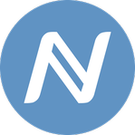

Αλγόριθμος κρυπτογράφησης:SHA-256 .Τύπος εξόρυξης:Απόδειξη εργασίας\(PoW\). Χρόνος μπλοκ:10λεπτά. Συντομογραφία:NMC. Απόδοση μπλοκ:50 NMC. Καμπύλη απόδοσης:Διχοτομείται ανά 210.000 μπλοκ. Συνολικός πληθυσμός:21.000.000. Τρέχων τιμή:0.35 ευρώ. Κατάταξη:376. Συνολική αξία:5.289.516 ευρώ. Τρέχων πληθυσμός:14.736.400 NMC. Υψηλότερη αξία:8.97 ευρώ\(Νοέμβριος 28,2013\). \(Τα οικονομικά στοιχεία πάρθηκαν από: www.coinmarketcap.com\) \(namecoin.org, 2017\)

Το Namecoin έχει σημαντική αξία διότι ήταν το πρώτο εναλλακτικό κρυπτονόμισμα που δημιουργήθηκε. Παρουσιάστηκα το 2011 ως παράγωγο του Bitcoin. Λόγω του ότι τα περισσότερα κρυπτονομίσματα είναι ανοιχτού κώδικα, μπορεί οποιοσδήποτε να αντιγράψει τον κώδικα τους για να εφαρμόσουν αλλαγές σε αυτόν. Έτσι δημιουργούνται νέα εναλλακτικά κρυπτονομίσματα. Το Namecoin ήταν το πρώτο στην ιστορία που πραγματοποίησε αυτή την τεχνοτροπία. \(Wikileaks, 2011\)

### Litecoin

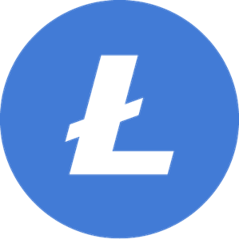

Αλγόριθμος κρυπτογράφησης:Scrypt. Τύπος εξόρυξης:Απόδειξη εργασίας\(PoW\) . Χρόνος μπλοκ:25 λεπτά. Συντομογραφία:LTC. Απόδοση μπλοκ:12.5 LTC. Καμπύλη απόδοσης:Διχοτομείται σχεδόν κάθε τέσσερα χρόνια, κάθε 840.000 μπλοκ.Συνολικός πληθυσμός:84.000.000 LTC. Τρέχων τιμή:42,31 ευρώ. Κατάταξη:6. Συνολική αξία:2.695.569.403 ευρώ. Τρέχων πληθυσμός:63.712.550 LTC. Υψηλότερη αξία:340,76 ευρώ \(Δεκέμβριος 19,2017\). \(Τα οικονομικά στοιχεία πάρθηκαν από: www.coinmarketcap.com\). \(litecoin.org, 2011; Wikipedia Contributors, 2019\)

Από τις πρώτες αντιγραφές του Bitcoin είναι το Litecoin. Χαρακτηρίστηκε ως το ασήμι έναντι του χρυσού το Bitcoin. Πρόκειται για ένα από τα δημοφιλέστερα κρυπτονομίσματα. Η αναγνώριση του είναι τεράστια από την ημέρα δημιουργίας του το 2011 μέχρι και σήμερα. Δημιουργός του είναι ο Τσάρλες Λι. Αρχικά δημιουργήθηκε για να χρίσει κατάλληλη την εξόρυξη από το σπίτι αφού η εξόρυξη του bitcoin χρειαζόταν μεγάλη υπολογιστική ισχύ. Ωστόσο λίγο αργότερα αντιμετώπισε τα ίδια προβλήματα εξόρυξης λόγω της δομής του που είναι σχεδόν ίδια με την Bitcoin αλυσίδα των μπλοκ. \(Demartino, 2016\) Η βασική τους διαφορά είναι πως τα μπλοκ ολοκληρώνονται γρηγορότερα. Χρειάζονται 2,5 λεπτά έναντι 10 που χρειάζεται η Bitcoin αλυσίδα των μπλοκ κι έτσι βοηθάει στο να γίνονται γρηγορότερα συναλλαγές. Επίσης χρησιμοποιεί αλγόριθμο κρυπτογράφησης, τον scrypt.

Στις 22 Φεβρουαρίου του 2018, η αλυσίδα του litecoin υπέστη σκληρή διχοτόμηση από το μπλοκ 1.371.111 Και από τότε λειτουργεί παράλληλα στο δίκτυο του litecoin η αλυσίδα των μπλοκ που παράγει το νόμισμα litecoin cash. Στο ξεκίνημα ήταν πολύ ισχυρό κρυπτονόμισμα κοστίζοντας 7,04 ευρώ το ένα αλλά περιοδικά αποδυναμώθηκε σχεδόν πλήρως. Η τρέχων αξία του είναι 0.005 ευρώ. \(Skotish, 2018\)

### Ethereum

Αλγόριθμος κρυπτογράφησης:Ethash. Τύπος εξόρυξης:Απόδειξη εργασίας Με δυνατότητα απόδειξης μεριδίου\(PoW,PoS\). Χρόνος μπλοκ:15sec. Συντομογραφία:ETH. Απόδοση μπλοκ:2 ETH. Συνολικός πληθυσμός:Άπειρος. Τρέχων τιμή:136,66 ευρώ. Κατάταξη:2. Συνολική αξία:14.856.608.882 ευρώ. Τρέχων πληθυσμός:108.713.712 ΕΤΗ. Υψηλότερη αξία:1.302,80 ευρώ. \(Τα οικονομικά στοιχεία πάρθηκαν από: www.coinmarketcap.com\) \(Demartino, 2016; etherscan.io, 2019; Wikipedia Contributors, 2019a\)

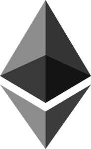

Το 2013 ο Βιτάλικ Μπουτέριν πρότεινε να χρηματοδοτήσει την πιο ενδιαφέρουσα αποκεντρωμένη πλατφόρμα την Etherium. Στις 30 Ιουλίου του 2015, λειτούργησε το δίκτυο της. Αναμφίβολα πρόκειται για το πιο επιτυχημένο εναλλακτικό κρυπτονόμισμα. Ωστόσο ο σκοπός του δεν ήταν η δημιουργία ενός ακόμα και τον νομίσματος. Η αλυσίδα των μπλοκ του δικτύου Εthereum, στην ουσία είναι μία αλυσίδα των πάντων. Η Bitcoin αλυσίδα των μπλοκ, χρησιμοποιείται κατά κύριο λόγο για οικονομικούς σκοπούς. Λόγω της δομής του, το Ethereum είναι το καταλληλότερο δίκτυο για να δημιουργήσει κάποιος χρήστης ειδικές συμβάσεις. Οι έξυπνες συμβάσεις συνήθως προγραμματίζονται με τη γλώσσα προγραμματισμού Solidity η οποία δημιουργήθηκε για να εξυπηρετεί το Ethereum. \(Solidity, 2016\) Ο δημιουργός της έξυπνης σύμβασης πρέπει να πληρώσει το δίκτυο με το κρυπτονόμισμα που παράγει αυτό, για την ένταξη της ειδικής σύμβασης.

Το κρυπτονόμισμα που παράγει το δίκτυο Ethereum μέσω της εξόρυξης, ονομάζεται Ether και πολλές φορές λανθασμένα αναφέρεται ως Ethereum. Οι εξορύκτες πληρώνονται με Ether για κάποιον ολοκληρωμένο κόμβο. Ο συνολικός πληθυσμός των Ether είναι άπειρος, γεγονός που χαρίζει μεγάλη προοπτική ορθής λειτουργίας του δικτύου για μεγάλο βάθος χρόνου. Η οικιακή εξόρυξη μέσω πολλαπλών καρτών γραφικών είναι εφικτή. \(BitClubGreece, 2019; GreekCoin, 2013; Škraba, 2018\)

### Dogecoin

Αλγόριθμος κρυπτογράφησης:Scrypt. Τύπος εξόρυξης:Απόδειξη εργασίας\(PoW\). Χρόνος μπλοκ:1 λεπτό. Συντομογραφία:DOGE. Απόδοση μπλοκ:10.000 DOGE. Καμπύλη απόδοσης:Διχοτομείται ανά 840.000 μπλοκ. Συνολικός πληθυσμός:Μεταβαλλόμενος στόχος. Τρέχων τιμή:0,002 ευρώ. Κατάταξη:30. Συνολική αξία:260.642.267 ευρώ. Τρέχων πληθυσμός:112.230.308.386 DOGE. Υψηλότερη αξία:0.017 ευρώ. \(Τα οικονομικά στοιχεία πάρθηκαν από: www.coinmarketcap.com\) \(Demartino, 2016; Wikipedia Contributors, 2019a\)

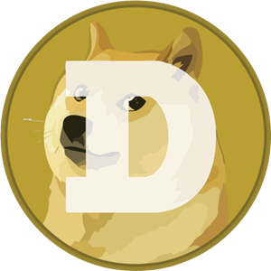

Το 2013, ο Τζάξον Πάλμερ και ο Μπίλι Μάρκους, δημιούργησαν για πλάκα ένα κρυπτονόμισμα που τελικά έφτασε την αξία των δύο δισεκατομμυρίων δολαρίων συνολικά. Το περίεργο κρυπτονόμισμα είχε ως εικόνα ένα διάσημο σκυλί ράτσας σίμπα ίνου, εμπνευσμένο από το δημοφιλή διαδικτυακό μιμίδιο. Η ονομασία του παραπέμπει πλήρως στην εικόνα του αφού ονομάστηκε DOGE από την αγγλική λέξη dog που σημαίνει σκυλί. \(Reed, 2018\)

Με την πάροδο του χρόνου, η αξία του και η φήμη του άρχισε να έχει ανοδική πρόοδο. Η κοινότητα του απαρτιζόταν από εξαίρετους χρήστες. Το 2014, η κοινότητα του Dogecoin συγκέντρωσε 55.000 δολάρια από ηλεκτρονικούς εράνους για τη χορήγηση του Dogecoin δικτύου στο αμάξι του Τζος Γουάις στους αγώνες Nascar. Έκτοτε έγινε διασημότερο και αξία του ανέβηκε. Ο οδηγός των αγώνων Νascar τοποθέτησε ένα τεράστιο αυτοκόλλητο με το λογότυπο του Dogecoin στο καπό του αυτοκινήτου του. Από τότε o Τζος είναι γνωστός ως τον οδηγό του Dogecoin. \(Frum, 2014\) Λίγο αργότερα πάλι από ηλεκτρονικούς εράνους, συγκεντρώθηκε το ποσό των 30.000 δολαρίων από την κοινότητα του Dogecoin και βοήθησε την εθνική ομάδα της Τζαμάικα να συμμετάσχει στους χειμερινούς Ολυμπιακούς αγώνες του Σότσι. \(Couts, 2014\)

Το Dogecoin δεν δημιουργήθηκε για χρήση σε βάθος χρόνου. Τα προβλήματα εμφανίστηκα, όταν σταμάτησα οι εξορύκτες για να εξορύξουν κάποιο άλλο εναλλακτικό κρυπτονόμισμα με μεγαλύτερο πιθανό κέρδος. Κάπως έτσι άρχισε να καταρρέει το σύστημα. Τηn λύση έδωσε το δίκτυο του Litecoin. Αποφασίστηκε πως θα συγχωνευτούν οι αλυσίδες των μπλοκ και πλέον οι εξορύξεις θα γίνονταν με έναν αλγόριθμο αλλά θα γίνεται εξόρυξη και στα δύο κρυπτονομίσματα ταυτόχρονα.

Σήμερα η αξία του κρυπτονομίσματος δεν είναι ούτε ένα λεπτό του ευρώ, ωστόσο υπάρχουν αρκετά dogecoin στην αγορά. Ήταν ένα νόμισμα που ξεκίνησε για πλάκα και χωρίς να καταλάβουν το πως οι δημιουργοί του, το είδα να αγγίζει την κορυφή λόγω της υποστήριξης από την κοινότητα. \(Demartino, 2016\)

### Ripple

Αλγόριθμος κρυπτογράφησης:ECDSA. Τύπος εξόρυξης:Δεν υποστηρίζεται εξόρυξη. Χρόνος μπλοκ:4 δευτερόλεπτα/συναλλαγή. Συντομογραφία:XRP. Συνολικός πληθυσμός:100 δισεκατομμύρια. Τρέχων τιμή:0,19 ευρώ. Κατάταξη:3. Συνολική αξία:8.625.332.047 ευρώ. Τρέχων πληθυσμός:99.991.280.558 XRP. Υψηλότερη αξία:3,49 ευρώ\(Ιανουάριος 4,2018\). \(Τα οικονομικά στοιχεία πάρθηκαν από: www.coinmarketcap.com\) \(ripple, 2014; XRP Ledger, 2019\)

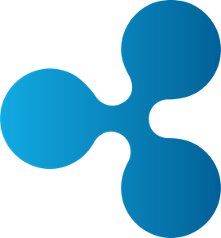

Το Ripple labs δημιούργησε το κρυπτονόμισμα Ripple, προϋπήρχε του Bitcoin. Μετά τη λευκή βίβλο, όταν συνειδητοποίησαν την δημοσιότητα που προσέλκυσαν τα κρυπτονομίσματα αποφάσισαν να εκδώσουν το δικό τους κρυπτονόμισμα. Πριν εκδοθεί το Ripple ήταν μία υπηρεσία πληρωμών παρόμοια με την PayPal.

Το Ripple δεν έχει αντιγράψει ούτε μία γραμμή κώδικα απο τον κώδικα του Bitcoin, όπως έπραξαν άλλα κρυπτονομίσματα. Αντιθέτως το προγραμμάτισαν οι ίδιοι και προ-εξόρυσαν όλα τα κρυπτονομίσματα Ripple, χωρίς να παρέχουν δυνατότητα από τους χρήστες για εξόρυξη. Αυτό όμως τους βοήθησε να πραγματοποιούν πολύ γρήγορα τις συναλλαγές που απαρτίζονται με το Ripple. Για κάθε συναλλαγή με Ripple, χρειάζονται 4 δευτερόλεπτα έναντι 10 λεπτών με τη χρήση Bitcoin. Αυτός είναι ο λόγος που είναι τόσο δημοφιλές και το προτιμούν πολλοί χρήστες. Δημιουργήθηκε από τον Κρις Λάρσεν και τον ιδρυτή του MtGOX, Τζεμπ Μακάλεμπ.

Το Ripple λειτουργεί βάσει των Gateways. Τα Gateways Επιτρέπουν την αγορά πολλών αγαθών. Πρόκειται για εταιρείες ή ιδιώτες που επιθυμούν να πουλήσουν κάποιο προϊόν και εκδίδουν υποσχετικές πληρωμές για αυτό. Για παράδειγμα μία εταιρεία μπορεί να πουλάει υποσχετική πληρωμή αξίας 5 γραμμαρίων χρυσού. Ο χρήστης που θα το αγοράσει, μπορεί να χρησιμοποιήσει την αξία της στο διαδίκτυο και να αγοράσει από κάποιο φυσικό κατάστημα της ίδιας εταιρείας το χρυσό 5 γραμμαρίων.

Πολλά μέλη της κοινότητας δεν εμπιστεύονται το Ripple λόγω της συγκεντρωτικής φύσης του και της προ-εξόρυξης. Η εταιρεία για να καθησυχάσει τους χρήστες του Ripple, υποσχέθηκε πως προ-εξόρυξε 70 δισεκατομμύρια Ripple. Τα 20 δισεκατομμύρια θα τα κρατήσει για τις πληρωμές των προγραμματιστών του εργάζονται για τον κώδικα του και την ασφάλεια του δικτύου. Τα υπόλοιπα 50 δισεκατομμύρια για διανομή στους χρήστες του. Σήμερα ο συνολικός αριθμός είναι 100 δισεκατομμύρια πράγμα που αποδεικνύει πως η διοίκηση δεν κράτησε τον λόγο της. Η διοίκηση του Ripple είναι μοναδικός παράγοντας που ελέγχει το κρυπτονόμισμα. \(Demartino, 2016; Frankenfield, 2019b; ripple, 2014\)

### Dash

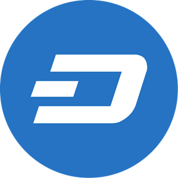

Αλγόριθμος κρυπτογράφησης:X11. Τύπος εξόρυξης:Απόδειξη εργασίας\(Pow και Proof of Service\). Χρόνος μπλοκ:2,5 λεπτά. Συντομογραφία:DASH. Απόδοση μπλοκ:3.11 DASH. Καμπύλη απόδοσης:2016 μπλοκ. Συνολικός πληθυσμός:18.900.000 DASH. Τρέχων τιμή:47,05 ευρώ. Κατάταξη:22. Συνολική αξία:432.336.250 ευρώ. Τρέχων πληθυσμός:9.189.430 DASH. Υψηλότερη αξία:1.484,09\(Δεκέμβριος 20,2017\). \(Τα οικονομικά στοιχεία πάρθηκαν από: www.coinmarketcap.com\) \(Wikipedia Contributors, 2019a\)

Το Dash Δημιουργήθηκε στις 18 Ιανουαρίου 2014 από τον Έβαν Ντούφιλντ. Αρχικά ονομαζόταν Xcoin. Το Φεβρουάριο του 2014 μετονομάστηκε σε Dark coin. Dark σημαίνει σκοτεινό στην Αγγλική γλώσσα. Επειδή η διοίκηση του Dash, δεν ήθελε να ταυτιστεί το κρυπτονόμισμα με παράνομες ενέργειες του σκοτεινού ιστού και αποφάσισαν να ξανά μετονομάσουν το κρυπτονόμισμα. Τελικά στις 25 Μαρτίου του 2015 ονομάστηκε Dash.

O Έβαν Ντούφιλντ Εμπνευσμένος από τη δομή του Bitcoin αποφάσισε να δημιουργήσει ένα κρυπτονόμισμα διορθώνοντας τα προβλήματα του Bitcoin. Σκοπός του ήταν να γίνονται πιο γρήγορα οι συναλλαγές και να καταρριφθεί η ψευδώνυμη φύση του Bitcoin με μία εντελώς ανώνυμη που έχει σκοπό να πρεσβευτή το Dash.

Η φύση του Dash για να πετύχει τον ανώνυμο σκοπό της, δεν απέχει πολύ από το δίκτυο TOR. Κάθε συναλλαγή προορίζεται ως ένας βασικός κόμβος. Ο κύριος αυτός κόμβος ενώνεται με άλλες κρυπτογραφημένες συναλλαγές. Κανένας τρίτος δεν έχει τη δυνατότητα να δει τι στάλθηκε από ποιον και ποιος είναι ο παραλήπτης. Παρότι κανείς δεν μπορεί να αμφισβητήσει την ανωνυμία που προσφέρει το Dash, είναι εφικτό να ταυτοποιηθεί κάποιος χρήστης χρησιμοποιώντας ειδικές τεχνικές για την αποκάλυψη χρήστη του δικτύου TOR.

Το Dash είναι ένα κρυπτονόμισμα που πρωταρχικός στόχος είναι να διαφυλάξει τα προσωπικά στοιχεία των χρηστών του. Όπως δήλωσε η ίδια η διοίκηση του, υπάρχουν πολλοί νόμιμοι λόγοι να επιθυμεί κάποιος την ανωνυμία τους. Η ανωνυμία δεν σχετίζεται αποκλειστικά με την παρανομία και το έγκλημα. \(Agrawal, 2019; Demartino, 2016\)

### Monero

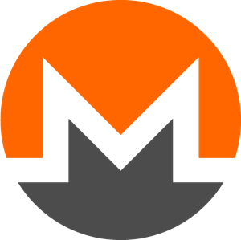

Αλγόριθμος κρυπτογράφησης:CryptoNight\(Βασισμένο σε CryptoNote\). Τύπος εξόρυξης:Απόδειξη εργασίας\(PoW\). Χρόνος μπλοκ:2λεπτά.Συντομογραφία:XMR. Απόδοση μπλοκ:Μεταβαλλόμενη βάση δυσκολίας. Καμπύλη απόδοσης:Μεταβαλλόμενη ανά 1 μπλοκ. Συνολικός πληθυσμός:Άγνωστο. Τρέχων τιμή:48,89 ευρώ. Κατάταξη:13. Συνολική αξία:847.488.182 ευρώ. Τρέχων πληθυσμός:17.336.099 XMR. Υψηλότερη αξία:447,42 ευρώ\(Ιανουάριος 7,2018\). \(Τα οικονομικά στοιχεία πάρθηκαν από: www.coinmarketcap.com\) \(bitcoin.it, 2014; Moneroblocks, 2019; Wikipedia Contributors, 2019d\)

Το 2014 η ομάδα πυρήνα του Monero, ίδρυσε το κρυπτονόμισμα της με το αντίστοιχο όνομα. Η ομάδα απαρτίζεται από επτά άτομα Ωστόσο μόνο δύο άτομα να γνωστοποιηθούν. Ο Ρικάρντο Σπάγκι και ο Ντέιβιντ Λαπατιέ είναι τα δύο γνώριμα άτομα, οι υπόλοιποι πέντε αποφάσισαν να παραμείνουν ανώνυμοι με τα ψευδώνυμα “Smooth”, ”Tacotime”, ”Othe”, ”eizh” και “NoodleDoodle”.

Το Monero Είναι μία εξέλιξη του κρυπτονομίσματος Bytecoin. Χρησιμοποιούν τον ίδιο λογαριασμό κρυπτογράφησης. Η τεχνολογία που λειτουργεί ο αλγόριθμος ονομάζεται περιμετρική υπογραφή \(ring signature\). Ένα μαθηματικό ανάλογο μιας εικόνας, επιβεβαιώνει ότι η συναλλαγή θα αποσταλεί στον σωστό παραλήπτη. Επιπλέον κάθε ολοκληρωμένη συναλλαγή δημιουργεί μία νέα διεύθυνση με αποτέλεσμα να γνωρίζει μόνο αποστολές που προορίζεται.

Το 2018 η διοίκηση απέρριψε την τεχνολογία και υιοθέτησε την τεχνολογία “Bulletproofs”. Πρόκειται για μία τεχνολογία “μη-διαδραστικής απόδειξης” και “μηδενικής γνώσης” που επιτρέπει την επαλήθευση συναλλαγών, χωρίς να είναι γνωστός ο αποστολέας και ο παραλήπτης. Επίσης, παρέχει τρόπο ώστε να μην μπορεί να στείλει ο αποστολέας τόσο που δεν διαθέτει. Τέλος, βοήθησε να γίνονται αρκετά γρηγορότερα οι συναλλαγές διότι δεν είναι αναγκαία αρκετά δεδομένα για κάθε συναλλαγή, κυρίως συναλλαγών που έχουν αρκετούς παραλήπτες. \(Bédrune et al., 2018\)

Δημιουργήθηκε το μόνο νερό ήταν φανερό πώς ήταν μια αναβάθμιση του Bytecoin. Πολλοί χρήστες το επέλεξαν γιατί εξασφάλιζε την ανωνυμία των προσωπικών τους στοιχείων. Το γεγονός ότι διόρθωσε προβλήματα που ήταν αντιληπτά στο δίκτυο του Bytecoin, όπως η προ-εξόρυξη και η μη-αποκέντρωση του, βοήθησε εσθήτα στην διάδοση του. \(BitDegree, 2018; Demartino, 2016\)

### Petro

Αλγόριθμος κρυπτογράφησης:X11. Τύπος εξόρυξης:Απόδειξη εργασίας, απόδειξη μεριδίοθ\(PoW,PoS\). Χρόνος μπλοκ:1 λεπτό. Συντομογραφία:PTR. Απόδοση μπλοκ:Μεταβαλλόμενη. Καμπύλη απόδοσης:Μεταβαλλόμενη. Συνολικός πληθυσμός:100 εκατομμύρια είναι ο αρχικός αριθμός της “πρώτης φάσης”. Τρέχων τιμή:54,10 ευρώ. \(Gobierno bolivariano de venezuela, 2018; petro, 2019\)

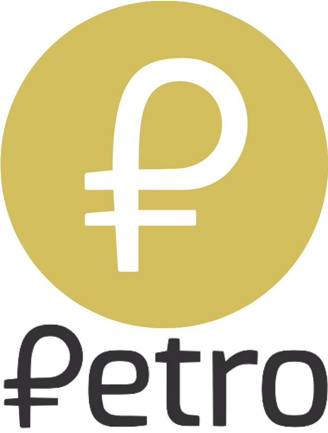

Το Petro, είναι το πρώτο κρυπτονόμισμα που υποστηρίχθηκε από την κυβέρνηση ενός κράτους.\(petro, 2019\) Σε μία προσπάθεια της κυβέρνησης της Βενεζουέλας, για αποφυγή των οικονομικών κυρώσεων, ο πρωθυπουργός της Νικολά Μαντούρο, τον Δεκέμβριο του 2017 ανακοίνωσε το Petro. Πρόκειται για ένα κρυπτονόμισμα που θα υποστηριχθεί από τα φυσικά αποθέματα της γης της Βενεζουέλας, όπως το πετρέλαιο, ο χρυσός και τα διαμάντια. Τον Ιανουάριο του 2018, ο Νικολά Μαντούρο, διέταξε έκδοση 100 εκατομμυρίων Petro, συμπληρώνοντας ότι η αξία του ενός κρυπτονομίσματος θα είναι ανάλογη με την αξία ενός βαρελιού πετρελαίου. Στα τέλη του Ιανουαρίου του 2018, ανακοίνωσε πως η εξόρυξη Petro είναι νόμιμη στη Βενεζουέλα και πως όποιος πολίτης της Βενεζουέλας είχε εκκρεμεί δικαστήριο για δραστηριότητες εξόρυξης, θα διαγραφεί. Στις 30 Ιανουαρίου του 2018, η κυβέρνηση του Μαντούρο, δημοσίευσε τη λευκή Βίβλο του κρυπτονομίσματος Petro.

Μία τέτοια κίνηση δεν άργησε να φέρει αντιδράσεις. Στις 19 Μαρτίου 2018 ο πλανητάρχης Ντόναλντ Τραμπ, ενοχλημένος, απαγόρευσε από τους Αμερικανούς πολίτες οποιαδήποτε ενέργεια με Petro. Έπειτα από το εμπάργκο, άρχισαν μεγάλα ανταλλακτήρια να μην υποστηρίζουν συναλλαγές με Petro. Είναι ο λόγος ο οποίος το Petro δεν υπάρχει στη μεγαλύτερη βάση δεδομένων και παρακολούθηση συναλλαγών στον κόσμο τον ιστότοπο coinmarketcap.com .

$$\text{PTR} = \sum_{i = 1}^{}\left( x_{i,t} \bullet F_{\text{ci}} \bullet P_{i} \right)$$

Όπου:

* PTR = Ένα Petro την χρονική στιγμή t
* Xi,t = Η τιμή του προϊόντος i τη χρονική στιγμή t
* Pi = Το βάρος του προϊόντος i
* FCi = Συντελεστής διόρθωσης του προϊόντος i

PTR0 = \(_X_1, 0 • FC1 • _P_1 + _X_2, 0 • FC2 • _P_2 • + _X_3, 0 • FC3 • _P_3 + _X_4, 0 • FC4 • _P_4\) • _Dond_

Όπου:

* Χ1,0 = Η τιμή του βαρελιού πετρελαίου της Βενεζουέλας σε δολάρια τη χρονική στιγμή t=0 στην αρχική τιμή του Petro
* P1 = 0,50
* X2,0 = Η τιμή μιας ουγκιάς χρυσού σε δολάρια τη χρονική στιγμή t=0 στην αρχική τιμή του Petro
* P2 = 0,20
* X3,0 = Η τιμή ενός τόνου σιδήρου σε δολάρια τη χρονική στιγμή t=0 στην αρχική τιμή του Petro
* P3 = 0,20
* X4,0 = Η τιμή ενός καρατιού διαμαντιού σε δολάρια τη χρονική στιγμή t=0 στην αρχική τιμή του Petro
* P4 = 0,10
* FC1,FC2,FC3,FC4 = Συντελεστής διόρθωσης του κάθε προϊόντος

  **Hellenic coin**

Αλγόριθμος κρυπτογράφησης:X11. Τύπος εξόρυξης:Απόδειξη εργασίας\(PoW\). Χρόνος μπλοκ:4-10 λεπτά. Συντομογραφία:HNC. Απόδοση μπλοκ:500 HNC. Καμπύλη απόδοσης:Διχοτομείται ανά 40.000 μπλοκ. Συνολικός πληθυσμός:100.000.000 HNC. Τρέχων τιμή:0.001 ευρώ. Κατάταξη:1401. Συνολική αξία:95,255 ευρώ. Τρέχων πληθυσμός:69.499.904 HNC. Υψηλότερη αξία:0.46 ευρώ\(Αύγουστος 19,2015\). Προ-εξόρυξη:50.000.000 HNC. \(Τα οικονομικά στοιχεία πάρθηκαν από: www.coinmarketcap.com\) \(Hellenic Coin, 2018\)

Το 2015 η ομάδα Hellenic coin, η οποία απαρτίζεται από επτά άτομα, δημοσίευσα το πρώτο ελληνικό κρυπτονόμισμα με το ίδιο όνομα. Πρόκειται για κρυπτονόμισμα βασισμένο στον κώδικα του Litecoin, αλλά με διαφορετικό αλγόριθμο κρυπτογράφησης. Στο ξεκίνημα του χρησιμοποιούσε τον αλγόριθμο Scrypt ενώ το 2016 άλλαξες σε X11.

Σκοπός τους είναι η ανάπτυξη της Ελληνικής οικονομίας, στοχεύοντας στον τουρισμό. Έλληνες και ξένοι τουρίστες θα μπορούν να χρησιμοποιήσουν Hellenic coin για τις αγορές τους. Είναι μία λύση ευκολίας για τους τουρίστες που δεν είναι κάτοικοι Ευρωπαϊκής Ένωσης και δεν χρησιμοποιούν ευρώ.

Στα άμεσα σχέδια της διοίκησης είναι η συνεργασία με πολυτελή ξενοδοχεία. Κάποιους πελάτες από οποιοδήποτε μέρος στον κόσμο θα μπορεί να πληρώσει την κράτηση του με κρυπτονόμισμα Hellenic coin. Επίσης στόχευαν μέσα στο 2019 να είχαν τοποθετήσει ATM Hellenic coin σε όλη την Ελλάδα δίνοντας προτεραιότητα στα Ελληνικά νησιά.

Πρόκειται να κυκλοφορήσουν 100.000.000 Hellenic coin. Τα 50 εκατομμύρια από αυτά έγιναν προ-εξόρυξη. Τα υπόλοιπα 50 εκατομμύρια δίνεται η δυνατότητα στους εξορύκτες για την εξόρυξη τους Χρησιμοποιώντας απόδειξη εργασίας για την αμοιβή της ολοκλήρωσης ενός μπλοκ. \(Hellenic Coin, 2018; newmoney, 2019\)

### ParkGene

Το 2016, ιδρύθηκε μία ελληνική εταιρεία η ParkGuru. Σκοπός της ήταν η δημιουργία μιας εφαρμογή στο κινητό η οποία θα υποστήριζε το έργο της. Η εφαρμογή δίνει την δυνατότητα στους χρήστες της να βρουν εύκολα και φθηνά θέση στάθμευσης για το αμάξι τους. Επίσης δίνεται η δυνατότητα να διαθέτουν για ενοίκιο στο σύστημα της, την ιδιωτική τους θέση στάθμευσης. Η διοίκηση την αποκαλεί σαν “Airbnb για θέση στάθμευσης”. Με αυτό τον τρόπο η επιχείρηση επιδιώκει να καταπολεμήσει την αγορά στάθμευσης, που υπολογίζεται η αξία της σε 100 δισεκατομμύρια ευρώ ετησίως.

Το 2018 αποφασίστηκε να δημιουργηθεί ένα σύστημα αλυσίδας των μπλοκ και να υποστηρίζει τις πληρωμές μέσω της εφαρμογής. Η αλυσίδα των μπλοκ φιλοξενήθηκε στο δίκτυο Ethereum, μέσω μιας ειδικά προγραμματιζόμενης έξυπνη σύμβασης. Η αλυσίδα των μπλοκ της επιχείρησης ονομάστηκε ParkGene και το κρυπτονόμισμα GENE. Έγινε προ-εξόρυξη ενός δισεκατομμυρίου GENE και δεν δίνεται η δυνατότητα για εξόρυξη από τους χρήστες. Αντί αυτού τα κρυπτονομίσματα δίνονται στους χρήστες που χρησιμοποιούν την εφαρμογή. \(PARKGENE-GENE Token, 2018\)

Επίσης υπάρχει σύστημα επιβράβευσης το οποίο δίνει ένα ποσό σε GENE σε χρήστες που πράττουν διάφορες δραστηριότητες όπως αξιολόγηση χρηστών, αξιολόγηση θέσεις στάθμευσης, σε χρήστες με έντονη απασχόληση στην εφαρμογή κ.α. Ωστόσο υπάρχει δυνατότητα αγοράς GENE με κρυπτονομίσματα. Το bitcoin, ether, bitcoin cash, litecoin και dash υποστηρίζουν αγορά GENE. Στην ουσία το GENE είναι το νόμισμα που χρησιμοποιείται για την αγορά θέσεων στάθμευσης μέσα στην εφαρμογή.

Η εφαρμογή φιλοξενεί παραπάνω από 67.000 χρήστες. Ο όμιλος PARKGURU, συνεργάζεται με επαγγελματικά πάρκινγκ τα οποία διαθέτουν θέσεις στάθμευσης στην εφαρμογή. Στη Θεσσαλονίκη και στην Αθήνα, είναι διαθέσιμες 18.000 θέσεις στάθμευσης σε επαγγελματικούς χώρους, ενώ περισσότερες από έξι εκατομμύρια σε 8.000 πόλεις στον κόσμο.

Η εταιρεία PARKGURU που ξεκίνησε το 2016, έχει διαμορφωθεί σε όμιλο και έχει παρουσία στην Αθήνα, στην Σόφια, στο Ταλίν, στο Λονδίνο και στην Σιγκαπούρη. Το έργο ParkGene, είναι ένα από τα λίγα εξολοκλήρου ελληνικό που έχει εντρυφήσει με τις αλυσίδες των μπλοκ. \(Made in Greece, 2019; PARKGENE LTD, 2017\)

## Οι επιπτώσεις στον πολιτισμό μας

Μέχρι στιγμής τα προηγούμενα κεφάλαια, έγινε κατανοητή η λειτουργία των αλυσίδων των μπλοκ και η χρησιμότητα του Bitcoin και των υπολοίπων εναλλακτικών κρυπτονομισμάτων. Στο συγκεκριμένο κεφάλαιο θα εξηγηθεί σε τι επηρεάζουν την τεχνολογία, την οικονομία, τον πολιτισμό μας ,ακόμα και τι ρόλο παίζει στην καθημερινότητά μας. Δεν είναι λίγοι εκείνοι που πιστεύουν πως οι αλυσίδες των μπλοκ, θα αποτελέσουν μία νέα σύγχρονη βιομηχανική επανάσταση. Δικαίως μάλιστα εφόσον επηρεάζουν πολλές πτυχές της καθημερινότητάς μας. Μεγάλες πολυεθνικές εταιρείες και τράπεζες, υιοθετούν ολοένα συστήματα αλυσίδων των μπλοκ για διάφορες λειτουργίες και υπηρεσίες.

### Κυβερνητικά κρυπτονομίσματα

* SOV - Νήσοι Mάρσαλ

Μπορεί η Βενεζουέλα με τον Petro να κατακτήσει τον τίτλο της πρώτης κυβέρνησης που δημιούργησε το πρώτο κρυπτονόμισμα. Ωστόσο οι Νήσοι Μάρσαλ ήταν αυτοί που το Φεβρουάριο του 2018, υιοθέτησαν το SOV \(συντομογραφία της λέξης sovereign που σημαίνει κυρίαρχος \)ως το διεθνή τους νόμισμα. Το νόμισμα κατάγεται από τη νήσο Majuro και δημιουργήθηκε για να ενισχύσει την οικονομία της χώρας και για να αποπληρώσουν χρέη διότι το συμβατικού τους νόμισμα βρισκόταν στο χείλος του γκρεμού. Οι Νήσοι Μάρσαλ, συνεργάστηκαν με την ισραηλινή εταιρεία ¨Neema” για να ξεκινήσει η δράση του SOV. Είναι εξολοκλήρου κρυπτονόμισμα σύμφωνα με το white papper. \(SOV whitepapper, 2019\) Η διαφορά είναι ότι απαιτείται πιστοποίηση των χρηστών του, διαγράφοντας έτσι την ανωνυμία. Είναι μία κίνηση που σύμφωνα με την κυβέρνηση των Νήσων Μάρσαλ, θα περιορίσει την εγκληματικότητα.

Όταν κυκλοφόρησε το SOV, έγινε προ εξόρυξη 24 εκατομμύρια κρυπτονομισμάτων, από τα οποία τα μισά ανήκουν στην εταιρία “Neema” και τα υπόλοιπα στην κυβέρνηση των Nήσων Mάρσαλ. Από το συνολικό πληθυσμό, μόνο το 40% είναι διαθέσιμο στους καταναλωτές σε όλο τον κόσμο. Έξι εκατομμύρια θα πουληθούν σε διεθνείς επενδυτές με σκοπό την έρευνα για την αντιμετώπιση της υπερθέρμανσης του πλανήτη και την υποστήριξη ατόμων που επηρεάζονται από τις πυρηνικές δοκιμές. Η χώρα σκοπεύει να μοιράσει δωρεάν 2,4 εκατομμύρια στους πολίτες της. Για την ισορροπία της αξίας του οι κυβερνήτες των νήσων, αποφάσισαν πως μόνο μέχρι 4% θα επιτρέπεται να ανέβει ο συνολικός αριθμός των κρυπτονομισμάτων κάθε χρόνο. Σε αντίθεση με τις κεντρικές τράπεζες, δεν θα δημιουργούνται περισσότερα κρυπτονομίσματα με αποτέλεσμα να μην υποτιμηθεί η αξία το. \(Hosia & Perry, 2018; Sov Foundation, 2018\)

* e-Dinar - Τυνησία

Η Τυνησία είναι μία ακόμα χώρα που η κυβέρνηση της έδειξε να είναι θετική στα οφέλη των κρυπτονομισμάτων. Πρόκειται για μία ακόμα περίπτωση που ένα ψευδο-κρυπτονόμισμα, υποστηρίζεται από κεντρική τράπεζα. Αναφέρεται σαν ψευδο-κρυπτονόμισμα διότι δεν είναι αποκεντρωμένο και ελέγχεται από κεντρική τράπεζα και την κυβέρνηση. Πιο συγκεκριμένα η κεντρική τράπεζα της Τυνησίας υποστηρίζει το κρυπτονόμισμα e-Dinar. Στην ουσία πρόκειται για μία ιδιαίτερη περίπτωση εφόσον μετατρέπονται τα συμβατικά δηνάρια ηλεκτρονικά. Αυτό σημαίνει πως θα υπάρχουν και οι δύο μορφές του εθνικού νομίσματος της Τυνησίας.

Η αντικατάσταση του συμβατικών δηναρίων σε e-Dinar, έχει ήδη ξεκινήσει. Η πρώτη συναλλαγή έγινε από τον διοικητή της κεντρικής Τράπεζας της Τυνησίας, προς έναν εκπρόσωπο του διεθνούς νομισματικού ταμείου.

Το νέο κρυπτονόμισμα θα είναι διαθέσιμο στους χρήστες μέσω διαδικτύου ενώ παράλληλα η Τυνησιακή κυβέρνηση σκοπεύει να τοποθετήσει 2.000 ATM κρυπτονομισμάτων τα οποία θα εξυπηρετούν τους χρήστες. Οι χρήστες θα μπορούν να αγοράσουν από τα ATM με τον ίδιο τρόπο που περιγράφηκε περιληπτικά σε προηγούμενο κεφάλαιο.

Η κυβέρνηση της Τυνησίας επίσης υποστηρίζει πως το e-Dinar, θα είναι αρκετά ασφαλέστερο από το συμβατικό νόμισμα. Επίσης ανέφερε πως είναι οικονομικότερος τρόπος για την “τύπωση” του νομίσματος και φιλικό προς το περιβάλλον αφού δεν απαιτείται χαρτί, μελάνι και ρεύμα για την εκτύπωση του. \(Zmudzinski, 2019; Παζόπουλος, 2019\)

* CryptoRuble - Ρωσία

Το cryptoRuble Είναι ένα νέο κρυπτονόμισμα το οποίο πρόκειται να κυκλοφορήσει στο εγγύς μέλλον. Ο πρωθυπουργός της Ρωσίας Βλαντιμίρ Πούτιν, ανακοίνωσε την δημιουργία του και την υποστήριξη του. Σαφώς και αυτό δεν θα είναι κανονικό κρυπτονόμισμα διότι θα ελέγχεται από την Ρωσική κυβέρνηση. Η αξία του cryptoRuble θα είναι ακριβώς η ίδια με ένα συμβατικό ρούβλι Ρωσίας. Κάτι τέτοιο είναι κατανοητό που στην ουσία δεν παράγει κάποιο νέο νόμισμα, αλλά μεταφέρει το συμβατικό νόμισμα σε ψηφιακό. Όπως δηλαδή και στην περίπτωση της Τυνησίας με το e-Dinar.

Όπως φαίνεται ο Ρώσος πρωθυπουργός έχει συμφέρον να μεταβεί σε μία αλυσίδα των μπλοκ, όχι για το μελλοντικό κέρδος αλλά για την ανωνυμία των συναλλαγών. Αυτό θα βοηθήσει τη Ρωσία να παρακάμψει διάφορα οικονομικά και εμπορικά εμπάργκο που την έχουν κηρύξει και στοχοποιήσει, σύμφωνα με τον οικονομικό σύμβουλο του Πούτιν, Σεργκέι Γλαζιέφ. Ο Σεργκέι μάλιστα υποβλήθηκε σε κυρώσεις από τον πλανητάρχη Μπαράκ Ομπάμα το 2014, απαγορεύοντάς του να εμπορεύεται από την Αμερική και να μην έχει το δικαίωμα να περάσει τα σύνορα της. \(Frankenfield, 2019a; O’Neal, 2018\)

* Ευρωπαϊκή Ένωση και Ελλάδα

“Το 2015, στην κορύφωση της Ελληνικής οικονομικής κρίσης ο τότε υπουργός oικονομικών και νυν βουλευτής Γιάννης Βαρουφάκης, πρότεινε ένα σύστημα πληρωμών βασισμένο στην τεχνολογία blockchain. Το Υπουργείο Οικονομικών θα εξέδιδε ειδικά κουπόνια, με τα οποία θα πληρώνουν ένα μέρος των οφειλών τους προς το κράτος για να αντιμετωπιστεί η έλλειψη ρευστότητας. Ωστόσο η πρόταση δεν εφαρμόστηκε ποτέ από την Ελληνική Κυβέρνηση.” \(Αργείτη et al., 2019\)

Το διεθνές νομισματικό ταμείο, είναι γνωστό πως εδώ και αρκετό καιρό παροτρύνει τις κυβερνήσεις για ψηφιοποίηση των ήδη υπαρχόντων συμβατικό νομισμάτων. Στις 12 Δεκεμβρίου του 2019, η διοικήτρια της ευρωπαϊκής κεντρικής τράπεζας Κριστίν Λαγκάρντ, πραγματοποίησε ομιλία σχετικά με τους σκοπούς της στην νομισματική πολιτική στην θητεία της.

Ο σκοπός της είναι εδώ και καιρό η δημιουργία ψηφιακού ευρώ. Στην ομιλία της αναφέρει πως η ψηφιοποίηση των νομισμάτων, είναι πλεονέκτημα για τις κυβερνήσεις που θα το υιοθετήσουν. Επίσης ανέφερε πως θα επιτυγχάνει την δημιουργία ενός ψηφιακού συστήματος που ολοένα γίνεται δυνατότερο. Ανέφερε πως έχει δημιουργήσει ήδη μία ομάδα που έχει σκοπό τη δημιουργία αλυσίδας των μπλοκ και πώς θα είναι έτοιμη να ξεκινήσει τη λειτουργία της στα μέσα του 2020. Ο σκοπός της είναι η προσπάθειά της μείωσης του κόστους, να εξαλείψει τους μεσάζοντες και στη συνέχεια να αναγνωρίσουν τα τεχνικά στοιχεία για τη σωστή λειτουργία ενός τέτοιου συστήματος. Τέλος τόνισε πως οι τεχνικοί θα πρέπει να μην επικεντρωθούν περισσότερο στην περίπτωση του Bitcoin, αλλά στο έργο κάποιου σταθερού κρυπτονομίσματος. \(Lagarde, 2019\)

Όπως είναι φανερό, υπάρχει μεγάλη πιθανότητα να δημιουργηθεί κάποιο ψηφιακό νόμισμα, ελεγχόμενο από την Ευρωπαϊκή κεντρική τράπεζα. Το οποίο ίσως αντικαταστήσει περιοδικά το συμβατικό ευρώ. Ένα τέτοιο γεγονός φυσικά θα επηρεάσει και την Ελλάδα εφόσον ανήκει στην Ευρωπαϊκή Ένωση και το εθνικό της νόμισμα είναι το ευρώ. Επομένως η κυβέρνηση πρέπει να εντρυφήσει και αυτή με τη σειρά της, θέτοντας μέτρα και φτιάχνοντας τεχνική ομάδα.

Όπως είναι αντιληπτό, πάρα πολλές κυβερνήσεις έχουν στρέψει το ενδιαφέρον τους στις αλυσίδες των μπλοκ. Η εφαρμογή κρυπτονομισμάτων στην κοινωνία δεν θα γίνει με τον γνωστό παραδοσιακό τρόπο όπως στην περίπτωση του Bitcoin, αλλά μέσω μιας μετάβασης όπως των γεγονότων της Τυνησίας και της Ρωσίας.

Οι ηγέτες των κρατών βρίσκουν ελκυστική την ανωνυμία που προσφέρουν οι αλυσίδες των μπλοκ. Σκοπός τους είναι μία ψηφιακή μορφή των ήδη υπαρχόντων εθνικών νομισμάτων με την ίδια ισοτιμία. Κάτι τέτοιο για να πραγματοποιηθεί, απαιτεί πολύ χρόνο, έρευνα και πειραματισμό. Επίσης η εξοικείωση παράπλευρων κυβερνήσεων με την εν λόγω κατάσταση, είναι αναγκαία για την επιβίωσή τους.

### Οι επιπτώσεις στο περιβάλλον

Σύμφωνα με μελέτη του πανεπιστημίου του Cambridge, οι ανάγκες για την διατήρηση της Bitcoin αλυσίδας των μπλοκ, καταναλώνουν περισσότερη ενέργεια από την Τσεχία. Πιο συγκεκριμένα καταναλώνονται 63,95 τεραβατώρες τον χρόνο έναντι 62,34 που χρησιμοποιεί η Τσεχία για την πραγματοποίηση των αναγκών της.

Αυτό συμβαίνει διότι οι εξορύκτες bitcoin, χρησιμοποιούν υπερβολικά μεγάλη ποσότητα ενέργειας για την ολοκλήρωση ενός μπλοκ. Με την πάροδο του χρόνου, η επίλυση ενός μπλοκ γίνεται ολοένα δυσκολότερη με αποτέλεσμα να χρειάζεται περισσότερη ηλεκτρική ενέργεια. Οι εξορύκτες επίσης προτιμούν να χρησιμοποιούν μηχανήματα ASIC τα οποία από τις προδιαγραφές τους καταναλώνουν υπερβολική ηλεκτρική ενέργεια, ωστόσο δεν διαθέτουν επιλογή καθώς τα μηχανήματα ASIC είναι μονόδρομος αν επιθυμούν το κέρδος.

Το κύριο πρόβλημα δεν είναι το γεγονός ότι καταναλώνετε πολύ ηλεκτρική ενέργεια. Αν η ενέργεια καταγόταν από κάποια φυσική πηγή όπως τον ήλιο ή τους υδροηλεκτρικούς σταθμούς τότε δεν θα υπήρχε καμία παρεμβολή στη φύση. Ωστόσο όπως φαίνεται το μεγαλύτερο ποσοστό της ενέργειας που χρησιμοποιούν τα δίκτυα αλυσίδων των μπλοκ, προέρχεται κυρίως από ορυκτά καύσιμα όπως τον άνθρακα.\(Wan, 2019\)

Κάποιοι πολίτες έχουν συσχετίσει το Bitcoin με το πετρέλαιο. Ισχυρίζονται πως το Bitcoin είναι το νέο πετρέλαιο διότι είναι το ίδιο βλαβερό προς το περιβάλλον. Επίσης βλέπουν ομοιότητες στην οικονομία και στην πορεία των τιμών τους. Κάτι ακόμα που αναφέρουν είναι η προσπάθεια για τον έλεγχο του χώρου. Στην προκειμένη περίπτωση τις μεγάλες φάρμες Bitcoin. Έχει γίνει λόγος μάλιστα για κρούσματα μαφιών, προκειμένου να κερδίσουν χώρο στο δίκτυο και στο κέρδος. \(Lou, 2019\)

Υπολογίζεται πως η εκπομπή διοξειδίου του άνθρακα που προέρχεται από ενέργειες εξόρυξης Bitcoin σε διάστημα 30 μηνών, ισούται με 1 εκατομμύριο αμάξια την ίδια περίοδο.

Οι ερευνητές Μαξ Κράους και Θάμπετ Τόλαγματ, υπολόγισαν πως χρειάζονται 17 mJoule για τη δημιουργία ενός δολαρίου στο δίκτυο Bitcoin. Σύγκριναν αυτή τη τιμή για την περίπτωση ενός δολαρίου στην εξόρυξη χρυσού, που την υπολόγισαν στα 5 mJoule ενώ 7 mJoule για την εξόρυξη πλατίνας.

Από το 2016 έως το 2018, υπολογίζεται πως οι ανάγκες της εξόρυξης Bitcoin παράγοντα 13 εκατομμύρια τόνους διοξειδίου του άνθρακα. Τα έξοδα και η εκπομπή διοξειδίου του άνθρακα δεν υπολογίζονται για τη συντήρηση των τεράστιων φάρμων εξόρυξης. \(NatureSustain, 2018\)

Η τεχνική φύση του Bitcoin είναι υπεύθυνη για τη μόλυνση του περιβάλλοντος. Πιο συγκεκριμένα η απόδειξη εργασίας \(PoW\).Ενώ άλλες αλυσίδες των μπλοκ προσπαθούν να αποφύγουν μία προβλεπόμενη μόλυνση χρησιμοποιώντας απόδειξη μεριδίου\(PoS\) ή άλλες αναθέσεις κρυπτογραφικών αλγορίθμων. Ωστόσο δεν φαίνεται να μπορεί να αλλάξει κάτι στο δίκτυο του Bitcoin. Κύριος λόγος η δημοτικότητα σε χρήστες και εξορύκτες. Η διοίκηση του Bitcoin επιθυμεί να μην διαταράξει τις ισορροπίες τροποποιώντας κάτι τέτοιο. Εξάλλου είναι ένας λόγος που συνέβη διχοτόμηση στην Bitcoin αλυσίδα των μπλοκ.

Από την άλλη όψη του νομίσματος υπάρχουν πολίτες οι οποίοι ισχυρίζονται πως η εξόρυξη δεν επιβαρύνει το περιβάλλον. Αντίστοιχοι ισχυρισμοί πως η εξόρυξη χρυσού βλάπτει περισσότερο το περιβάλλον από την εξόρυξη Bitcoin, είναι αληθινοί. Σε αντίστοιχη έρευνα οι αριθμοί έδειξαν πως όλες οι ανάγκες για την εξόρυξη χρυσού είναι 132 τεραβατώρες ετησίως, σε αντίθεση με την εξόρυξη Bitcoin που είναι 22.

Ένα άλλο επιχείρημα είναι πως η εξόρυξη Bitcoin, δεν προκαλεί καταστροφές στο φλοιό της γης και δεν καταστρέφει το φυσικό περιβάλλον. Για τη δημιουργία ενός χρυσού δαχτυλιδιού, παράγονται 20 τόνοι τοξικών αποβλήτων οι οποίοι είναι πιθανό να καταλήξουν στους ωκεανούς. Επίσης κατά την εξόρυξη χρυσού, καταστρέφονται φυσικά τοπία και πολλές φορές δάση τα οποία εμπλουτίζουν με οξυγόνο το περιβάλλον. Τέλος, για την μετακίνηση του χρυσού, απαιτούνται τεράστιες ποσότητες ορυκτών καυσίμων τα οποία θα μετατραπούν σε καυσαέρια, σε αντίθεση με τη μεταφορά τεράστιας χρηματικής αξίας σε Bitcoin η οποία είναι σχεδόν ανευλαβή στο περιβάλλον και εξαιρετικά άμεση σε όλο το φάσμα της παγκόσμιας κλίμακας. \(Hillpot, 2019\)

Κάποιες μελέτες Επίσης αμφισβητούν τις κακές κριτικές για την εξόρυξη Bitcoin. Η Σούζαν Κέιλερ και ο Μάσιμο Πίτζαλ, πραγματοποίησαν μελέτη και διαπίστωσαν λάθος υπολογισμούς από προηγούμενες μελέτες. Σύμφωνα με την Κέιλερ, οι εκπομπές διοξειδίου του άνθρακα που υπολογίστηκαν σε 63 μεγατόνους, είναι λανθασμένη ενώ στην πραγματικότητα είναι αρκετά χαμηλότερη, 17,29 μεγατόνους.

Η Κίνα έχει αρνητικό ισοζύγιο διοξειδίου του άνθρακα. Σύμφωνα με μελέτη, είναι υπεύθυνη για το 47% των εκπομπών διοξειδίου του άνθρακα από την παγκόσμια εξόρυξη Bitcoin. Ωστόσο εκεί φιλοξενούνται δύο από τις μεγαλύτερες φάρμες εξόρυξης στον κόσμο. H “Bitmain: και η “Canaan Creative”. Επειδή όμως είναι μία μεγάλη σε έκταση χώρα, είναι αναμενόμενο να υπάρχουν διάφορες πηγές ενέργειας που χρησιμοποιούνται από περιοχή σε περιοχή. Η περιοχή Σιτσουάν, παράγει σημαντικά λιγότερες εκπομπές από ότι άλλες περιοχές στην ενδοχώρα. Αυτό οφείλεται διότι υπάρχει εξόρυξη Bitcoin την οποία την καλύπτει πλήρως με υδροηλεκτρική ενέργεια. \(Sharratt, 2019; Valera, 2019\)

Η ανάπτυξη του Bitcoin έφερε και δημοσιότητα. Τα μέσα μαζικής ενημέρωσης αλλά και οι πολίτες είναι εύκολο να φτάσουν σε κάποιο άστοχο συμπέρασμα και να καταλογίζουν λανθασμένες ευθύνες. Σίγουρα το Bitcoin αποικοδόμησε πολλές μεγάλες και μερικές φορές ακραίες κατηγορίες για τη μόλυνση του περιβάλλοντος. Ωστόσο δεν σημαίνει πως η εξόρυξη Bitcoin είναι φιλική προς το περιβάλλον και πως δεν επιβαρύνει στο παραμικρό την εκπομπή διοξειδίου του άνθρακα.

### Οι επιπτώσεις στην βιομηχανία καρτών γραφικών

Το 2018, στον πυρετό του Bitcoin, ξεκίνησε μεγάλο ποσοστό του πληθυσμού να ασχολείται με την εξόρυξη. Σαφώς αυτό σημαίνει πως το πρώτο βήμα τους, έπειτα από την έρευνα, ήταν να αγοράσουν κάρτες γραφικών. Όχι μία μοναδική κάρτα γραφικών, αλλά πολλές αφού όπως εξηγήθηκε ένας τρόπος εξόρυξης είναι και η χρήση πολλών παράλληλων καρτών γραφικών.

Πολλοί ήταν αυτοί που αγόραζαν τις κάρτες γραφικών σε δεκάδες ακόμα και εικοσάδες. Ως αποτέλεσμα να μην υπάρχουν αρκετές κάρτες γραφικών στην αγορά για να καλύψει τις ανάγκες των οικιακών χρηστών. Όπως είναι κατανοητό αυτή η κίνηση αυξήσει υπερβολικά τις τιμές των καρτών γραφικών. Σε μερικές περιπτώσεις η τιμή των προϊόντων υπερδιπλασιάστηκε. Το συγκεκριμένο συμβάν δημιούργησε κύματα αντιδράσεων από τους φίλους των ηλεκτρονικών παιχνιδιών οι οποίοι κατηγορούσαν σε κάθε ευκαιρία του εξορύκτες κρυπτονομισμάτων. \(Meer, 2018; Warren, 2018\)

Η γνωστή εταιρεία παραγωγής καρτών γραφικών “Nvidia”, έχει θέσει προτεραιότητα στους φίλους των ηλεκτρονικών παιχνιδιών έναντι των εξορυκτών. Έχει προτείνει στους μεταπωλητές των προϊόντων της, να προμηθεύουν τους πελάτες τους, με το πολύ δύο ή τρία προϊόντα ανά πελάτη. Στη Γερμανία Μάλιστα τέσσερις στους έξι μεταπωλητές, έχουν θέσει αυστηρά μέτρα ώστε να απομακρύνουν τους εξορύκτες από τη μαζική αγορά καρτών γραφικών. Ωστόσο η “Nvidia” ανακοίνωσε πως δεν έχει ανάγκη ακόμα και πιο απαιτητικός φίλος των ηλεκτρονικών παιχνιδιών 6 παράλληλες ισχυρές κάρτες γραφικών. \(Gault, 2018\)

Οι εξορύκτες στρέφουν τους φίλους των ηλεκτρονικών παιχνιδιών στις παιχνιδοκονσόλες, με τρεις τρόπους. Ο πρώτος, οι κατασκευαστές ASIC μηχανών, προμηθεύονται ολοκληρωμένα κυκλώματα από τα εργοστάσια, αφήνοντας έτσι λιγότερα διαθέσιμα για τις εταιρείες παρασκευής καρτών γραφικών. Οι μεγάλες φάρμες κρυπτονομισμάτων, προμηθεύονται αυτόματα κάρτες γραφικών πριν προλάβουν να κυκλοφορήσουν στην αγορά. Τέλος, οι μικρότεροι σε ισχύ εξορύκτες, αγοράζουν πολλαπλές κάρτες γραφικών με αποτέλεσμα την εκτόξευση της τιμή τους. \(Mizrahi, 2018\)

### Η συμβολή στην λύση του προσφυγικού προβλήματος

Το 2012 ο Τουφίκ Ελ-ριούλα ανακάλυψε ότι στην πραγματικότητα είναι ένας “αόρατος άνθρωπος”. Ο Τουφίκ γεννήθηκε στο Κουβέιτ και μετανάστευσε στην Ολλανδία. Κατά τη διάρκεια του πολέμου του κόλπου το 1990, τα μητρικά γεννήσεως καταστράφηκαν μαζικά και δεν μπορούσε να αποδείξει ποιος πραγματικά είναι. \(Tammik, 2018\)

Σε συνέντευξη στην εκπομπή “ΕΡΤ Reports”, μας εξηγεί την ιστορία του και πως κατάφερε να ιδρύσει την δικιά του εταιρεία “Tykn”. Ο Τουφίκ κατοικούσε ήδη στην Ευρώπη και όταν έληξε η σύμβαση εργασίας του, η υπηρεσία αλλοδαπών τον ενημέρωσε πως ο λόγος που διανέμει στην Ολλανδία δεν είναι έγκυρος και πρέπει να φύγει και πως ο μόνος τρόπος για να μείνει η να κάνει αίτηση για άσυλο. “Έτσι στις 23 Σεπτεμβρίου κοιμήθηκα στο δικό μου σπίτι και στις 24 Σεπτεμβρίου κοιμήθηκα στο παγωμένο πάτωμα στο κέντρο κράτησης μεταναστών στο Τερ Άπελ”, ανέφερε. Συμπλήρωσε, “Κουβαλούσε έγραφα στο χέρι για να αποδείξω ότι είμαι πρόσφυγας, 14 κιλά χαρτιά! Κι αυτό το ταξίδι που έκανα ήταν 987 χιλιόμετρα εντός της Ολλανδίας “.

Στο καταυλισμό ήρθε σε επαφή με περισσότερους πρόσφυγες και συνειδητοποίησε πώς το πρόβλημα είναι η αποκέντρωση αυτών των δεδομένων και πως τα συστήματα ταυτοποίησης είναι απαρχαιωμένα. “Με τον ίδιο τρόπο έχουμε οικογένειες που έχασαν τίτλους ακινήτων, γιατρούς που δεν έχουν τα ακαδημαϊκά πτυχία τους”.

Ο Τουφίκ όταν ήταν στον καταυλισμό ήταν αποκομμένος από το οικονομικό σύστημα. Δεν διέθετε ούτε χρήματα, ούτε πιστωτικές κάρτες, ούτε λογαριασμό paypal, το μόνο που την έδινε τη δυνατότητα να παραγγείλει μία πίτσα για να αποφύγει το κρύο φαγητό του καταυλισμού, ήταν το Bitcoin. Στον καταυλισμό έμαθε από το διαδίκτυο πώς το Πανεπιστήμιο Λευκωσίας διαθέτει δωρεάν μαθήματα για το blockchain. Εκεί εμπνεύστηκε και αποφάσισε να δημιουργήσει ένα δίκτυο το οποίο θα κατέγραφε τα δεδομένα των προσφύγων έτσι ώστε να είναι πάντα διαθέσιμα σε μία αλυσίδα των μπλοκ και να μπορούν να τακτοποιηθούν άμεσα.

Όταν ο Τουφίκ τελείωσε τις δωρεάν σπουδές του, το Πανεπιστήμιο Λευκωσίας του απέστειλε το πτυχίο του σε ψηφιακή μορφή το οποίο είναι και κατοχυρωμένο σε αλυσίδα των μπλοκ. Επίσης το Πανεπιστήμιο Λευκωσίας ήταν το πρώτο παγκοσμίως που δέχτηκε το Bitcoin σαν νόμισμα για την πληρωμή διδάκτρων. Τελικά κατάφερε να ιδρύσει τη δικιά του startup εταιρεία για να πραγματοποιήσει τους στόχους του. \(Αργείτη et al., 2019\) Σήμερα είναι ιδιοκτήτης της εταιρείας “Tykn”, η οποία δημιούργησε την εφαρμογή της, βασισμένη στην αλυσίδα των μπλοκ και εξυπηρετεί ακριβώς το όραμα που είχε ο Τουφίκ. \(tykn tech, 2019\).

Επίσης πολλοί μετανάστες ανά τον κόσμο έχουν βρει ως μοναδική λύση την μεταφορά χρημάτων μέσω μιας αλυσίδας των μπλοκ, πίσω στην πατρίδα τους. Μεταφορές γίνονται κυρίως σε χώρες της Αφρικής αλλά είναι εφικτές σε όλο τον κόσμο. Είναι ένας τρόπος να γλιτώσει κάποιος την τεράστια παρακράτηση της αξίας των χρημάτων που αποστέλλονται μέσω εταιρειών μεταφοράς χρημάτων. Επίσης με αυτό τον τρόπο παρακάμψουν τυχόν οικονομικά εμπάργκο ή περιορισμούς σχετικά με το ποσό που θα εξαχθεί από την εκάστοτε χώρα.

### Επιπτώσεις στην καθημερινότητα

Όπως Αναφέρθηκε σε προηγούμενο υποκεφάλαιο οι επιπτώσεις της τεχνολογίας των αλυσίδων των μπλοκ είναι ευκολότερα αντιληπτή στην οικονομία. Ένα σημαντικό παράδειγμα που επηρεάζει την καθημερινότητά μας είναι οι μεταφορές χρημάτων με εμβάσματα. Ο Οικονομικός διευθυντής του πανεπιστημίου Λευκωσίας, Χρήστος Βλάχος, Σε συνέντευξή του στην εκπομπή “ΕΡΤ Reports”, αναφέρει: “Εταιρείες μεταφοράς όπως Western Union που μεταφέρουν χρήματα στο εξωτερικό, όταν αυτό το πράγμα πάει στον κόσμο, θα κλείσουν αμέσως. Οι προμήθειες που θα χάσουν οι τράπεζες όταν αυτό το πράγμα πάει στον κόσμο, είναι δισεκατομμύρια, τρισεκατομμύρια. Με τα κρυπτονομίσματα αυτό το πράγμα θα εξανεμιστεί. Αυτές οι εταιρείες όπως Western Union, MoneyGram και οι σχετικές υπηρεσίες των τραπεζών που ασχολούνται με μεταφορά χρημάτων, θα πάθουν ότι έπαθαν οι εταιρείες που πουλούσαν πάγο όταν ανακαλύφθηκε το ψυγείο.” Σαφώς αναφέρεται στην κατάληξη των συγκεκριμένων τύπου εταιριών όταν ενσωματωθεί το Bitcoin στην καθημερινότητά μας. \(Αργείτη et al., 2019\)

Έχει αναφερθεί το γεγονός πως ένα εναλλακτικό κρυπτονόμισμα, έγινε χορηγός σε αθλητική ομάδα. Το Dogecoin δεν ήταν το μοναδικό που χορήγησε αθλητική ομάδα, αλλά το πρώτο. Η τουρκική ομάδα ποδοσφαίρου Γενί Μαλάτιασπορ Διαφήμισε μέσω της εμφάνισης της το εναλλακτικό κρυπτονόμισμα Btc Turk. Δεν είναι όμως η μοναδική. Η διάσημη ομάδα του αγγλικού πρωταθλήματος Γουότφορντ, διαφήμισε μία στοιχηματική εταιρεία στην εμφάνισή της στην “sportbet.io”. Το ενδιαφέρον στην υπόθεση είναι πως η εταιρεία επέλεξε να προσθέσει επιπλέον το λογότυπο του Bitcoin στο μανίκι της εμφάνισης. Στην ουσία δεν έχουν όφελος να διαφημίσουν το Bitcoin, όμως θέλουν να κάνουν γνωστό στο κοινό ότι μπορούν να στοιχηματίσουν με bitcoin. Επίσης όπως δήλωσε η διοίκηση της εταιρείας θέλουν να ανταποδώσουν τη συνεισφορά του Bitcoin στην κοινωνία.

Η Γουότφορντ, δέχεται bitcoin στο ηλεκτρονικό της κατάστημα για να αγοράσουν οι πελάτες αναμνηστικά της ομάδας. Επίσης και άλλες ομάδες του αγγλικού πρωταθλήματος όπως η Λέστερ σίτι, η Τότεναμ χοτσπερ και η Νιούκασλ γιουνάιτεντ, έχουν αποκαλύψει πως ασχολούνται με το κυπτονόμισμα bitcoin. \(Παζόπουλος, 2019a\)

Μία αλυσίδα των μπλοκ, μπορεί να αντιμετωπίσει κύρια προβλήματα που αντιμετωπίζει η ιατρική σχετικά με τα δεδομένα των αρρώστων. Το παραδοσιακό σύστημα καταγραφής δεδομένων, πολλές φορές είναι αναξιόπιστο και πολύ εύκολο τα δεδομένα των πασχόντων να χαθούνε. Από την άλλη μεριά κάποιος ασθενής είναι πολύ πιθανό να μη γνωρίζει για το γενεαλογικό του δέντρου και από τη νοσούσαν οι πρόγονοί του. Επίσης ένας ασθενής είναι πολύ πιθανό, στη διάρκεια της ζωής του να αλλάξει γιατρό της ίδιας ειδικότητας. Σε αυτή την περίπτωση θα πρέπει να ξανά αναφέρει στον γιατρό, ολόκληρο τον ιστορικό φάκελο νοσηλείας που διατηρούσε ο προηγούμενος γιατρός.

Με τη χρυσή αλυσίδας των μπλοκ, όλες αυτές οι δυσκολίες εξαλείφονται. Τα δεδομένα των αρρώστων που είναι διατηρημένα σε μία αλυσίδα των μπλοκ, δεν μπορούν να τροποποιηθούν και είναι σίγουρο πως δεν θα χαθούν. Όλα τα δεδομένα προηγούμενων γενιών θα είναι καταγεγραμμένα, και έτσι ένας νέος ασθενής θα γνωρίζει εύκολα αν υπάρχει πιθανότητα να νοσήσει από κάποια κληρονομικό νόσο και να την αντιμετωπίσει άμεσα. Οι γιατροί Θα γνωρίζουν τα δεδομένα του ασθενή εφόσον δεν θα είναι αναγκαίο να δημιουργήσει ξανά ένα νέο φάκελο για κάθε γιατρό που επισκέπτεται. Αντιθέτως θα ενημερώνει με νέα δεδομένα την αλυσίδα των μπλοκ. Επιπλέον οι αμοιβές που πρέπει να πληρώσουν οι ασθενείς, θα είναι γνωστές προς όλους, αποτρέποντας το γεγονός για επιπλέον χρηματική αμοιβή, το λεγόμενο φακελάκι.

Οι φιλανθρωπικές δωρεές μεταβαίνουν κι αυτές σε μία νέα εποχή. Η Unicef έκανε γνωστό πως δέχεται bitcoin και Ether τις δωρεές των πολιτών. Επίσης γνωστοποίησε πως τα κρυπτονομίσματα που καταλήγουν στο πορτοφόλι της φιλανθρωπικής εταιρείας, δεν θα μετατρέπονται σε συμβατικά χρήματα όπως πράττουν άλλες εταιρείες. Αντιθέτως, θα παραμένουν ως κρυπτονομίσματα και θα πληρώνονται λογαριασμοί και δωρεές μέσων αυτών. Επέλεξαν αυτό τον τρόπο για να διαβεβαιώσουν τους πολίτες που έκανα τις δωρεές, για το που πραγματικά πηγαίνουν τα λεφτά που δώρισαν. Ένας άλλος σκοπός τους είναι να αποφύγουν τις τραπεζικές αμοιβές εμβασμάτων, μιας και η Unicef και είναι παγκόσμια γνωστή και δέχεται δωρεές από όλο τον πλανήτη. \(Παζόπουλος, 2019b\)

Μία ακόμη χρήσιμη εφαρμογή των αλυσίδων των μπλοκ είναι στα τρόφιμα. Μεγάλες εταιρείες έχουν δημιουργήσει εφαρμογές βασισμένες σε αλυσίδες των μπλοκ οι οποίες βοηθούν τους καταναλωτές και τα καταστήματα να γνωρίζουν ακριβώς από πού προέρχεται κάποιο προϊόν. Η εταιρεία :”IBM”, δημιούργησε την εφαρμογή “Food Trust”. Εντοπίζει και καταγράφει την δρομολόγηση ενός αγροτικού προϊόντος όπως οι ντομάτες, οι πατάτες, τα λάχανα, οι κόκκοι καφέ και άλλα πολλά. Η δρομολόγηση γίνεται τη στιγμή και το μέρος της συγκομιδής μέχρι να καταλήξει στο καρότσι των Καταναλωτών και καταγράφεται σε μία αλυσίδα των μπλοκ. \(IBM, 2019\)

Το πολυκατάστημα τροφίμων “Καρεφούρ”, έγινε το πρώτο κατάστημα στην Ευρώπη που χρησιμοποίησε μία αλυσίδα των μπλοκ για την εύρεση διαδρομής ενός τρόφιμου. Αρχικά υπηρεσία κάλυπτε μόνο τις ντομάτες και το κοτόπουλο. Πλέον διαθέτει δυνατότητα εντοπισμού φρέσκου γάλακτος. Οι καταναλωτές σκαρώνουν τον ψηφιακό κωδικό barcode με την κινητή του συσκευή χρησιμοποιώντας το κατάλληλο λογισμικό και αμέσως γνωστοποιείται σε αυτούς η διαδρομή του προϊόντος και απόδειξη στο πόσο φρέσκο είναι. Οι πελάτες μπορούν επίσης να μάθουν από ποια φάρμα προέρχεται το γάλα, που συσκευάστικε και πότε τοποθετήθηκε στα ράφια. Επιπλέον υπάρχει η δυνατότητα να εμφανιστεί η διεύθυνση της φάρμας και να δοθούν οδηγίες για να φτάσει κάποιος εκεί. Ο όμιλος “Καρεφούρ” για αυτή τη δυνατότητα συνεργάστηκε με τον όμιλο “IBM” για τη χρήση της εφαρμογής “Food Trust”. \(Barley, 2019\)

Μπορεί oι παράνομες ενέργειες με την χρήση Bitcoin να ελαττώθηκαν και να ανακτήθηκε η φήμη του κρυπτονομίσματος, ωστόσο η πλήρης εξάλειψη της παρανομίας είναι αναπόφευκτη. Ένα συμβάν το οποίο ήταν συνηθισμένο παλαιότερα είναι η αποπληρωμή λίτρων με κρυπτονόμισμα. Τον Οκτώβριο του 2018 άγνωστοι απήγαγαν τη σύζυγό του επενδυτή Τομ Χάγκεν. Το πρωτοφανές της υπόθεσης είναι, πως δεν ζήτησαν λύτρα σε συμβατικά χρήματα. Αντιθέτως ζήτησαν να αποπληρωθεί το ποσό των εννέα εκατομμυρίων ευρώ σε εναλλακτικό κρυπτονόμισμα monero. \(TANEA Team, 2019\)

Όπως είναι αντιληπτό η τεχνολογία των αλυσίδων των μπλοκ, αλλάζει σταδιακά την καθημερινότητά μας. Ωστόσο είναι πιθανές οι αλλαγές σε συνηθισμένα καθημερινά πράγματα. Πλέον συναντάμε παντού τις αλυσίδες των μπλοκ. Σε οικονομικά, διατροφικά και ιατρικά θέματα, στο χώρο των θεαμάτων όπως το ποδόσφαιρο, σε φιλανθρωπίες, ακόμα και οι κακοποιοί στράφηκαν προς αυτή τεχνολογία. Κανείς δεν μπορεί να πει με σιγουριά πως είναι το κλειδί για την επόμενη βιομηχανική επανάσταση, όμως σύμφωνα με τα τωρινά δεδομένα είναι πολύ πιθανό.

## Συμπεράσματα

Στην συγκεκριμένη πτυχιακή εργασία, εξηγήθηκαν βασικές γνώσεις σχετικά με την τεχνολογία των αλυσιδωτών μπλοκ, του επικρατέστερου κρυπτονομίσματα, το Bitcoin, οι αντιγραφές του ανοιχτού κώδικα του δημιουργώντας έτσι εναλλακτικά κρυπτονομίσματα και οι επιπτώσεις της τεχνολογίας αυτής στον πολιτισμό, την οικονομία την καθημερινότητά μας.

Εξηγήθηκαν πολύπλοκοι όροι στην ευκολότερη τους μορφή για να κατανοήσει ο χρήστης περί τίνος πρόκειται μία αλυσίδα των μπλοκ. Περιεγράφηκαν αναλυτικά οι μέθοδοι και οι τεχνικές που πρέπει να ακολουθήσουν αν επιθυμούν να ασχοληθούν με αυτό σαν χόμπι ή σαν επάγγελμα. Δόθηκαν διάφορα παραδείγματα για την ευκολότερη κατανόηση τον όρων.

Η συγκεκριμένη πτυχιακή εργασία ήταν μία δοκιμασία η οποία με απασχόλησε τον τελευταίο ενάμιση χρόνο. Οι γνώσεις που μου πρόσφερε είναι ποικίλες και με βοήθησαν ώστε να εμβαθύνω περισσότερο σε αυτό τον τομέα. Αν επιχειρούσαν να την ξανακάνω, θα την έκανα με την ίδια προσοχή και συγκέντρωση και θα αφιέρωνα την ίδια ενέργεια που αφιέρωσα την πρώτη φορά διότι είναι μία δίοδος προς τη γνώση.

Φυσικά αν κάποιος σπουδαστής επιθυμεί να συνεχίσει το έργο, έχει το δικαίωμα να χρησιμοποιήσει τη συγκεκριμένη πτυχιακή εργασία. Πρόκειται για έναν κλάδο ο οποίος εξελίσσεται κάθε μήνα. Οπότε θα ήταν πολύ ωραίο να την ανανέωνε κάποιος στο μέλλον. Τέλος, πρόκειται για ένα αντικείμενο που κάποιος πρέπει να έχει γνώσεις πληροφορικών, οικονομικών και κοινωνικών επιστημών.

**Βιβλιογραφία**

Aaron van Wirdum. \(2018, July 12\). _The Genesis Files: With Bit Gold, Szabo Was Inches Away From..._ Bitcoin Magazine. [https://bitcoinmagazine.com/articles/genesis-files-bit-gold-szabo-was-inches-away-inventing-bitcoin](https://bitcoinmagazine.com/articles/genesis-files-bit-gold-szabo-was-inches-away-inventing-bitcoin)

Agrawal, H. \(2017, March 12\). _How to make A bitcoin paper wallet & how to spend bitcoins_. CoinSutra - Bitcoin Community. [https://coinsutra.com/make-bitcoin-paper-wallet-spend-bitcoins/](https://coinsutra.com/make-bitcoin-paper-wallet-spend-bitcoins/)

Agrawal, H. \(2018a, April 17\). _5 different types of crypto wallets you should know about_. CoinSutra - Bitcoin Community. [https://coinsutra.com/types-of-crypto-wallets/](https://coinsutra.com/types-of-crypto-wallets/)

Agrawal, H. \(2018b, August 12\). _What does fork mean in cryptocurrency?_ CoinSutra - Bitcoin Community. [https://coinsutra.com/fork-meaning-cryptocurrency/](https://coinsutra.com/fork-meaning-cryptocurrency/)

Agrawal, H. \(2019, August 12\). _Dash cryptocurrency: Everything A beginner needs to know_. CoinSutra - Bitcoin Community. [https://coinsutra.com/dash-cryptocurrency/](https://coinsutra.com/dash-cryptocurrency/)

Aziz, Master the Crypto Founder. \(2018, October 19\). _Public Vs Private Blockchain: What’s The Difference?_ Master The Crypto. [https://masterthecrypto.com/public-vs-private-blockchain-whats-the-difference/](https://masterthecrypto.com/public-vs-private-blockchain-whats-the-difference/)

Barley, M. \(2019, March 5\). _Carrefour extends blockchain traceability to milk - ledger insights_. Ledger Insights. [https://www.ledgerinsights.com/carrefour-blockchain-food-traceability-milk/](https://www.ledgerinsights.com/carrefour-blockchain-food-traceability-milk/)

Barone, A. \(2019\). _What happens to bitcoin after all 21 million are mined?_ Investopedia. [https://www.investopedia.com/tech/what-happens-bitcoin-after-21-million-mined/](https://www.investopedia.com/tech/what-happens-bitcoin-after-21-million-mined/)

Bcash. \(2020\). _BcashTM - bitcoin ATM και crypto ATM_. Bcash. [https://bcash.eu/gr](https://bcash.eu/gr)

Bédrune, J.-B., Tessier, C., & Videau, M. \(2018, October 22\). _Security Audit of Monero Bulletproofs_. Quarkslab.Com. [https://blog.quarkslab.com/security-audit-of-monero-bulletproofs.html](https://blog.quarkslab.com/security-audit-of-monero-bulletproofs.html)

Bergman, M. \(2001\). White paper: The deep web: Surfacing hidden value. In _Umich.edu_. [https://quod.lib.umich.edu/cgi/t/text/text-idx?c=jep](https://quod.lib.umich.edu/cgi/t/text/text-idx?c=jep)

BitClubGreece. \(2019\). _Ethereum τι είναι και πως λειτουργεί;_ Bitclub-Greece.Gr. [https://www.bitclub-greece.gr/exorixi-bitcoin/ethereum/ti-einai](https://www.bitclub-greece.gr/exorixi-bitcoin/ethereum/ti-einai)

Bitcoin Mining Hardware. \(2014\). _0est bitcoin mining hardware reviews for 2020 \(+ profit calculations\)_. 99 Bitcoins. [https://99bitcoins.com/bitcoin-mining/hardware/](https://99bitcoins.com/bitcoin-mining/hardware/)

bitcoin.com. \(2017\). _Bitcoin.com_. Bitcoin.Com. [https://www.bitcoin.com/](https://www.bitcoin.com/)

bitcoin.it. \(2014, June 19\). _CryptoNight - bitcoin wiki_. Bitcoin.It. [https://en.bitcoin.it/wiki/CryptoNight](https://en.bitcoin.it/wiki/CryptoNight)

BitDegree. \(2018, May 25\). _The complete guide to monero cryptocurrency_. BitDegree Tutorials; BitDegree. [https://www.bitdegree.org/tutorials/monero/](https://www.bitdegree.org/tutorials/monero/)

blockchain.wtf. \(2018\). _What’s the difference between centralization and decentralization?_ Blockchain.Wtf. [https://blockchain.wtf/what-the-faq/centralization-vs-decentralization/](https://blockchain.wtf/what-the-faq/centralization-vs-decentralization/)

Bruno. \(2019, March 5\). _Top 8 Cryptocurrencies for CPU Mining \| Total Bitcoin_. Total Bitcoin; Total Bitcoin. [https://totalbitcoin.org/top-8-cryptocurrencies-for-cpu-mining/](https://totalbitcoin.org/top-8-cryptocurrencies-for-cpu-mining/)

Chaum, D. \(2013\). _Advances in Cryptology Proceedings of Crypto 82._ Springer Verlag.

Coinbase. \(2019\). _Coinbase - buy/sell digital currency_. @coinbase. [https://www.coinbase.com/legal/user\_agreement](https://www.coinbase.com/legal/user_agreement)

Coinbase. \(2020\). _Identity verification_. Coinbase.Com. [https://help.coinbase.com/en/coinbase/getting-started/authentication-and-verification/identity-verification.html](https://help.coinbase.com/en/coinbase/getting-started/authentication-and-verification/identity-verification.html)

CoinMarketCap. \(2019\). _Bitcoin_. CoinMarketCap. [https://coinmarketcap.com/currencies/bitcoin/](https://coinmarketcap.com/currencies/bitcoin/)

Couts, A. \(2014, January 20\). _Dogecoin users raise $30,000 to send jamaican bobsled team to winter olympics_. Digital Trends; Digital Trends. [https://www.digitaltrends.com/social-media/dogecoin-jamaican-bobsled-team-olympics/](https://www.digitaltrends.com/social-media/dogecoin-jamaican-bobsled-team-olympics/)

CryptoPro. \(2019, July 31\). _5 types of cryptocurrency wallets \[pros & cons\] - crypto pro_. Crypto Pro. [https://cryptopro.app/5-types-of-cryptocurrency-wallets-pros-cons/](https://cryptopro.app/5-types-of-cryptocurrency-wallets-pros-cons/)

Demartino, I. \(2016\). _The bitcoin guidebook : how to obtain, invest, and spend the world’s first decentralized cryptocurrency_. Skyhorse Publishing.

Demiro Massessi. \(2018, December 12\). _Public Vs Private Blockchain In A Nutshell_. Medium; Coinmonks. [https://medium.com/coinmonks/public-vs-private-blockchain-in-a-nutshell-c9fe284fa39f](https://medium.com/coinmonks/public-vs-private-blockchain-in-a-nutshell-c9fe284fa39f)

e-gold. \(2009, November 1\). _e-gold Update: Value Access_. E-Gold® Blog. [https://blog.e-gold.com/2009/11/egold-update-value-access.html](https://blog.e-gold.com/2009/11/egold-update-value-access.html)

Enikos.gr. \(2016, March 13\). _Τουρκία - απαγόρευση πρόσβασης σε facebook και twitter μετά την επίθεση_. Enikos.Gr; enikos.gr. [https://www.enikos.gr/international/376698/tourkia-apagorefsi-prosvasis-se-facebook-kai-twitter-meta-tin-epithesi](https://www.enikos.gr/international/376698/tourkia-apagorefsi-prosvasis-se-facebook-kai-twitter-meta-tin-epithesi)

etherscan.io. \(2019\). _Ethereum \(ETH\) Blockchain Explorer_. Ethereum \(ETH\) Blockchain Explorer. [https://etherscan.io/](https://etherscan.io/)

euretirio.com. \(2010, February 9\). _Φούσκα χρηματιστηριακών τιμών \(stock price bubble\) - ορισμός \| ευρετήριο οικονομικών όρων_. Ευρετήριο Οικονομικών Όρων. [https://www.euretirio.com/fouska-xrimatistiriakon-timon/](https://www.euretirio.com/fouska-xrimatistiriakon-timon/)

Fessenden, M. \(2015, November 30\). _What Was the First Thing Sold on the Internet?_ Smithsonian; Smithsonian.com. [https://www.smithsonianmag.com/smart-news/what-was-first-thing-sold-internet-180957414/](https://www.smithsonianmag.com/smart-news/what-was-first-thing-sold-internet-180957414/)

Foxley, W. \(2019, November 15\). _As Bitcoin Cash Hard Forks, Unknown Mining Pool Continues Old Chain - CoinDesk_. CoinDesk; CoinDesk. [https://www.coindesk.com/as-bitcoin-cash-hard-forks-unknown-mining-pool-continues-old-chain](https://www.coindesk.com/as-bitcoin-cash-hard-forks-unknown-mining-pool-continues-old-chain)

FRANKENFIELD, J. \(2019, June 25\). _B-money_. Investopedia. [https://www.investopedia.com/terms/b/bmoney.asp](https://www.investopedia.com/terms/b/bmoney.asp)

Frankenfield, J. \(2019a, June 25\). _CryptoRuble_. Investopedia. [https://www.investopedia.com/terms/c/cryptoruble.asp](https://www.investopedia.com/terms/c/cryptoruble.asp)

Frankenfield, J. \(2019b, June 25\). _Mt. gox_. Investopedia. [https://www.investopedia.com/terms/m/mt-gox.asp](https://www.investopedia.com/terms/m/mt-gox.asp)

Frankenfield, J. \(2019c, August 11\). _Ripple \(Cryptocurrency\)_. Investopedia. [https://www.investopedia.com/terms/r/ripple-cryptocurrency.asp](https://www.investopedia.com/terms/r/ripple-cryptocurrency.asp)

Frum, L. \(2014, April 24\). _Reddit, dogecoin support NASCAR racer at talladega - CNN_. CNN. [https://edition.cnn.com/2014/04/24/tech/web/nascar-dogecoin-talladega/index.html](https://edition.cnn.com/2014/04/24/tech/web/nascar-dogecoin-talladega/index.html)

Gault, M. \(2018, January 22\). _Nvidia says “gamers come first” as cryptocurrency miners continue to hoard gpus_. Vice; vice. [https://www.vice.com/en\_us/article/9knj73/as-cryptocurrency-miners-buy-gpus-in-bulk-nvidia-says-gamers-come-first](https://www.vice.com/en_us/article/9knj73/as-cryptocurrency-miners-buy-gpus-in-bulk-nvidia-says-gamers-come-first)

Gobierno bolivariano de venezuela. \(2018\). _Petro: Towards the economic digital revolution_.

Godin, M. \(2017, December 21\). _Crazylister_. EBay Sellers Journey to $100,000 a Month; Crazylister. [https://crazylister.com/blog/ebay-bitcoin-ecommerce/](https://crazylister.com/blog/ebay-bitcoin-ecommerce/)

GreekCoin. \(2013\). _Ethereum \| προγραμματιζόμενη πλατφόρμα για ασφαλείς συναλλαγές_. Greek-Coin.Gr. [https://www.greek-coin.gr/Page/21/Ethereum](https://www.greek-coin.gr/Page/21/Ethereum)

Greenberg, A. \(2014, October 31\). _Why facebook just launched its own “dark web” site_. WIRED; WIRED. [https://www.wired.com/2014/10/facebook-tor-dark-site/](https://www.wired.com/2014/10/facebook-tor-dark-site/)

Greene, T. \(2018, February 2\). _A brief history of bitcoin mining hardware_. Hard Fork \| The Next Web; The Next Web. [https://thenextweb.com/hardfork/2018/02/02/a-brief-history-of-bitcoin-mining-hardware/](https://thenextweb.com/hardfork/2018/02/02/a-brief-history-of-bitcoin-mining-hardware/)

Grig, I. \(1999, February 10\). _How DigiCash Blew Everything_. Cryptome.Org. [https://cryptome.org/jya/digicrash.htm](https://cryptome.org/jya/digicrash.htm)

GuruSoccerBlog. \(2018, October 17\). _Bitcoin mining – τι είναι, πόσα αποφέρει & Ο κατάλληλος εξοπλισμός_. GuruSoccer Blog. [https://blog.gurusoccer.eu/el/bitcoin-mining-guide/](https://blog.gurusoccer.eu/el/bitcoin-mining-guide/)

Hackernoon. \(2018a, January 22\). _10+ uses for blockchain that will change the world_. Hackernoon.Com. [https://hackernoon.com/10-uses-for-blockchain-that-will-change-the-world-c5b96cf7c976](https://hackernoon.com/10-uses-for-blockchain-that-will-change-the-world-c5b96cf7c976)

Hackernoon. \(2018b, September 11\). _6 innovative uses for blockchain that aren’t bitcoin_. Hackernoon.Com. [https://hackernoon.com/6-innovative-uses-for-blockchain-that-arent-bitcoin-268713c768d6](https://hackernoon.com/6-innovative-uses-for-blockchain-that-arent-bitcoin-268713c768d6)

Haig, S. \(2019, July 17\). _Venezuelan petro against US sanctions: History and use of the crypto_. Cointelegraph. [https://cointelegraph.com/news/venezuelan-petro-against-us-sanctions-history-and-use-of-the-crypto](https://cointelegraph.com/news/venezuelan-petro-against-us-sanctions-history-and-use-of-the-crypto)

Hankin, A. \(2019, June 25\). _Bitcoin Pizza Day: Celebrating the $80 Million Pizza Order_. Investopedia. [https://www.investopedia.com/news/bitcoin-pizza-day-celebrating-20-million-pizza-order/](https://www.investopedia.com/news/bitcoin-pizza-day-celebrating-20-million-pizza-order/)

hashrates.com. \(2019\). _Hashrates_. Hashrates. [https://www.hashrates.com/gpus/](https://www.hashrates.com/gpus/)

Hellenic Blockchain Hub. \(n.d.\). _Τι είναι Η τεχνολογία blockchain_. Https://Www.Blockchain.Org.Gr/. Retrieved June 15, 2019, from [https://www.blockchain.org.gr/home/mathe/](https://www.blockchain.org.gr/home/mathe/)

Hellenic Coin. \(2018\). _Hellenic coin whitepaper 1.0_.

Hillpot, J. \(2019, April 25\). _Bitcoin vs. gold: Which hurts the environment more?_ Medium; Medium. [https://medium.com/@hillpot/bitcoin-vs-gold-which-hurts-the-environment-more-75193863dfb6](https://medium.com/@hillpot/bitcoin-vs-gold-which-hurts-the-environment-more-75193863dfb6)

Hosia, H., & Perry, N. \(2018, March 5\). _This is the first country to adopt a cryptocurrency as its official currency_. Money; Money. [https://money.com/this-is-the-first-country-to-adopt-a-cryptocurrency-as-its-official-currency/](https://money.com/this-is-the-first-country-to-adopt-a-cryptocurrency-as-its-official-currency/)

Huang, Z. \(2018, November 15\). _Bitcoin cash “hard fork”: Everything you need to know about the latest cryptocurrency civil war_. South China Morning Post. [https://www.scmp.com/tech/blockchain/article/2173389/bitcoin-cash-hard-fork-everything-you-need-know-about-latest](https://www.scmp.com/tech/blockchain/article/2173389/bitcoin-cash-hard-fork-everything-you-need-know-about-latest)

IBM. \(2019\). _IBM Food Trust_. Ibm.Com. [https://www.ibm.com/blockchain/solutions/food-trust](https://www.ibm.com/blockchain/solutions/food-trust)

Kallgren, J. \(2014, April 17\). _The evolution of bitcoin, from behind a berlin bar_. CoinDesk; CoinDesk. [https://www.coindesk.com/evolution-bitcoin-behind-berlin-bar](https://www.coindesk.com/evolution-bitcoin-behind-berlin-bar)

Kleine, D. \(2019, November 5\). _Bitcoin, bitcoin cash, and bitcoin SV: A brief history for crypto dummies \| cryptocurrency news_. Cryptocurrency News. [https://cryptobriefing.com/bitcoin-cash-sv-brief-history-crypto-dummies/](https://cryptobriefing.com/bitcoin-cash-sv-brief-history-crypto-dummies/)

Kuznetsov, I. \(2017\). _Building Blockchain in Go. Part 1: Basic Prototype - Going the distance_. Jeiwan.Net. [https://jeiwan.net/posts/building-blockchain-in-go-part-1/](https://jeiwan.net/posts/building-blockchain-in-go-part-1/)

Lagarde, C. \(2019, December 12\). _ECB governing council press conference - 12 december 2019_.

laszlo. \(2010, May 18\). _Pizza for bitcoins?_ Bitcointalk.Org. [https://bitcointalk.org/index.php?topic=137.0](https://bitcointalk.org/index.php?topic=137.0)

litecoin.org. \(2011\). _Litecoin - open source P2P digital currency_. Litecoin.Org. [https://litecoin.org/](https://litecoin.org/)

Lou, E. \(2019, January 17\). _bitcoin as big oil: The next big environmental fight?_ The Guardian; The Guardian. [https://www.theguardian.com/commentisfree/2019/jan/17/bitcoin-big-oil-environment-energy](https://www.theguardian.com/commentisfree/2019/jan/17/bitcoin-big-oil-environment-energy)

Lyberis, E. \(2013, October 3\). _Το silk road, το online κατάστημα ναρκωτικών, «έπεσε» γιατί ο ιδιοκτήτης του έγινε απρόσεκτος_. Digital Life! [https://www.digitallife.gr/silk-road-admin-arrested-poor-operational-security-15829](https://www.digitallife.gr/silk-road-admin-arrested-poor-operational-security-15829)

Made in Greece. \(2019, May 10\). _Αποκλειστικό - made in greece η parkguru: Βρίσκεις parking στο λεπτό & πληρώνεις ακόμα και με κρυπτονομίσματα! – από απλή εφαρμογή, όμιλος σε 8.000 πόλεις παγκοσμίως - made in greece_. Made in Greece. [https://www.madeingreece.news/homepostmain/apokleistiko-made-in-greepse-h-parkgyry-briskeis-parking-sto-le](https://www.madeingreece.news/homepostmain/apokleistiko-made-in-greepse-h-parkgyry-briskeis-parking-sto-le)

Madeira, A. \(2016, December 6\). _How to buy on amazon with bitcoin_. CryptoCompare. [https://www.cryptocompare.com/coins/guides/how-to-buy-on-amazon-with-bitcoin/](https://www.cryptocompare.com/coins/guides/how-to-buy-on-amazon-with-bitcoin/)

MARIO. \(2014, March 27\). _Bitcoin History – Price since 2009 to 2019, BTC Charts – BitcoinWiki_. Bitcoinwiki.Org; BitcoinWiki. [https://en.bitcoinwiki.org/wiki/Bitcoin\_history](https://en.bitcoinwiki.org/wiki/Bitcoin_history)

Meer, A. \(2018, February 6\). _The great GPU crisis – why are graphics cards so expensive now, and just how bad is it?_ Rock Paper Shotgun. [https://www.rockpapershotgun.com/2018/02/06/why-are-graphics-cards-so-expensive/](https://www.rockpapershotgun.com/2018/02/06/why-are-graphics-cards-so-expensive/)

Mironichev, E. \(2017, December 25\). _TOP-5 Smart Contracts and How to Use Them_. ByteScout. [https://bytescout.com/blog/top-5-smart-contracts.html](https://bytescout.com/blog/top-5-smart-contracts.html)

Mizrahi, A. \(2018, January 23\). _Nvidia tries to limit GPU sales to cryptocurrency miners - bitcoin news_. Bitcoin News. [https://news.bitcoin.com/nvidia-tries-to-limit-gpu-sales-to-cryptocurrency-miners/](https://news.bitcoin.com/nvidia-tries-to-limit-gpu-sales-to-cryptocurrency-miners/)

Moneroblocks. \(2019\). _Monero blocks - XMR block explorer_. Moneroblocks.Info. [https://moneroblocks.info/](https://moneroblocks.info/)

MyCelia. \(2018\). _Mycelia for music_. Mycelia for Music. [http://myceliaformusic.org/](http://myceliaformusic.org/)

Nakamoto, S. \(2008\). _Bitcoin: A peer-to-peer electronic cash system_. [https://bitcoin.org/bitcoin.pdf](https://bitcoin.org/bitcoin.pdf)

namecoin.org. \(2017\). _FAQ_. Namecoin.Org. [https://www.namecoin.org/docs/faq/](https://www.namecoin.org/docs/faq/)

NatureSustain. \(2018\). ‘Mining’ bitcoin takes more energy than mining gold. _Nature_, _563_\(7731\), 296–296. [https://doi.org/10.1038/d41586-018-07283-3](https://doi.org/10.1038/d41586-018-07283-3)

newmoney. \(2019, March 15\). _Hellenic coin: Το πρώτο ελληνικό κρυπτονόμισμα! - newmoney_. Newmoney. [https://www.newmoney.gr/roh/palmos-oikonomias/texnologia/hellenic-coin-to-proto-elliniko-kriptonomisma/](https://www.newmoney.gr/roh/palmos-oikonomias/texnologia/hellenic-coin-to-proto-elliniko-kriptonomisma/)

nosequeldeebee. \(2019, August 16\). _nosequeldeebee/blockchain-tutorial_. GitHub. [https://github.com/nosequeldeebee/blockchain-tutorial](https://github.com/nosequeldeebee/blockchain-tutorial)

O’Neal, S. \(2018, November 17\). _CryptoRuble: How stable could russian national stablecoin be?_ Cointelegraph. [https://cointelegraph.com/news/cryptoruble-how-stable-could-russian-national-stablecoin-be](https://cointelegraph.com/news/cryptoruble-how-stable-could-russian-national-stablecoin-be)

PARKGENE LTD. \(2017\). _PARKGENE \| parking for everyone! \| GENE & blockchain powered_. PARKGENE \| Parking for Everyone! \| GENE & Blockchain Powered. [https://parkgene.io/](https://parkgene.io/)

PARKGENE-GENE Token. \(2018, January 4\). _PARKGENE-GENE token on twitter_. Twitter. [https://twitter.com/parkgene1/status/948965776190517249](https://twitter.com/parkgene1/status/948965776190517249)

petro. \(2019\). _El petro - sembrando la soberanía tecnológica_. Petro.Gob.Ve. [https://www.petro.gob.ve/](https://www.petro.gob.ve/)

Pitta, J. \(2013, June 6\). Requiem for a Bright Idea. _Forbes_. [https://www.forbes.com/forbes/1999/1101/6411390a.html\#7875f6da715f](https://www.forbes.com/forbes/1999/1101/6411390a.html#7875f6da715f)

Praveen Jayachandran. \(2018, August 6\). _The difference between public and private blockchain - Blockchain Pulse: IBM Blockchain Blog_. Blockchain Pulse: IBM Blockchain Blog. [https://www.ibm.com/blogs/blockchain/2017/05/the-difference-between-public-and-private-blockchain/](https://www.ibm.com/blogs/blockchain/2017/05/the-difference-between-public-and-private-blockchain/)

Reed, R. \(2018, June 30\). _A history of dogecoin_. OpenLedger DEX. [https://dex.openledger.io/a-history-of-dogecoin/](https://dex.openledger.io/a-history-of-dogecoin/)

ripple. \(2014\). _XRP \| ripple_. Ripple. [https://ripple.com/xrp/?](https://ripple.com/xrp/?)

Satoshi Nakamoto Institute. \(2014\). _Hal finney \| satoshi nakamoto institute_. Nakamotoinstitute.Org. [https://nakamotoinstitute.org/finney/](https://nakamotoinstitute.org/finney/)

Sharratt, R. \(2019, January 29\). _The reports of bitcoin environmental damage are garbage_. Medium; Coinmonks. [https://medium.com/coinmonks/the-reports-of-bitcoin-environmental-damage-are-garbage-5a93d32c2d7](https://medium.com/coinmonks/the-reports-of-bitcoin-environmental-damage-are-garbage-5a93d32c2d7)

Simply Explained - Savjee. \(2017a\). How does a blockchain work - Simply Explained. In _YouTube_. [https://www.youtube.com/watch?v=SSo\_EIwHSd4](https://www.youtube.com/watch?v=SSo_EIwHSd4)

Simply Explained - Savjee. \(2017b\). Smart contracts - Simply Explained \[YouTube Video\]. In _YouTube_. [https://www.youtube.com/watch?v=ZE2HxTmxfrI](https://www.youtube.com/watch?v=ZE2HxTmxfrI)

Skotish, J. \(2018, February 26\). _Litecoin \(LTC\): Here’s all about the hard fork_. Crypto Gazette; Crypto Gazette. [https://cryptogazette.com/litecoin-ltc-heres-all-about-the-hard-fork/](https://cryptogazette.com/litecoin-ltc-heres-all-about-the-hard-fork/)

Škraba, Ž. P. \(2018, April 30\). _Τι είναι το ethereum; πράγματα που πρέπει να ξέρετε - kriptomat_. Kriptomat. [https://kriptomat.io/gr/kryptonomismata/ethereum/ti-einai-to-kryptonomisma-ethereum-pragmata-p/](https://kriptomat.io/gr/kryptonomismata/ethereum/ti-einai-to-kryptonomisma-ethereum-pragmata-p/)

Solidity. \(2016\). _Solidity — solidity 0.5.12 documentation_. Readthedocs.Io. [https://solidity.readthedocs.io/en/v0.5.12/](https://solidity.readthedocs.io/en/v0.5.12/)

Sov Foundation. \(2018\). _SOV_. Sov.Foundation. [https://sov.foundation/](https://sov.foundation/)

SOV whitepapper. \(2019\). _The marshallese Sovereign \(SOV\): Fair, Sustainable Money_. [https://docsend.com/view/nvi59vw](https://docsend.com/view/nvi59vw)

Szabo, N. \(2008, December 27\). _Bit gold_. Blogspot.Com. [http://unenumerated.blogspot.com/2005/12/bit-gold.html](http://unenumerated.blogspot.com/2005/12/bit-gold.html)

Tails. \(2020\). _Tails - privacy for anyone anywhere_. Boum.Org. [https://tails.boum.org/index.en.html](https://tails.boum.org/index.en.html)

Tammik, H. \(2018, July 4\). _How ‘being invisible’ inspired tey el-rjula to start his own blockchain enterprise - nudge global impact challenge_. Nudge Global Impact Challenge. [https://www.nudgeglobalimpactchallenge.com/blockchain-expert-tey-el-rjula](https://www.nudgeglobalimpactchallenge.com/blockchain-expert-tey-el-rjula)

TANEA Team. \(2019, January 9\). _Νορβηγία: Απαγωγείς ζήτησαν λύτρα σε κρυπτονομίσματα! - ΤΑ ΝΕΑ_. ΤΑ ΝΕΑ. [https://www.tanea.gr/2019/01/09/world/norvigia-lytra-se-kryptonomismata-theloun-oi-apagogeis-syzygou-epixeirimatia/?fbclid=IwAR1XcwMVFcs4a3v8BZT5gNEGTHIIzJhhE3jmbDZHmTwC1d\_kXwvcKAgM0rM](https://www.tanea.gr/2019/01/09/world/norvigia-lytra-se-kryptonomismata-theloun-oi-apagogeis-syzygou-epixeirimatia/?fbclid=IwAR1XcwMVFcs4a3v8BZT5gNEGTHIIzJhhE3jmbDZHmTwC1d_kXwvcKAgM0rM)

The LuxTag Project. \(2018, December 17\). _Private vs. Public Blockchain: What are the Major Differences?_ Medium; LuxTag — Everlasting Legacy. [https://medium.com/luxtag-live-tokenized-assets-on-blockchain/private-vs-public-blockchain-what-are-the-major-differences-d92a504f3a4a](https://medium.com/luxtag-live-tokenized-assets-on-blockchain/private-vs-public-blockchain-what-are-the-major-differences-d92a504f3a4a)

tykn tech. \(2019\). _Tykn - digital identity management system. private and secure._ Tykn. [https://tykn.tech/](https://tykn.tech/)

Valera, V. \(2019, November 21\). _Bitcoin vs. environment: New study invalidates allegations against mining farms_. Criptomonedas e ICOs. [https://www.criptomonedaseico.com/en/news-en/bitcoin-vs-environment-new-study-invalidates-allegations-against-mining-farms/](https://www.criptomonedaseico.com/en/news-en/bitcoin-vs-environment-new-study-invalidates-allegations-against-mining-farms/)

Wan, S. \(2019, August 15\). _Bitcoin’s impact on the environment is largely fiction, claims prominent energy specialist \| newsbtc_. NewsBTC. [https://www.newsbtc.com/2019/08/15/bitcoins-impact-on-the-environment-is-largely-fiction-claims-prominent-energy-specialist/](https://www.newsbtc.com/2019/08/15/bitcoins-impact-on-the-environment-is-largely-fiction-claims-prominent-energy-specialist/)

Warren, T. \(2018, January 30\). _Bitcoin mania is hurting PC gamers by pushing up GPU prices_. The Verge; The Verge. [https://www.theverge.com/2018/1/30/16949550/bitcoin-graphics-cards-pc-prices-surge](https://www.theverge.com/2018/1/30/16949550/bitcoin-graphics-cards-pc-prices-surge)

Wikileaks. \(2011, June 9\). _WikiLeaks on twitter_. Twitter. [https://twitter.com/wikileaks/status/78906603948093440](https://twitter.com/wikileaks/status/78906603948093440)

Wikipedia Contributors. \(2019a, January 14\). _Dash \(cryptocurrency\)_. Wikipedia; Wikimedia Foundation. [https://en.wikipedia.org/wiki/Dash\_\(cryptocurrency](https://en.wikipedia.org/wiki/Dash_%28cryptocurrency)\)

Wikipedia Contributors. \(2019b, January 31\). _Dogecoin_. Wikipedia; Wikimedia Foundation. [https://en.wikipedia.org/wiki/Dogecoin](https://en.wikipedia.org/wiki/Dogecoin)

Wikipedia Contributors. \(2019c, April 10\). _Ethereum_. Wikipedia; Wikimedia Foundation. [https://en.wikipedia.org/wiki/Ethereum](https://en.wikipedia.org/wiki/Ethereum)

Wikipedia Contributors. \(2019d, April 27\). _Monero \(cryptocurrency\)_. Wikipedia; Wikimedia Foundation. [https://en.wikipedia.org/wiki/Monero\_\(cryptocurrency](https://en.wikipedia.org/wiki/Monero_%28cryptocurrency)\)

Wikipedia Contributors. \(2019e, October 14\). _Litecoin_. Wikipedia; Wikimedia Foundation. [https://en.wikipedia.org/wiki/Litecoin](https://en.wikipedia.org/wiki/Litecoin)

XRP Ledger. \(2019\). _Home - XRP ledger dev portal_. Xrpl.Org. [https://xrpl.org/](https://xrpl.org/)

Zmudzinski, A. \(2019, November 9\). _Tunisia to launch e-dinar national currency using blockchain_. Cointelegraph. [https://cointelegraph.com/news/tunisia-to-launch-e-dinar-national-currency-using-blockchain](https://cointelegraph.com/news/tunisia-to-launch-e-dinar-national-currency-using-blockchain)

Άγγελος Κυρίτσης. \(2016, January 20\). _Κρυπτογράφηση Δεδομένων - Τι είναι και Πώς Λειτουργεί \| PCsteps.gr_. PCsteps.Gr. [https://www.pcsteps.gr/16634-%CE%BA%CF%81%CF%85%CF%80%CF%84%CE%BF%CE%B3%CF%81%CE%AC%CF%86%CE%B7%CF%83%CE%B7-%CE%B4%CE%B5%CE%B4%CE%BF%CE%BC%CE%AD%CE%BD%CF%89%CE%BD/](https://www.pcsteps.gr/16634-%CE%BA%CF%81%CF%85%CF%80%CF%84%CE%BF%CE%B3%CF%81%CE%AC%CF%86%CE%B7%CF%83%CE%B7-%CE%B4%CE%B5%CE%B4%CE%BF%CE%BC%CE%AD%CE%BD%CF%89%CE%BD/)

Άγγελος Κυρίτσης. \(2019, March 30\). _Bitcoin mining: Ένας τρόπος να χάσεις πολλά χρήματα \| pcsteps.gr_. PCsteps.Gr. [https://www.pcsteps.gr/13927-bitcoin-mining/](https://www.pcsteps.gr/13927-bitcoin-mining/)

Αναγνωστόπουλος, Χ. \(2017, August 5\). _Τι είναι το deep web και το dark web, μύθοι και αλήθειες \| pcsteps.gr_. PCsteps.Gr. [https://www.pcsteps.gr/200164-%CF%84%CE%B9-%CE%B5%CE%AF%CE%BD%CE%B1%CE%B9-%CF%84%CE%BF-deep-web-%CE%BA%CE%B1%CE%B9-%CF%84%CE%BF-dark-web-%CE%BC%CF%8D%CE%B8%CE%BF%CE%B9-%CE%B1%CE%BB%CE%AE%CE%B8%CE%B5%CE%B9%CE%B5%CF%82/](https://www.pcsteps.gr/200164-%CF%84%CE%B9-%CE%B5%CE%AF%CE%BD%CE%B1%CE%B9-%CF%84%CE%BF-deep-web-%CE%BA%CE%B1%CE%B9-%CF%84%CE%BF-dark-web-%CE%BC%CF%8D%CE%B8%CE%BF%CE%B9-%CE%B1%CE%BB%CE%AE%CE%B8%CE%B5%CE%B9%CE%B5%CF%82/)

Αργείτη, Ε. Α., Δεμερτζιάν, Μ., & Νικολάρα, Μ. \(2019, March 6\). _Blockchain. το νέο internet_ \[ΕΡΤ Reports\]. Ελληνική Ραδιοφωνία Τηλεόραση.

Γιώργος Τράντζας. \(2016, May 13\). _Ανταλλαγή αρχείων - πώς λειτουργεί το P2P και τα torrent \| pcsteps.gr_. PCsteps.Gr. [https://www.pcsteps.gr/100244-%CE%B1%CE%BD%CF%84%CE%B1%CE%BB%CE%BB%CE%B1%CE%B3%CE%AE-%CE%B1%CF%81%CF%87%CE%B5%CE%AF%CF%89%CE%BD-%CF%80%CF%8E%CF%82-%CE%BB%CE%B5%CE%B9%CF%84%CE%BF%CF%85%CF%81%CE%B3%CE%B5%CE%AF-p2p-torrent/](https://www.pcsteps.gr/100244-%CE%B1%CE%BD%CF%84%CE%B1%CE%BB%CE%BB%CE%B1%CE%B3%CE%AE-%CE%B1%CF%81%CF%87%CE%B5%CE%AF%CF%89%CE%BD-%CF%80%CF%8E%CF%82-%CE%BB%CE%B5%CE%B9%CF%84%CE%BF%CF%85%CF%81%CE%B3%CE%B5%CE%AF-p2p-torrent/)

ΚΡΟΝΤΗΡΑΣ, Ν. \(2017\). BLOCK. In _PC MAGAZINE Ελληνίκη Έκδοση_.

Κρόντηρας, Ν. \(2017, March 11\). Blockchain: Η αόρατη τεχνολογία που αλλάζει τον κόσμο. _PC MAGAZINE_, 77–89.

Κυρίτσης, Ά. \(2019\). Τι Είναι Το Bitcoin Και Πώς Λειτουργεί, Για Αρχάριους \[YouTube Video\]. In _YouTube_. [https://www.youtube.com/watch?v=zsp997R75Ww](https://www.youtube.com/watch?v=zsp997R75Ww)

Παζόπουλος, Β. \(2019a, September 17\). _Το bitcoin στον χώρο του ποδοσφαίρου_. Euro2day.Gr. [https://www.euro2day.gr/investments/crypto/article/1698374/to-bitcoin-ston-horo-toy-podosfairoy.html](https://www.euro2day.gr/investments/crypto/article/1698374/to-bitcoin-ston-horo-toy-podosfairoy.html)

Παζόπουλος, Β. \(2019b, October 17\). _Γιατί η Unicef δέχεται Bitcoin και Ethereum_. Euro2day.Gr. [https://www.euro2day.gr/investments/crypto/article/1702777/giati-h-unisef-dehetai-bitcoin-kai-ethereum.html](https://www.euro2day.gr/investments/crypto/article/1702777/giati-h-unisef-dehetai-bitcoin-kai-ethereum.html)

Παζόπουλος, Β. \(2019c, November 11\). _Γεγονός το πρώτο ψηφιακό νόμισμα κεντρικής τράπεζας_. Euro2day.Gr. [https://www.euro2day.gr/investments/crypto/article/1706117/gegonos-to-proto-pshfiako-nomisma-kentrikhs-trapez.html](https://www.euro2day.gr/investments/crypto/article/1706117/gegonos-to-proto-pshfiako-nomisma-kentrikhs-trapez.html)

Τσακούμης, Α. \(2017, November 24\). _Πορτοφόλια bitcoin και forks - bitcoinx.gr_. Το Ελληνικό Στέκι Του Bitcoin. [https://bitcoinx.gr/%cf%80%ce%bf%cf%81%cf%84%ce%bf%cf%86%cf%8c%ce%bb%ce%b9%ce%b1-bitcoin-%ce%ba%ce%b1%ce%b9-forks/](https://bitcoinx.gr/%cf%80%ce%bf%cf%81%cf%84%ce%bf%cf%86%cf%8c%ce%bb%ce%b9%ce%b1-bitcoin-%ce%ba%ce%b1%ce%b9-forks/)

Χουλιάρα, Γ. \(2019, April 6\). _Dark net - deep web: Ένα παράλληλο online σκοτεινό σύμπαν_. HuffPost Greece; HuffPost Greece. [https://www.huffingtonpost.gr/entry/dark-net-deep-web-ena-parallelo-on-line-skoteino-sempan\_gr\_5ca8737ce4b047edf95abcf8](https://www.huffingtonpost.gr/entry/dark-net-deep-web-ena-parallelo-on-line-skoteino-sempan_gr_5ca8737ce4b047edf95abcf8)

